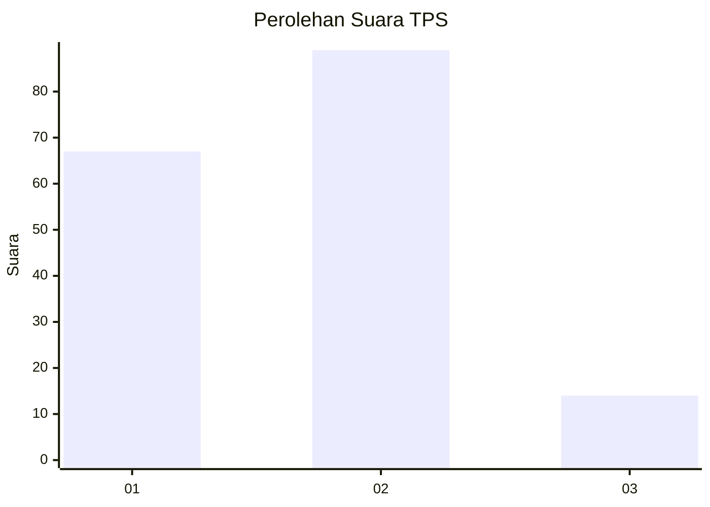

# Hasil

## Grafik

## Tabel

| No. | Nama Paslon    | Suara | Suara (raw) | Persentase |
|:--- |:-------------- | -----:| -----------:| ----------:|
| 1   | ANIES MUHAIMIN | 67    | [67][p-1]   | 39,41      |
| 2   | PRABOWO GIBRAN | 89    | [89][p-2]   | 52,35      |
| 3   | GANJAR MAHFUD  | 14    | [14][p-3]   | 8,24       |

[p-1]: https://github.com/gigit-pemilu/pemilu-2024-35-jawa-timur/blob/main/pilpres/hitung-suara/sub/35-jawa-timur/sub/09-jember/sub/15-sukorambi/sub/2004-karangpring/sub/009-tps/sub/paslon-1.txt
[p-2]: https://github.com/gigit-pemilu/pemilu-2024-35-jawa-timur/blob/main/pilpres/hitung-suara/sub/35-jawa-timur/sub/09-jember/sub/15-sukorambi/sub/2004-karangpring/sub/009-tps/sub/paslon-2.txt
[p-3]: https://github.com/gigit-pemilu/pemilu-2024-35-jawa-timur/blob/main/pilpres/hitung-suara/sub/35-jawa-timur/sub/09-jember/sub/15-sukorambi/sub/2004-karangpring/sub/009-tps/sub/paslon-3.txt

## Foto C Plano

https://sirekap-obj-formc.kpu.go.id/1cae/pemilu/ppwp/35/09/15/20/04/3509152004009-20240214-200042--a4a46c03-2b3c-4898-b414-d37263a8c89b.jpg

https://sirekap-obj-formc.kpu.go.id/1cae/pemilu/ppwp/35/09/15/20/04/3509152004009-20240214-200201--e8a43611-773e-4179-8d58-47b7d89421f6.jpg

https://sirekap-obj-formc.kpu.go.id/1cae/pemilu/ppwp/35/09/15/20/04/3509152004009-20240214-200401--b0a32ad0-7d0f-48e7-af0c-1c67d1efcc06.jpg

## Metadata

| Key        | Value               |
| ---------- | ------------------- |
| Time Stamp | 2024-02-15 19:30:26 |

