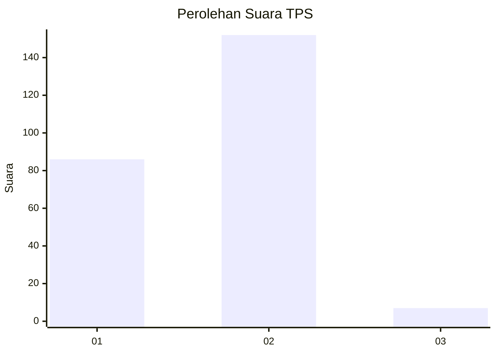
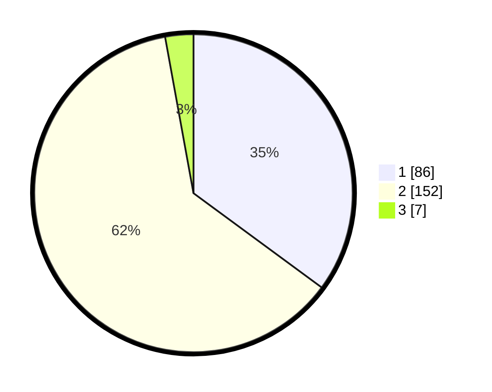

# Hasil

## Grafik

## Tabel

| No. | Nama Paslon    | Suara | Suara (raw) | Persentase |
|:--- |:-------------- | -----:| -----------:| ----------:|
| 1   | ANIES MUHAIMIN | 86    | [86][p-1]   | 35,10      |
| 2   | PRABOWO GIBRAN | 152   | [152][p-2]  | 62,04      |
| 3   | GANJAR MAHFUD  | 7     | [7][p-3]    | 2,86       |

[p-1]: https://github.com/gigit-pemilu/pemilu-2024/blob/main/pilpres/hitung-suara/sub/35-jawa-timur/sub/09-jember/sub/15-sukorambi/sub/2004-karangpring/sub/011-tps/sub/paslon-1.txt
[p-2]: https://github.com/gigit-pemilu/pemilu-2024/blob/main/pilpres/hitung-suara/sub/35-jawa-timur/sub/09-jember/sub/15-sukorambi/sub/2004-karangpring/sub/011-tps/sub/paslon-2.txt
[p-3]: https://github.com/gigit-pemilu/pemilu-2024/blob/main/pilpres/hitung-suara/sub/35-jawa-timur/sub/09-jember/sub/15-sukorambi/sub/2004-karangpring/sub/011-tps/sub/paslon-3.txt

## Foto C Plano

https://sirekap-obj-formc.kpu.go.id/3922/pemilu/ppwp/35/09/15/20/04/3509152004011-20240214-205213--ac13cf0a-449d-45bf-8bcd-68764e381fd0.jpg

https://sirekap-obj-formc.kpu.go.id/3922/pemilu/ppwp/35/09/15/20/04/3509152004011-20240214-205344--f586a4c8-819e-412a-9c10-73596b3d12a2.jpg

https://sirekap-obj-formc.kpu.go.id/3922/pemilu/ppwp/35/09/15/20/04/3509152004011-20240214-205521--5a101e33-e305-4c8c-a411-976e056047b5.jpg

## Metadata

| Key        | Value               |
| ---------- | ------------------- |
| Time Stamp | 2024-02-15 15:00:29 |

