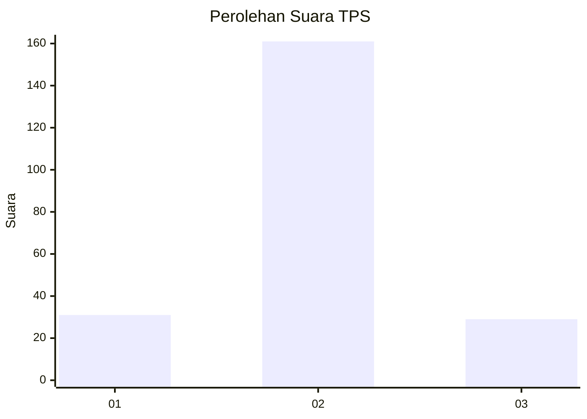
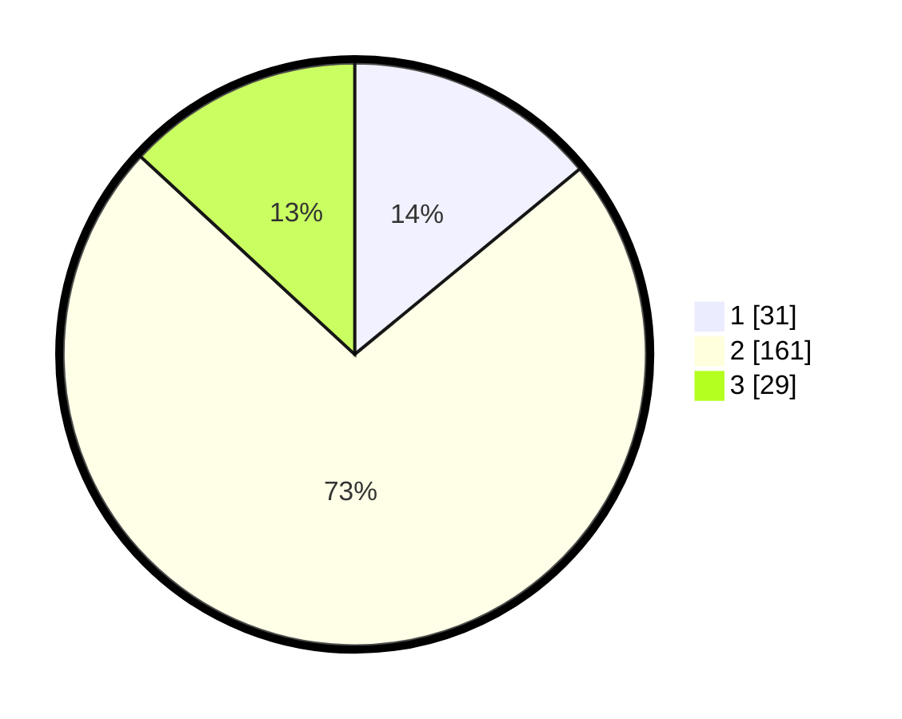

# Hasil

## Grafik

## Tabel

| No. | Nama Paslon    | Suara | Suara (raw) | Persentase |
|:--- |:-------------- | -----:| -----------:| ----------:|
| 1   | ANIES MUHAIMIN | 31    | [31][p-1]   | 14,03      |
| 2   | PRABOWO GIBRAN | 161   | [161][p-2]  | 72,85      |
| 3   | GANJAR MAHFUD  | 29    | [29][p-3]   | 13,12      |

[p-1]: https://github.com/gigit-pemilu/pemilu-2024/blob/main/pilpres/hitung-suara/sub/35-jawa-timur/sub/09-jember/sub/15-sukorambi/sub/2004-karangpring/sub/015-tps/sub/paslon-1.txt
[p-2]: https://github.com/gigit-pemilu/pemilu-2024/blob/main/pilpres/hitung-suara/sub/35-jawa-timur/sub/09-jember/sub/15-sukorambi/sub/2004-karangpring/sub/015-tps/sub/paslon-2.txt
[p-3]: https://github.com/gigit-pemilu/pemilu-2024/blob/main/pilpres/hitung-suara/sub/35-jawa-timur/sub/09-jember/sub/15-sukorambi/sub/2004-karangpring/sub/015-tps/sub/paslon-3.txt

## Foto C Plano

https://sirekap-obj-formc.kpu.go.id/cf17/pemilu/ppwp/35/09/15/20/04/3509152004015-20240214-232603--26af03aa-003a-4eb5-bcbb-e9dffb6d79c2.jpg

https://sirekap-obj-formc.kpu.go.id/cf17/pemilu/ppwp/35/09/15/20/04/3509152004015-20240214-233001--095c104f-ce41-4d9b-b245-1c616ccee5bb.jpg

https://sirekap-obj-formc.kpu.go.id/cf17/pemilu/ppwp/35/09/15/20/04/3509152004015-20240214-233058--2212df60-4c62-4f9b-95b0-b47b1e5542e4.jpg

## Metadata

| Key        | Value               |
| ---------- | ------------------- |
| Time Stamp | 2024-02-15 18:00:26 |

