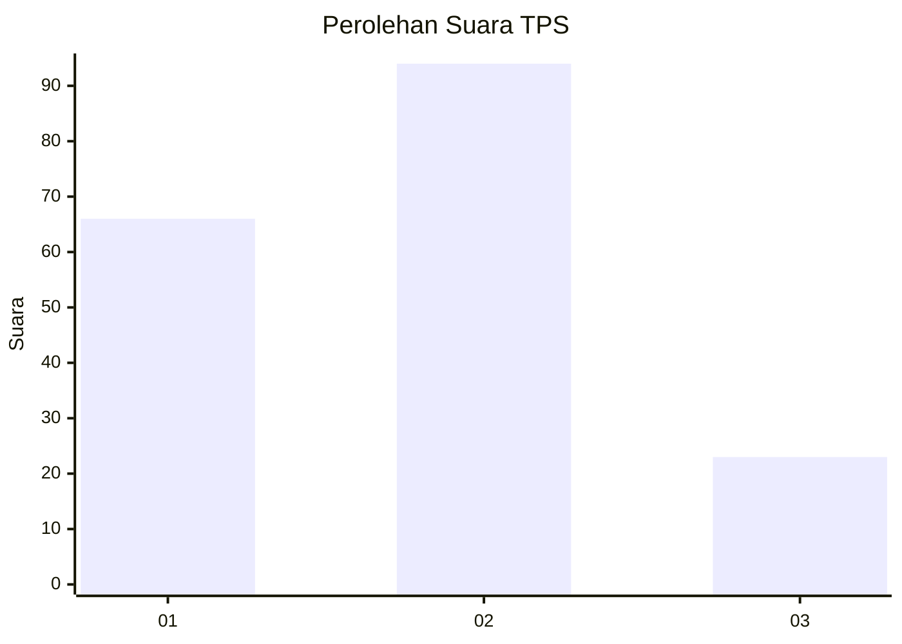
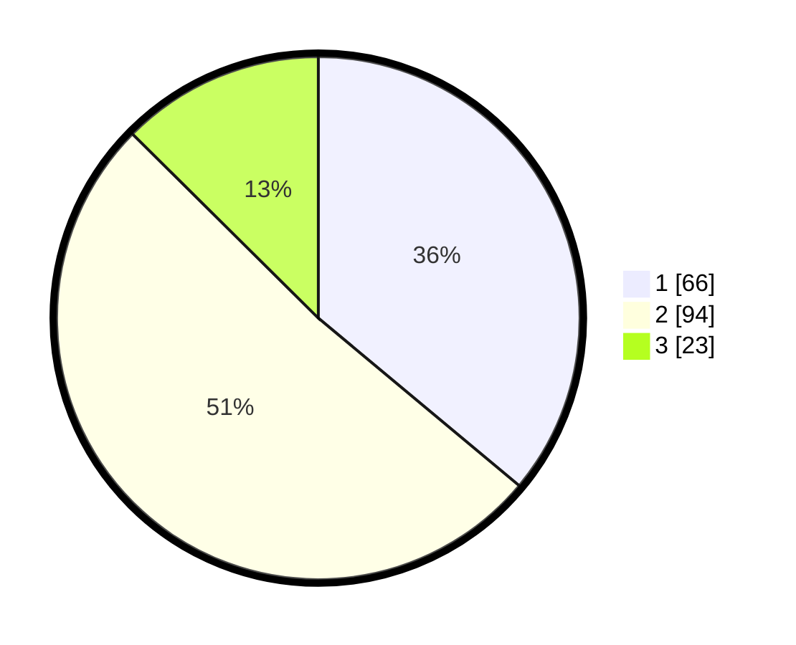

# Hasil

## Grafik

## Tabel

| No. | Nama Paslon    | Suara | Suara (raw) | Persentase |
|:--- |:-------------- | -----:| -----------:| ----------:|
| 1   | ANIES MUHAIMIN | 66    | [66][p-1]   | 36,07      |
| 2   | PRABOWO GIBRAN | 94    | [94][p-2]   | 51,37      |
| 3   | GANJAR MAHFUD  | 23    | [23][p-3]   | 12,57      |

[p-1]: https://github.com/gigit-pemilu/pemilu-2024-35-jawa-timur/blob/main/pilpres/hitung-suara/sub/35-jawa-timur/sub/09-jember/sub/15-sukorambi/sub/2004-karangpring/sub/019-tps/sub/paslon-1.txt
[p-2]: https://github.com/gigit-pemilu/pemilu-2024-35-jawa-timur/blob/main/pilpres/hitung-suara/sub/35-jawa-timur/sub/09-jember/sub/15-sukorambi/sub/2004-karangpring/sub/019-tps/sub/paslon-2.txt
[p-3]: https://github.com/gigit-pemilu/pemilu-2024-35-jawa-timur/blob/main/pilpres/hitung-suara/sub/35-jawa-timur/sub/09-jember/sub/15-sukorambi/sub/2004-karangpring/sub/019-tps/sub/paslon-3.txt

## Foto C Plano

https://sirekap-obj-formc.kpu.go.id/0132/pemilu/ppwp/35/09/15/20/04/3509152004019-20240214-210952--1a976003-8785-40b7-b6d8-d3d67792370c.jpg

https://sirekap-obj-formc.kpu.go.id/0132/pemilu/ppwp/35/09/15/20/04/3509152004019-20240214-210956--8c741d13-9772-4a58-aa56-a80d6595ed33.jpg

https://sirekap-obj-formc.kpu.go.id/0132/pemilu/ppwp/35/09/15/20/04/3509152004019-20240214-211005--d79f09d5-180a-4875-bc4b-e534953f1e60.jpg

## Metadata

| Key        | Value               |
| ---------- | ------------------- |
| Time Stamp | 2024-02-15 00:41:44 |

