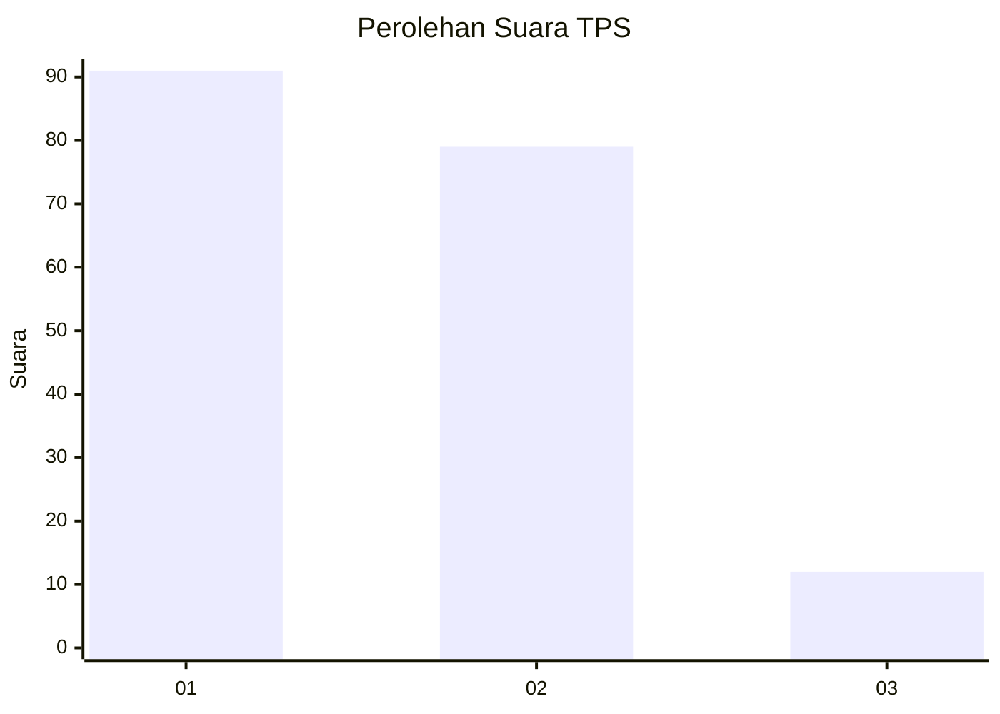
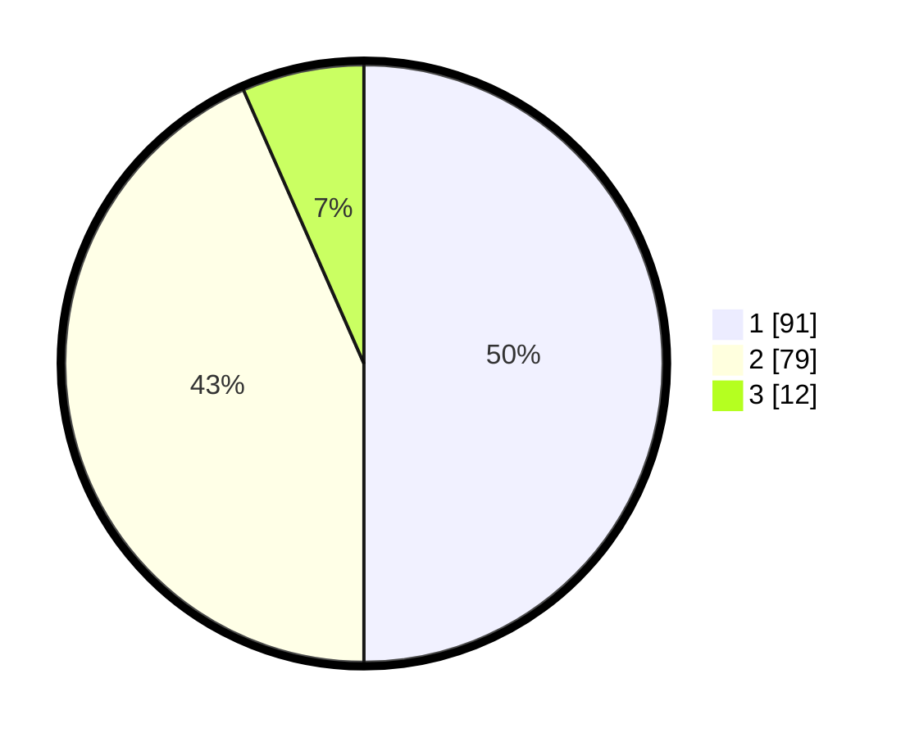

# Hasil

## Grafik

## Tabel

| No. | Nama Paslon    | Suara | Suara (raw) | Persentase |
|:--- |:-------------- | -----:| -----------:| ----------:|
| 1   | ANIES MUHAIMIN | 91    | [91][p-1]   | 50,00      |
| 2   | PRABOWO GIBRAN | 79    | [79][p-2]   | 43,41      |
| 3   | GANJAR MAHFUD  | 12    | [12][p-3]   | 6,59       |

[p-1]: https://github.com/gigit-pemilu/pemilu-2024-35-jawa-timur/blob/main/pilpres/hitung-suara/sub/35-jawa-timur/sub/09-jember/sub/15-sukorambi/sub/2004-karangpring/sub/022-tps/sub/paslon-1.txt
[p-2]: https://github.com/gigit-pemilu/pemilu-2024-35-jawa-timur/blob/main/pilpres/hitung-suara/sub/35-jawa-timur/sub/09-jember/sub/15-sukorambi/sub/2004-karangpring/sub/022-tps/sub/paslon-2.txt
[p-3]: https://github.com/gigit-pemilu/pemilu-2024-35-jawa-timur/blob/main/pilpres/hitung-suara/sub/35-jawa-timur/sub/09-jember/sub/15-sukorambi/sub/2004-karangpring/sub/022-tps/sub/paslon-3.txt

## Foto C Plano

https://sirekap-obj-formc.kpu.go.id/c071/pemilu/ppwp/35/09/15/20/04/3509152004022-20240214-215325--1e0a7e5f-35f6-4d2a-8aba-7c9a568078a9.jpg

https://sirekap-obj-formc.kpu.go.id/c071/pemilu/ppwp/35/09/15/20/04/3509152004022-20240214-231025--7193c771-1d80-4bee-9c5c-c11a3f837270.jpg

https://sirekap-obj-formc.kpu.go.id/c071/pemilu/ppwp/35/09/15/20/04/3509152004022-20240214-231127--a8c28557-3e95-4764-8833-12f64875606e.jpg

## Metadata

| Key        | Value               |
| ---------- | ------------------- |
| Time Stamp | 2024-02-15 18:00:26 |

