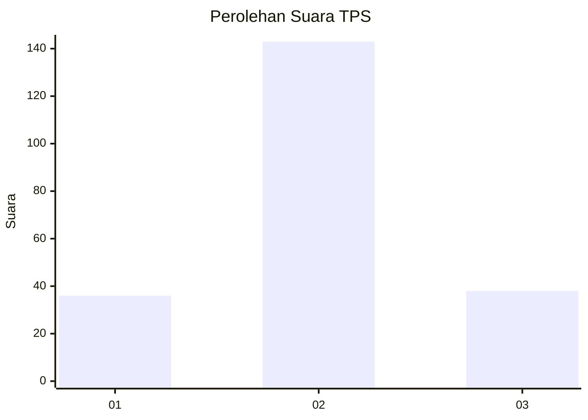
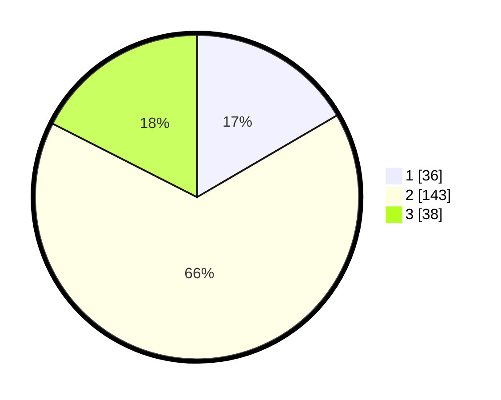

# Hasil

## Grafik

## Tabel

| No. | Nama Paslon    | Suara | Suara (raw) | Persentase |
|:--- |:-------------- | -----:| -----------:| ----------:|
| 1   | ANIES MUHAIMIN | 36    | [36][p-1]   | 16,59      |
| 2   | PRABOWO GIBRAN | 143   | [143][p-2]  | 65,90      |
| 3   | GANJAR MAHFUD  | 38    | [38][p-3]   | 17,51      |

[p-1]: https://github.com/gigit-pemilu/pemilu-2024/blob/main/pilpres/hitung-suara/sub/35-jawa-timur/sub/09-jember/sub/15-sukorambi/sub/2005-klungkung/sub/001-tps/sub/paslon-1.txt
[p-2]: https://github.com/gigit-pemilu/pemilu-2024/blob/main/pilpres/hitung-suara/sub/35-jawa-timur/sub/09-jember/sub/15-sukorambi/sub/2005-klungkung/sub/001-tps/sub/paslon-2.txt
[p-3]: https://github.com/gigit-pemilu/pemilu-2024/blob/main/pilpres/hitung-suara/sub/35-jawa-timur/sub/09-jember/sub/15-sukorambi/sub/2005-klungkung/sub/001-tps/sub/paslon-3.txt

## Foto C Plano

https://sirekap-obj-formc.kpu.go.id/26fa/pemilu/ppwp/35/09/15/20/05/3509152005001-20240214-141339--dbec6fd5-9aa7-4055-93be-c3171f9a4ce5.jpg

https://sirekap-obj-formc.kpu.go.id/26fa/pemilu/ppwp/35/09/15/20/05/3509152005001-20240214-141512--1f31b97b-0780-4f12-a508-d8a5394df8fd.jpg

https://sirekap-obj-formc.kpu.go.id/26fa/pemilu/ppwp/35/09/15/20/05/3509152005001-20240214-141626--325a21b1-eeac-43f2-9a25-766d6f72e15c.jpg

## Metadata

| Key        | Value               |
| ---------- | ------------------- |
| Time Stamp | 2024-02-20 11:00:00 |

