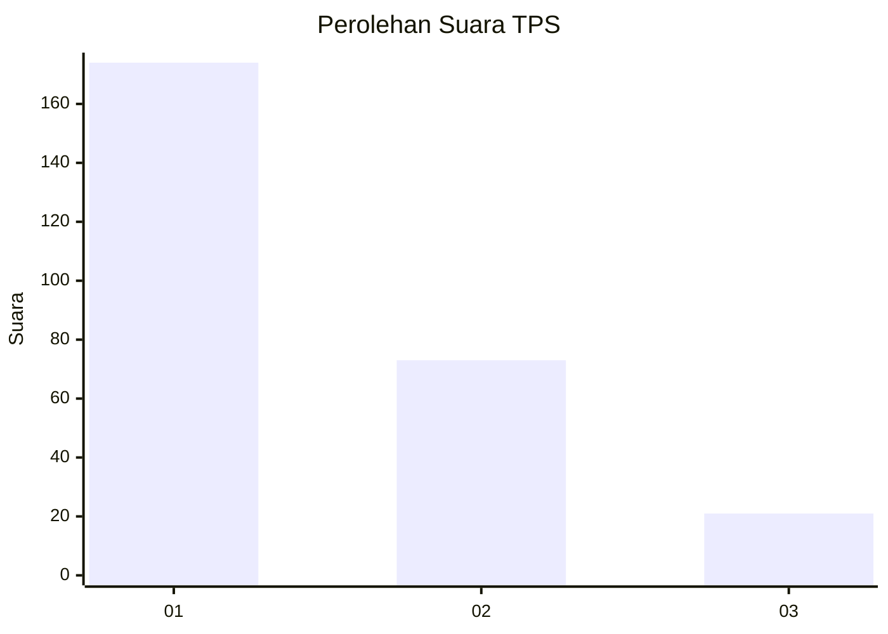
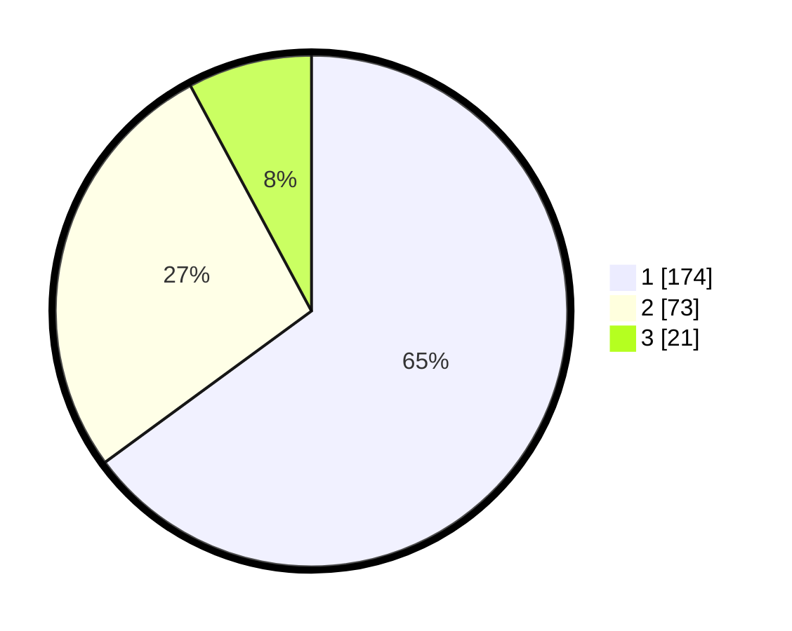

# Hasil

## Grafik

## Tabel

| No. | Nama Paslon    | Suara | Suara (raw) | Persentase |
|:--- |:-------------- | -----:| -----------:| ----------:|
| 1   | ANIES MUHAIMIN | 174   | [174][p-1]  | 64,93      |
| 2   | PRABOWO GIBRAN | 73    | [73][p-2]   | 27,24      |
| 3   | GANJAR MAHFUD  | 21    | [21][p-3]   | 7,84       |

[p-1]: https://github.com/gigit-pemilu/pemilu-2024-35-jawa-timur/blob/main/pilpres/hitung-suara/sub/35-jawa-timur/sub/09-jember/sub/15-sukorambi/sub/2005-klungkung/sub/004-tps/sub/paslon-1.txt
[p-2]: https://github.com/gigit-pemilu/pemilu-2024-35-jawa-timur/blob/main/pilpres/hitung-suara/sub/35-jawa-timur/sub/09-jember/sub/15-sukorambi/sub/2005-klungkung/sub/004-tps/sub/paslon-2.txt
[p-3]: https://github.com/gigit-pemilu/pemilu-2024-35-jawa-timur/blob/main/pilpres/hitung-suara/sub/35-jawa-timur/sub/09-jember/sub/15-sukorambi/sub/2005-klungkung/sub/004-tps/sub/paslon-3.txt

## Foto C Plano

https://sirekap-obj-formc.kpu.go.id/533e/pemilu/ppwp/35/09/15/20/05/3509152005004-20240214-222452--583e97f5-a6cf-4c67-8ff6-317b0682c4b8.jpg

https://sirekap-obj-formc.kpu.go.id/533e/pemilu/ppwp/35/09/15/20/05/3509152005004-20240214-222550--27c3c9b4-e7e7-44a7-a6d1-00f9473215ab.jpg

## Metadata

| Key        | Value               |
| ---------- | ------------------- |
| Time Stamp | 2024-02-15 18:00:26 |

