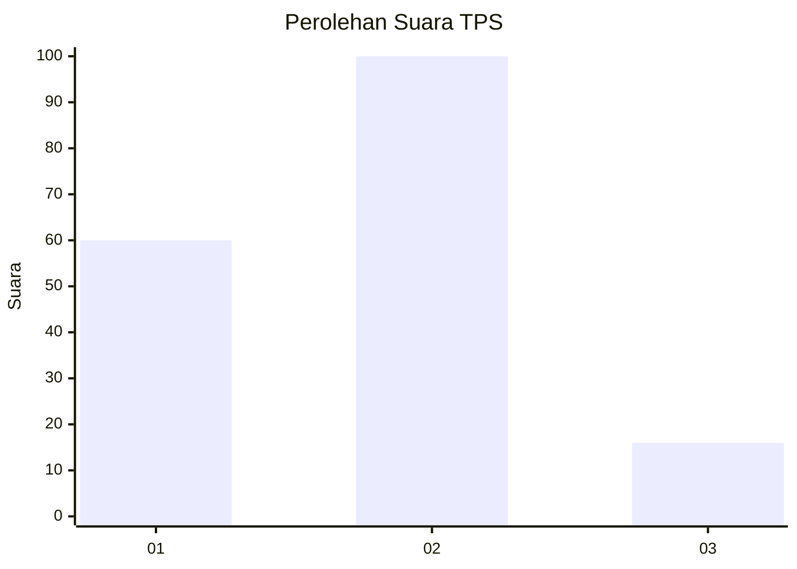
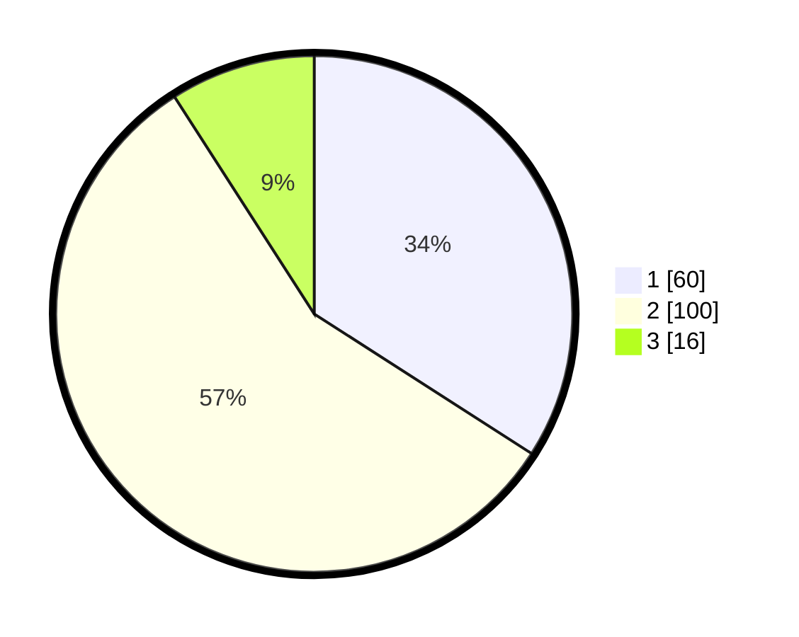

# Hasil

## Grafik

## Tabel

| No. | Nama Paslon    | Suara | Suara (raw) | Persentase |
|:--- |:-------------- | -----:| -----------:| ----------:|
| 1   | ANIES MUHAIMIN | 60    | [60][p-1]   | 34,09      |
| 2   | PRABOWO GIBRAN | 100   | [100][p-2]  | 56,82      |
| 3   | GANJAR MAHFUD  | 16    | [16][p-3]   | 9,09       |

[p-1]: https://github.com/gigit-pemilu/pemilu-2024/blob/main/pilpres/hitung-suara/sub/35-jawa-timur/sub/09-jember/sub/15-sukorambi/sub/2005-klungkung/sub/015-tps/sub/paslon-1.txt
[p-2]: https://github.com/gigit-pemilu/pemilu-2024/blob/main/pilpres/hitung-suara/sub/35-jawa-timur/sub/09-jember/sub/15-sukorambi/sub/2005-klungkung/sub/015-tps/sub/paslon-2.txt
[p-3]: https://github.com/gigit-pemilu/pemilu-2024/blob/main/pilpres/hitung-suara/sub/35-jawa-timur/sub/09-jember/sub/15-sukorambi/sub/2005-klungkung/sub/015-tps/sub/paslon-3.txt

## Foto C Plano

https://sirekap-obj-formc.kpu.go.id/df45/pemilu/ppwp/35/09/15/20/05/3509152005015-20240214-141017--8e48a03c-a878-4af4-85d7-1e4f7a8a304a.jpg

https://sirekap-obj-formc.kpu.go.id/df45/pemilu/ppwp/35/09/15/20/05/3509152005015-20240214-141232--dc4ec242-e74f-452a-9b42-6c7f9693a0bd.jpg

https://sirekap-obj-formc.kpu.go.id/df45/pemilu/ppwp/35/09/15/20/05/3509152005015-20240214-141341--941cfbe2-646e-409e-b95b-7a4814430a96.jpg

## Metadata

| Key        | Value               |
| ---------- | ------------------- |
| Time Stamp | 2024-02-15 19:30:26 |

