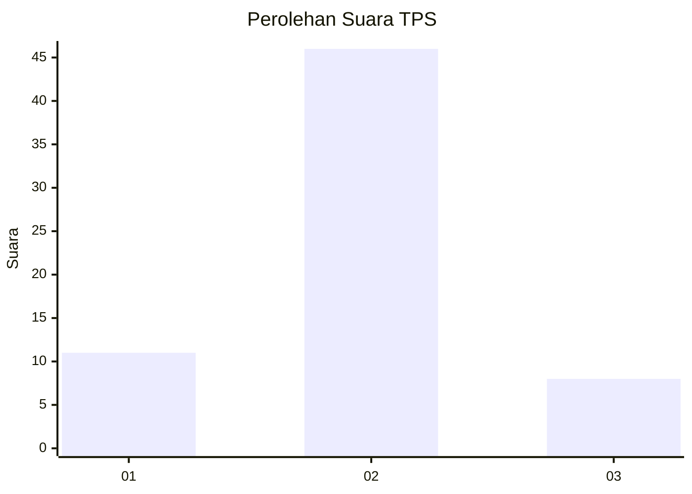
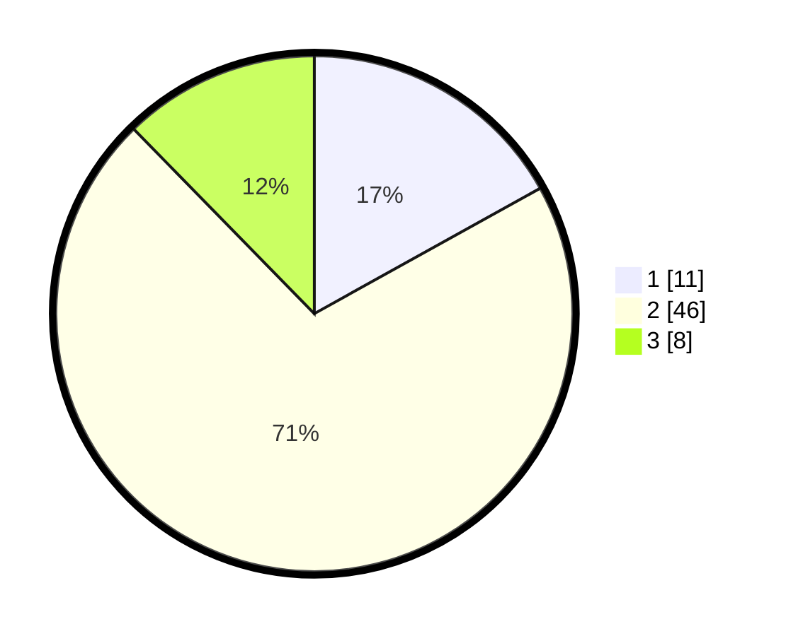

# Hasil

## Grafik

## Tabel

| No. | Nama Paslon    | Suara | Suara (raw) | Persentase |
|:--- |:-------------- | -----:| -----------:| ----------:|
| 1   | ANIES MUHAIMIN | 11    | [11][p-1]   | 16,92      |
| 2   | PRABOWO GIBRAN | 46    | [46][p-2]   | 70,77      |
| 3   | GANJAR MAHFUD  | 8     | [8][p-3]    | 12,31      |

[p-1]: https://github.com/gigit-pemilu/pemilu-2024/blob/main/pilpres/hitung-suara/sub/35-jawa-timur/sub/09-jember/sub/16-jenggawah/sub/2003-jenggawah/sub/011-tps/sub/paslon-1.txt
[p-2]: https://github.com/gigit-pemilu/pemilu-2024/blob/main/pilpres/hitung-suara/sub/35-jawa-timur/sub/09-jember/sub/16-jenggawah/sub/2003-jenggawah/sub/011-tps/sub/paslon-2.txt
[p-3]: https://github.com/gigit-pemilu/pemilu-2024/blob/main/pilpres/hitung-suara/sub/35-jawa-timur/sub/09-jember/sub/16-jenggawah/sub/2003-jenggawah/sub/011-tps/sub/paslon-3.txt

## Foto C Plano

https://sirekap-obj-formc.kpu.go.id/cc91/pemilu/ppwp/35/09/16/20/03/3509162003011-20240216-060834--e5944c17-891a-469e-9167-3bc18fa4ab80.jpg

https://sirekap-obj-formc.kpu.go.id/cc91/pemilu/ppwp/35/09/16/20/03/3509162003011-20240216-060836--3f04ec81-7f52-45cf-aa95-ffb60dc698fc.jpg

https://sirekap-obj-formc.kpu.go.id/cc91/pemilu/ppwp/35/09/16/20/03/3509162003011-20240216-060835--35a4d974-c0e1-4ed9-854f-0f89326a7760.jpg

## Metadata

| Key        | Value               |
| ---------- | ------------------- |
| Time Stamp | 2024-02-20 13:00:00 |

## DATA PEMILIH TETAP

Jumlah pemilih dalam DPT: **107**.
 * L: **54**.
 * P: **53**.

## DATA PENGGUNA HAK PILIH

Jumlah pengguna hak pilih dalam DPT: **65**.
 * L: **30**.
 * P: **35**.

Jumlah pengguna hak pilih dalam DPTb: **0**.
 * L: **0**.
 * P: **0**.

Jumlah pengguna hak pilih dalam DPK: **0**.
 * L: **0**.
 * P: **0**.

Jumlah pengguna hak pilih: **65**.
 * L: **30**.
 * P: **35**.

## JUMLAH SUARA SAH DAN TIDAK SAH

JUMLAH SELURUH SUARA SAH: **65**.

JUMLAH SUARA TIDAK SAH: **0**.

JUMLAH SELURUH SUARA SAH DAN SUARA TIDAK SAH: **65**.

