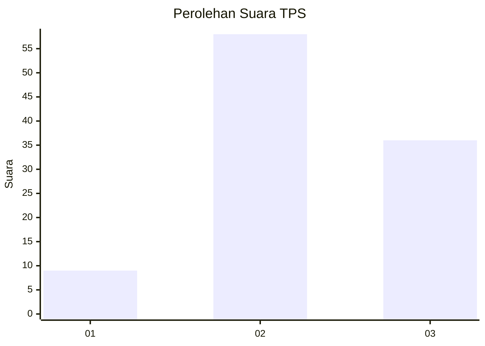
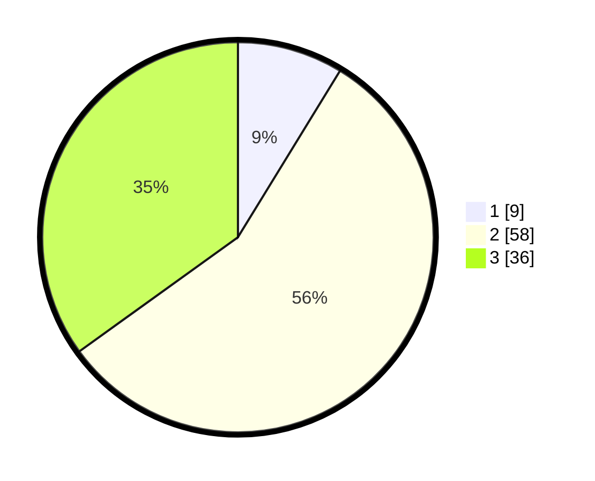

# Hasil

## Grafik

## Tabel

| No. | Nama Paslon    | Suara | Suara (raw) | Persentase |
|:--- |:-------------- | -----:| -----------:| ----------:|
| 1   | ANIES MUHAIMIN | 9     | [9][p-1]    | 8,74       |
| 2   | PRABOWO GIBRAN | 58    | [58][p-2]   | 56,31      |
| 3   | GANJAR MAHFUD  | 36    | [36][p-3]   | 34,95      |

[p-1]: https://github.com/gigit-pemilu/pemilu-2024-35-jawa-timur/blob/main/pilpres/hitung-suara/sub/35-jawa-timur/sub/09-jember/sub/16-jenggawah/sub/2007-jatimulyo/sub/003-tps/sub/paslon-1.txt
[p-2]: https://github.com/gigit-pemilu/pemilu-2024-35-jawa-timur/blob/main/pilpres/hitung-suara/sub/35-jawa-timur/sub/09-jember/sub/16-jenggawah/sub/2007-jatimulyo/sub/003-tps/sub/paslon-2.txt
[p-3]: https://github.com/gigit-pemilu/pemilu-2024-35-jawa-timur/blob/main/pilpres/hitung-suara/sub/35-jawa-timur/sub/09-jember/sub/16-jenggawah/sub/2007-jatimulyo/sub/003-tps/sub/paslon-3.txt

## Foto C Plano

https://sirekap-obj-formc.kpu.go.id/2b47/pemilu/ppwp/35/09/16/20/07/3509162007003-20240219-201409--dfff2197-cb0c-4e5a-aacd-27546035ea13.jpg

https://sirekap-obj-formc.kpu.go.id/2b47/pemilu/ppwp/35/09/16/20/07/3509162007003-20240219-202226--3e4c8a90-13ef-4bef-b310-7ce906ded708.jpg

https://sirekap-obj-formc.kpu.go.id/2b47/pemilu/ppwp/35/09/16/20/07/3509162007003-20240219-202225--bafcfabe-20ce-4d3e-9121-6aefe45322db.jpg

## Metadata

| Key        | Value               |
| ---------- | ------------------- |
| Time Stamp | 2024-02-20 15:00:00 |

## DATA PEMILIH TETAP

Jumlah pemilih dalam DPT: **147**.
 * L: **71**.
 * P: **76**.

## DATA PENGGUNA HAK PILIH

Jumlah pengguna hak pilih dalam DPT: **0**.
 * L: **700**.
 * P: **700**.

Jumlah pengguna hak pilih dalam DPTb: **705**.
 * L: **777**.
 * P: **777**.

Jumlah pengguna hak pilih dalam DPK: **2**.
 * L: **1**.
 * P: **1**.

Jumlah pengguna hak pilih: **103**.
 * L: **48**.
 * P: **55**.

## JUMLAH SUARA SAH DAN TIDAK SAH

JUMLAH SELURUH SUARA SAH: **103**.

JUMLAH SUARA TIDAK SAH: **0**.

JUMLAH SELURUH SUARA SAH DAN SUARA TIDAK SAH: **103**.

