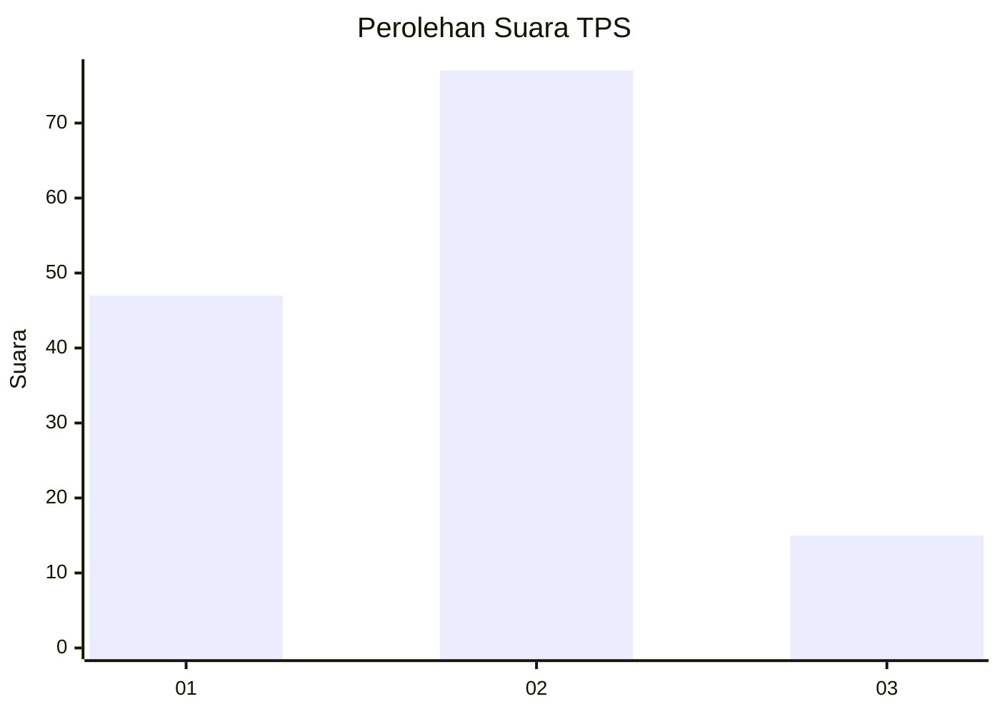
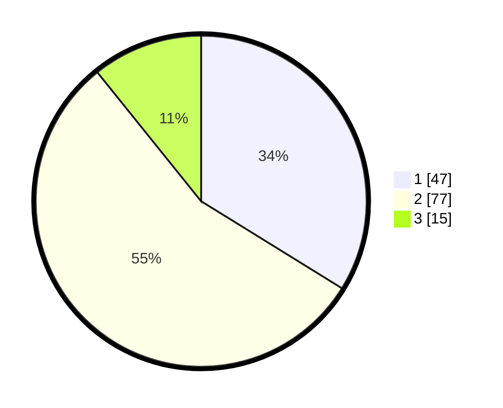

# Hasil

## Grafik

## Tabel

| No. | Nama Paslon    | Suara | Suara (raw) | Persentase |
|:--- |:-------------- | -----:| -----------:| ----------:|
| 1   | ANIES MUHAIMIN | 47    | [47][p-1]   | 33,81      |
| 2   | PRABOWO GIBRAN | 77    | [77][p-2]   | 55,40      |
| 3   | GANJAR MAHFUD  | 15    | [15][p-3]   | 10,79      |

[p-1]: https://github.com/gigit-pemilu/pemilu-2024-35-jawa-timur/blob/main/pilpres/hitung-suara/sub/35-jawa-timur/sub/09-jember/sub/17-ajung/sub/2001-sukamakmur/sub/003-tps/sub/paslon-1.txt
[p-2]: https://github.com/gigit-pemilu/pemilu-2024-35-jawa-timur/blob/main/pilpres/hitung-suara/sub/35-jawa-timur/sub/09-jember/sub/17-ajung/sub/2001-sukamakmur/sub/003-tps/sub/paslon-2.txt
[p-3]: https://github.com/gigit-pemilu/pemilu-2024-35-jawa-timur/blob/main/pilpres/hitung-suara/sub/35-jawa-timur/sub/09-jember/sub/17-ajung/sub/2001-sukamakmur/sub/003-tps/sub/paslon-3.txt

## Foto C Plano

https://sirekap-obj-formc.kpu.go.id/e43f/pemilu/ppwp/35/09/17/20/01/3509172001003-20240214-234925--b6eb4a57-ec45-4bc1-b6ac-8859d3201474.jpg

https://sirekap-obj-formc.kpu.go.id/e43f/pemilu/ppwp/35/09/17/20/01/3509172001003-20240214-235038--c4a8b3fe-a7f8-4814-8ee6-c3283c509fb6.jpg

https://sirekap-obj-formc.kpu.go.id/e43f/pemilu/ppwp/35/09/17/20/01/3509172001003-20240215-000303--ffbed1ed-1d49-439c-b286-89e8afe582db.jpg

## Metadata

| Key        | Value               |
| ---------- | ------------------- |
| Time Stamp | 2024-02-15 12:00:28 |

