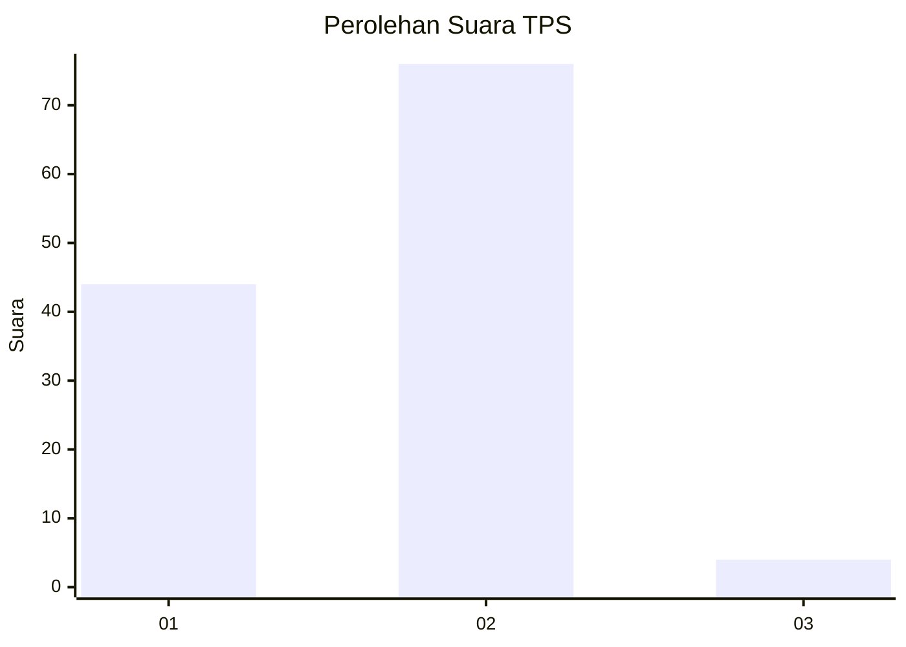
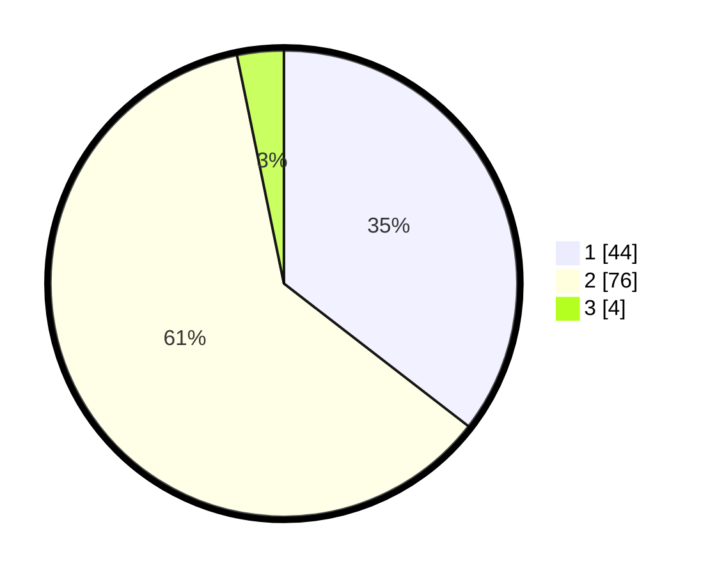

# Hasil

## Grafik

## Tabel

| No. | Nama Paslon    | Suara | Suara (raw) | Persentase |
|:--- |:-------------- | -----:| -----------:| ----------:|
| 1   | ANIES MUHAIMIN | 44    | [44][p-1]   | 35,48      |
| 2   | PRABOWO GIBRAN | 76    | [76][p-2]   | 61,29      |
| 3   | GANJAR MAHFUD  | 4     | [4][p-3]    | 3,23       |

[p-1]: https://github.com/gigit-pemilu/pemilu-2024-35-jawa-timur/blob/main/pilpres/hitung-suara/sub/35-jawa-timur/sub/09-jember/sub/17-ajung/sub/2001-sukamakmur/sub/008-tps/sub/paslon-1.txt
[p-2]: https://github.com/gigit-pemilu/pemilu-2024-35-jawa-timur/blob/main/pilpres/hitung-suara/sub/35-jawa-timur/sub/09-jember/sub/17-ajung/sub/2001-sukamakmur/sub/008-tps/sub/paslon-2.txt
[p-3]: https://github.com/gigit-pemilu/pemilu-2024-35-jawa-timur/blob/main/pilpres/hitung-suara/sub/35-jawa-timur/sub/09-jember/sub/17-ajung/sub/2001-sukamakmur/sub/008-tps/sub/paslon-3.txt

## Foto C Plano

https://sirekap-obj-formc.kpu.go.id/4fa7/pemilu/ppwp/35/09/17/20/01/3509172001008-20240214-220059--4c6d5a74-054b-4dbb-9e70-d5dcfef0b197.jpg

https://sirekap-obj-formc.kpu.go.id/4fa7/pemilu/ppwp/35/09/17/20/01/3509172001008-20240214-220118--c29673b7-a45e-4249-ae5a-681103912f2e.jpg

https://sirekap-obj-formc.kpu.go.id/4fa7/pemilu/ppwp/35/09/17/20/01/3509172001008-20240214-141354--788aaefb-0750-4202-bf75-9f558342cbfd.jpg

## Metadata

| Key        | Value               |
| ---------- | ------------------- |
| Time Stamp | 2024-02-15 12:00:28 |

