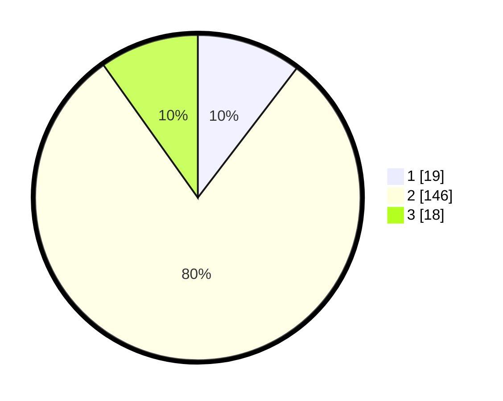

# Hasil

## Grafik

## Tabel

| No. | Nama Paslon    | Suara | Suara (raw) | Persentase |
|:--- |:-------------- | -----:| -----------:| ----------:|
| 1   | ANIES MUHAIMIN | 19    | [19][p-1]   | 10,38      |
| 2   | PRABOWO GIBRAN | 146   | [146][p-2]  | 79,78      |
| 3   | GANJAR MAHFUD  | 18    | [18][p-3]   | 9,84       |

[p-1]: https://github.com/gigit-pemilu/pemilu-2024/blob/main/pilpres/hitung-suara/sub/35-jawa-timur/sub/09-jember/sub/17-ajung/sub/2001-sukamakmur/sub/010-tps/sub/paslon-1.txt
[p-2]: https://github.com/gigit-pemilu/pemilu-2024/blob/main/pilpres/hitung-suara/sub/35-jawa-timur/sub/09-jember/sub/17-ajung/sub/2001-sukamakmur/sub/010-tps/sub/paslon-2.txt
[p-3]: https://github.com/gigit-pemilu/pemilu-2024/blob/main/pilpres/hitung-suara/sub/35-jawa-timur/sub/09-jember/sub/17-ajung/sub/2001-sukamakmur/sub/010-tps/sub/paslon-3.txt

## Foto C Plano

https://sirekap-obj-formc.kpu.go.id/ca24/pemilu/ppwp/35/09/17/20/01/3509172001010-20240217-080739--43d1ce74-76d0-4e7c-a593-bb78a73160ff.jpg

https://sirekap-obj-formc.kpu.go.id/ca24/pemilu/ppwp/35/09/17/20/01/3509172001010-20240215-004715--d91c4597-a180-49d7-9f21-ed47fab932f8.jpg

https://sirekap-obj-formc.kpu.go.id/ca24/pemilu/ppwp/35/09/17/20/01/3509172001010-20240215-004823--fc2c5a64-1c86-4ae1-a803-9f8acae1e8fd.jpg

## Metadata

| Key        | Value               |
| ---------- | ------------------- |
| Time Stamp | 2024-02-21 16:00:00 |

