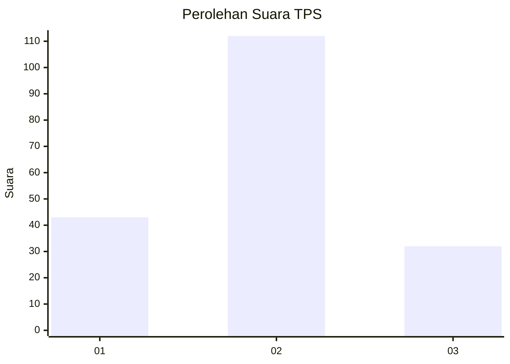

# Hasil

## Grafik

## Tabel

| No. | Nama Paslon    | Suara | Suara (raw) | Persentase |
|:--- |:-------------- | -----:| -----------:| ----------:|
| 1   | ANIES MUHAIMIN | 43    | [43][p-1]   | 22,99      |
| 2   | PRABOWO GIBRAN | 112   | [112][p-2]  | 59,89      |
| 3   | GANJAR MAHFUD  | 32    | [32][p-3]   | 17,11      |

[p-1]: https://github.com/gigit-pemilu/pemilu-2024/blob/main/pilpres/hitung-suara/sub/35-jawa-timur/sub/09-jember/sub/17-ajung/sub/2001-sukamakmur/sub/013-tps/sub/paslon-1.txt
[p-2]: https://github.com/gigit-pemilu/pemilu-2024/blob/main/pilpres/hitung-suara/sub/35-jawa-timur/sub/09-jember/sub/17-ajung/sub/2001-sukamakmur/sub/013-tps/sub/paslon-2.txt
[p-3]: https://github.com/gigit-pemilu/pemilu-2024/blob/main/pilpres/hitung-suara/sub/35-jawa-timur/sub/09-jember/sub/17-ajung/sub/2001-sukamakmur/sub/013-tps/sub/paslon-3.txt

## Foto C Plano

https://sirekap-obj-formc.kpu.go.id/8c67/pemilu/ppwp/35/09/17/20/01/3509172001013-20240215-003954--c3adf883-15cd-48cf-acd0-1ddee7f45c72.jpg

https://sirekap-obj-formc.kpu.go.id/8c67/pemilu/ppwp/35/09/17/20/01/3509172001013-20240215-004135--c7016177-d0ef-4383-a1a5-da5a2a24a546.jpg

https://sirekap-obj-formc.kpu.go.id/8c67/pemilu/ppwp/35/09/17/20/01/3509172001013-20240215-004212--1ed82675-a5c6-44bd-8fd7-0873d3580262.jpg

## Metadata

| Key        | Value               |
| ---------- | ------------------- |
| Time Stamp | 2024-02-15 12:00:28 |

