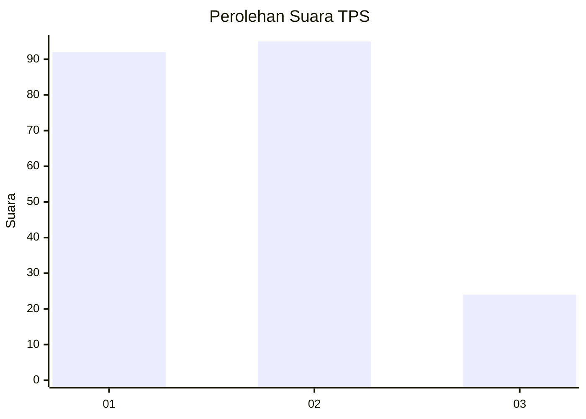
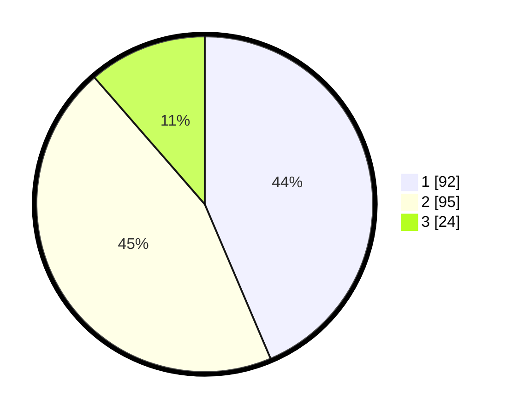

# Hasil

## Grafik

## Tabel

| No. | Nama Paslon    | Suara | Suara (raw) | Persentase |
|:--- |:-------------- | -----:| -----------:| ----------:|
| 1   | ANIES MUHAIMIN | 92    | [92][p-1]   | 43,60      |
| 2   | PRABOWO GIBRAN | 95    | [95][p-2]   | 45,02      |
| 3   | GANJAR MAHFUD  | 24    | [24][p-3]   | 11,37      |

[p-1]: https://github.com/gigit-pemilu/pemilu-2024-35-jawa-timur/blob/main/pilpres/hitung-suara/sub/35-jawa-timur/sub/09-jember/sub/17-ajung/sub/2001-sukamakmur/sub/019-tps/sub/paslon-1.txt
[p-2]: https://github.com/gigit-pemilu/pemilu-2024-35-jawa-timur/blob/main/pilpres/hitung-suara/sub/35-jawa-timur/sub/09-jember/sub/17-ajung/sub/2001-sukamakmur/sub/019-tps/sub/paslon-2.txt
[p-3]: https://github.com/gigit-pemilu/pemilu-2024-35-jawa-timur/blob/main/pilpres/hitung-suara/sub/35-jawa-timur/sub/09-jember/sub/17-ajung/sub/2001-sukamakmur/sub/019-tps/sub/paslon-3.txt

## Foto C Plano

https://sirekap-obj-formc.kpu.go.id/86d7/pemilu/ppwp/35/09/17/20/01/3509172001019-20240215-051130--3c462e9f-ebe2-42b8-bd68-a123a5bc85dd.jpg

https://sirekap-obj-formc.kpu.go.id/86d7/pemilu/ppwp/35/09/17/20/01/3509172001019-20240215-051241--c763c246-999f-4382-9cf9-44ae1f381dbb.jpg

https://sirekap-obj-formc.kpu.go.id/86d7/pemilu/ppwp/35/09/17/20/01/3509172001019-20240215-051339--dc382c16-c515-4e44-a553-b80839fd46b6.jpg

## Metadata

| Key        | Value               |
| ---------- | ------------------- |
| Time Stamp | 2024-02-15 21:01:18 |

