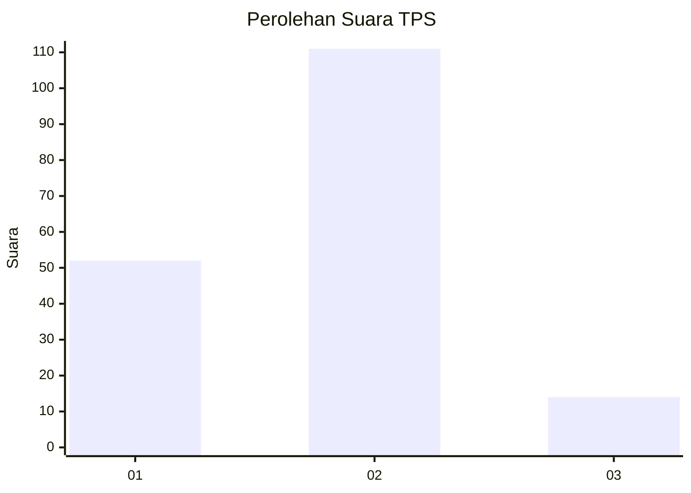
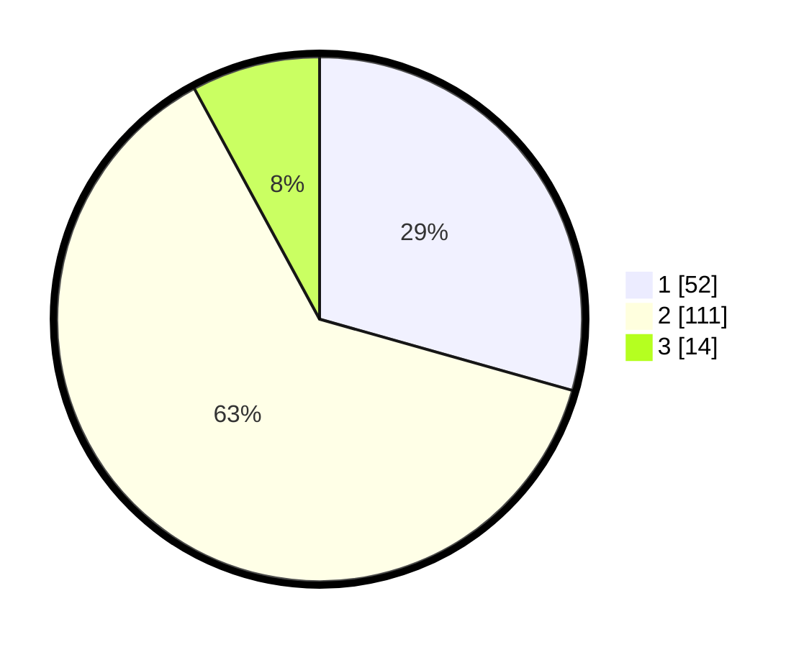

# Hasil

## Grafik

## Tabel

| No. | Nama Paslon    | Suara | Suara (raw) | Persentase |
|:--- |:-------------- | -----:| -----------:| ----------:|
| 1   | ANIES MUHAIMIN | 52    | [52][p-1]   | 29,38      |
| 2   | PRABOWO GIBRAN | 111   | [111][p-2]  | 62,71      |
| 3   | GANJAR MAHFUD  | 14    | [14][p-3]   | 7,91       |

[p-1]: https://github.com/gigit-pemilu/pemilu-2024/blob/main/pilpres/hitung-suara/sub/35-jawa-timur/sub/09-jember/sub/17-ajung/sub/2001-sukamakmur/sub/020-tps/sub/paslon-1.txt
[p-2]: https://github.com/gigit-pemilu/pemilu-2024/blob/main/pilpres/hitung-suara/sub/35-jawa-timur/sub/09-jember/sub/17-ajung/sub/2001-sukamakmur/sub/020-tps/sub/paslon-2.txt
[p-3]: https://github.com/gigit-pemilu/pemilu-2024/blob/main/pilpres/hitung-suara/sub/35-jawa-timur/sub/09-jember/sub/17-ajung/sub/2001-sukamakmur/sub/020-tps/sub/paslon-3.txt

## Foto C Plano

https://sirekap-obj-formc.kpu.go.id/575b/pemilu/ppwp/35/09/17/20/01/3509172001020-20240217-164627--4ec09ad3-2abf-4f44-a837-5ca6892d534d.jpg

https://sirekap-obj-formc.kpu.go.id/575b/pemilu/ppwp/35/09/17/20/01/3509172001020-20240217-164839--2b24abb6-bedc-42d2-b2be-0b760fe48d0d.jpg

https://sirekap-obj-formc.kpu.go.id/575b/pemilu/ppwp/35/09/17/20/01/3509172001020-20240217-165816--0c4c467e-4ddd-4da0-8982-337ff8076f19.jpg

## Metadata

| Key        | Value               |
| ---------- | ------------------- |
| Time Stamp | 2024-02-24 22:31:28 |

