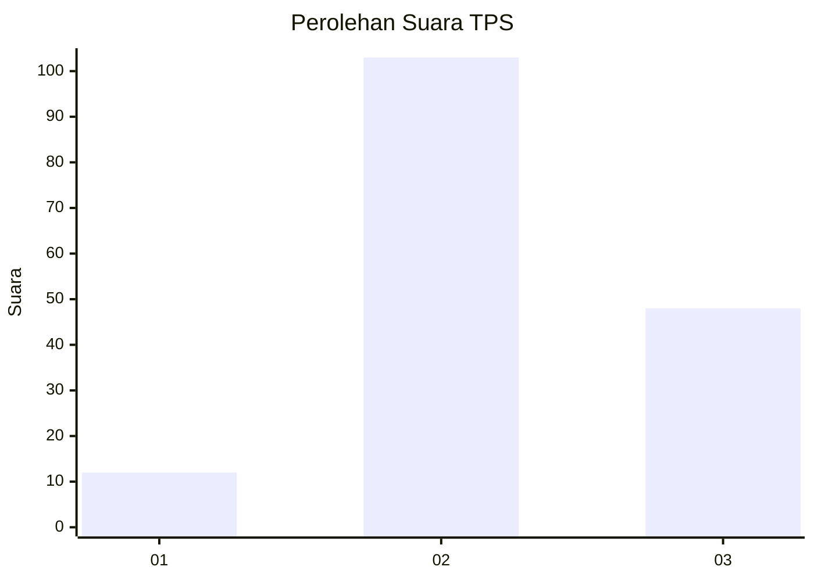
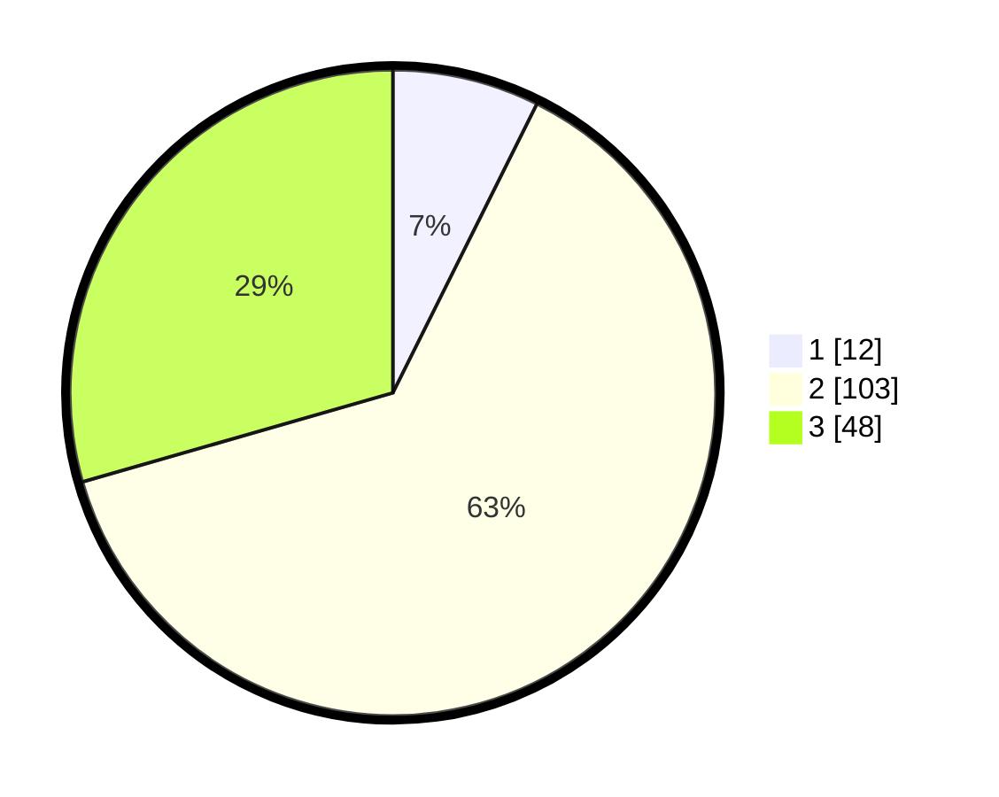

# Hasil

## Grafik

## Tabel

| No. | Nama Paslon    | Suara | Suara (raw) | Persentase |
|:--- |:-------------- | -----:| -----------:| ----------:|
| 1   | ANIES MUHAIMIN | 12    | [12][p-1]   | 7,36       |
| 2   | PRABOWO GIBRAN | 103   | [103][p-2]  | 63,19      |
| 3   | GANJAR MAHFUD  | 48    | [48][p-3]   | 29,45      |

[p-1]: https://github.com/gigit-pemilu/pemilu-2024/blob/main/pilpres/hitung-suara/sub/35-jawa-timur/sub/09-jember/sub/17-ajung/sub/2001-sukamakmur/sub/024-tps/sub/paslon-1.txt
[p-2]: https://github.com/gigit-pemilu/pemilu-2024/blob/main/pilpres/hitung-suara/sub/35-jawa-timur/sub/09-jember/sub/17-ajung/sub/2001-sukamakmur/sub/024-tps/sub/paslon-2.txt
[p-3]: https://github.com/gigit-pemilu/pemilu-2024/blob/main/pilpres/hitung-suara/sub/35-jawa-timur/sub/09-jember/sub/17-ajung/sub/2001-sukamakmur/sub/024-tps/sub/paslon-3.txt

## Foto C Plano

https://sirekap-obj-formc.kpu.go.id/b133/pemilu/ppwp/35/09/17/20/01/3509172001024-20240214-201611--200b556e-0f8f-4725-a9d0-1513f0fdef79.jpg

https://sirekap-obj-formc.kpu.go.id/b133/pemilu/ppwp/35/09/17/20/01/3509172001024-20240214-201653--4f7cbaa0-3e7d-442c-9cdf-1fb5e6e053ff.jpg

https://sirekap-obj-formc.kpu.go.id/b133/pemilu/ppwp/35/09/17/20/01/3509172001024-20240214-201715--20c78f86-ca0e-46bd-acff-649cb3a453dc.jpg

## Metadata

| Key        | Value               |
| ---------- | ------------------- |
| Time Stamp | 2024-02-22 22:00:00 |

