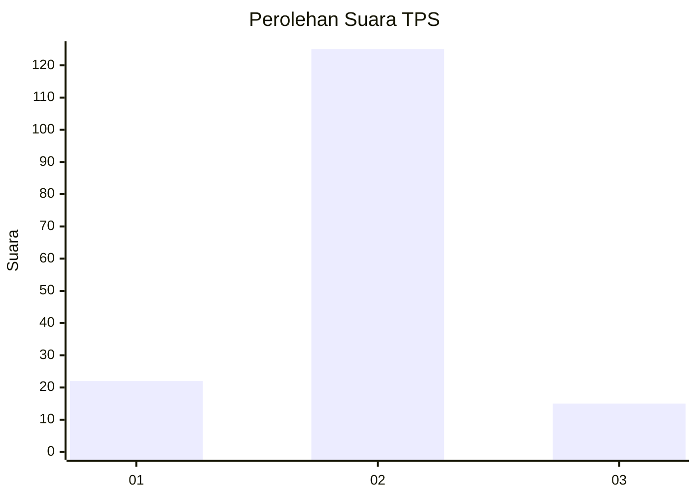
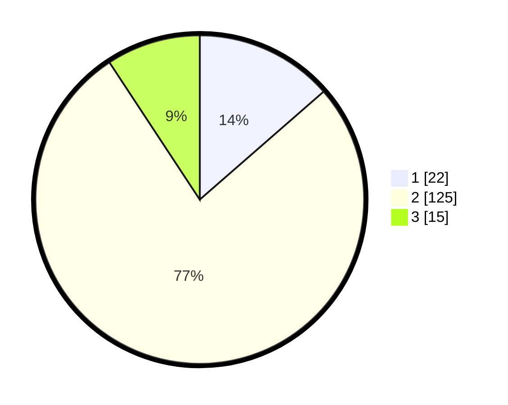

# Hasil

## Grafik

## Tabel

| No. | Nama Paslon    | Suara | Suara (raw) | Persentase |
|:--- |:-------------- | -----:| -----------:| ----------:|
| 1   | ANIES MUHAIMIN | 22    | [22][p-1]   | 13,58      |
| 2   | PRABOWO GIBRAN | 125   | [125][p-2]  | 77,16      |
| 3   | GANJAR MAHFUD  | 15    | [15][p-3]   | 9,26       |

[p-1]: https://github.com/gigit-pemilu/pemilu-2024-35-jawa-timur/blob/main/pilpres/hitung-suara/sub/35-jawa-timur/sub/09-jember/sub/17-ajung/sub/2001-sukamakmur/sub/037-tps/sub/paslon-1.txt
[p-2]: https://github.com/gigit-pemilu/pemilu-2024-35-jawa-timur/blob/main/pilpres/hitung-suara/sub/35-jawa-timur/sub/09-jember/sub/17-ajung/sub/2001-sukamakmur/sub/037-tps/sub/paslon-2.txt
[p-3]: https://github.com/gigit-pemilu/pemilu-2024-35-jawa-timur/blob/main/pilpres/hitung-suara/sub/35-jawa-timur/sub/09-jember/sub/17-ajung/sub/2001-sukamakmur/sub/037-tps/sub/paslon-3.txt

## Foto C Plano

https://sirekap-obj-formc.kpu.go.id/e06b/pemilu/ppwp/35/09/17/20/01/3509172001037-20240214-214138--32f55472-d818-4fcf-952d-1dfdf90f4a9f.jpg

https://sirekap-obj-formc.kpu.go.id/e06b/pemilu/ppwp/35/09/17/20/01/3509172001037-20240214-214301--ce027492-93db-4a76-9df8-e0a64600f338.jpg

https://sirekap-obj-formc.kpu.go.id/e06b/pemilu/ppwp/35/09/17/20/01/3509172001037-20240214-214407--c81f5f50-04b8-4b2c-9e9c-2367dbb1d143.jpg

## Metadata

| Key        | Value               |
| ---------- | ------------------- |
| Time Stamp | 2024-02-15 15:00:29 |

