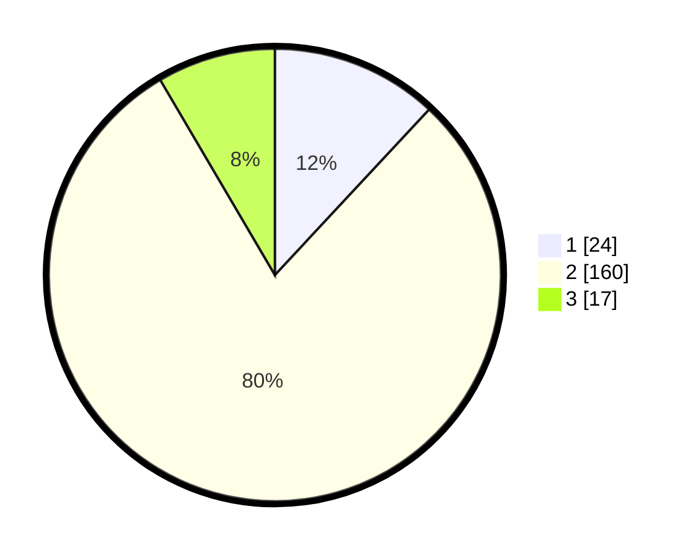

# Hasil

## Grafik

## Tabel

| No. | Nama Paslon    | Suara | Suara (raw) | Persentase |
|:--- |:-------------- | -----:| -----------:| ----------:|
| 1   | ANIES MUHAIMIN | 24    | [24][p-1]   | 11,94      |
| 2   | PRABOWO GIBRAN | 160   | [160][p-2]  | 79,60      |
| 3   | GANJAR MAHFUD  | 17    | [17][p-3]   | 8,46       |

[p-1]: https://github.com/gigit-pemilu/pemilu-2024-35-jawa-timur/blob/main/pilpres/hitung-suara/sub/35-jawa-timur/sub/09-jember/sub/17-ajung/sub/2002-mangaran/sub/006-tps/sub/paslon-1.txt
[p-2]: https://github.com/gigit-pemilu/pemilu-2024-35-jawa-timur/blob/main/pilpres/hitung-suara/sub/35-jawa-timur/sub/09-jember/sub/17-ajung/sub/2002-mangaran/sub/006-tps/sub/paslon-2.txt
[p-3]: https://github.com/gigit-pemilu/pemilu-2024-35-jawa-timur/blob/main/pilpres/hitung-suara/sub/35-jawa-timur/sub/09-jember/sub/17-ajung/sub/2002-mangaran/sub/006-tps/sub/paslon-3.txt

## Foto C Plano

https://sirekap-obj-formc.kpu.go.id/5aab/pemilu/ppwp/35/09/17/20/02/3509172002006-20240215-033831--6689258a-3f42-4cd0-9f46-53e005853e6d.jpg

https://sirekap-obj-formc.kpu.go.id/5aab/pemilu/ppwp/35/09/17/20/02/3509172002006-20240215-021641--645e467e-a30d-4007-be85-327a2c897460.jpg

https://sirekap-obj-formc.kpu.go.id/5aab/pemilu/ppwp/35/09/17/20/02/3509172002006-20240215-021831--5e625cff-0e65-4163-bbd0-c8e38cfb2553.jpg

## Metadata

| Key        | Value               |
| ---------- | ------------------- |
| Time Stamp | 2024-02-15 21:01:18 |

