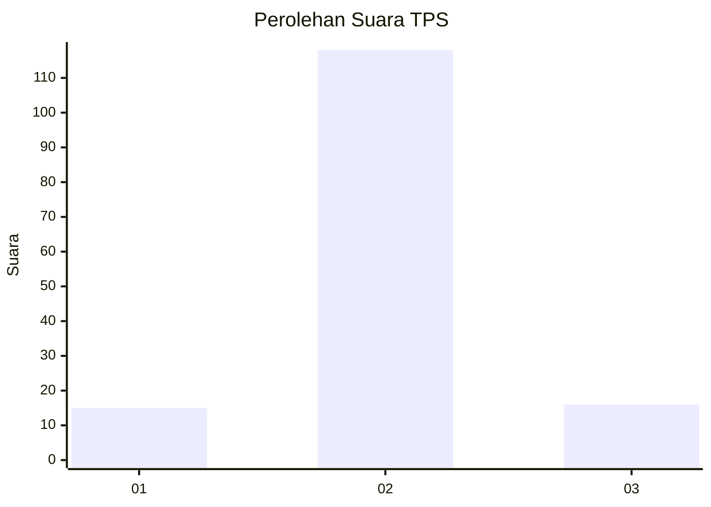
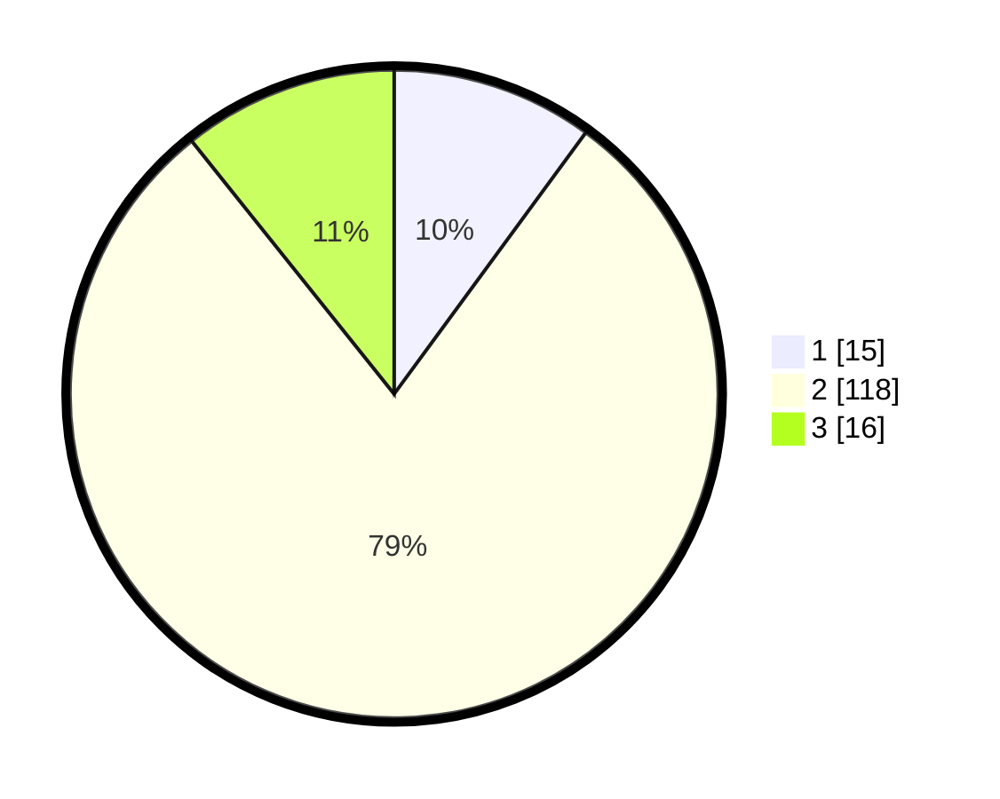

# Hasil

## Grafik

## Tabel

| No. | Nama Paslon    | Suara | Suara (raw) | Persentase |
|:--- |:-------------- | -----:| -----------:| ----------:|
| 1   | ANIES MUHAIMIN | 15    | [15][p-1]   | 10,07      |
| 2   | PRABOWO GIBRAN | 118   | [118][p-2]  | 79,19      |
| 3   | GANJAR MAHFUD  | 16    | [16][p-3]   | 10,74      |

[p-1]: https://github.com/gigit-pemilu/pemilu-2024/blob/main/pilpres/hitung-suara/sub/35-jawa-timur/sub/09-jember/sub/17-ajung/sub/2002-mangaran/sub/008-tps/sub/paslon-1.txt
[p-2]: https://github.com/gigit-pemilu/pemilu-2024/blob/main/pilpres/hitung-suara/sub/35-jawa-timur/sub/09-jember/sub/17-ajung/sub/2002-mangaran/sub/008-tps/sub/paslon-2.txt
[p-3]: https://github.com/gigit-pemilu/pemilu-2024/blob/main/pilpres/hitung-suara/sub/35-jawa-timur/sub/09-jember/sub/17-ajung/sub/2002-mangaran/sub/008-tps/sub/paslon-3.txt

## Foto C Plano

https://sirekap-obj-formc.kpu.go.id/dc89/pemilu/ppwp/35/09/17/20/02/3509172002008-20240214-234553--6d271cc9-2185-4c52-ae9d-46e5e4c1fc62.jpg

https://sirekap-obj-formc.kpu.go.id/dc89/pemilu/ppwp/35/09/17/20/02/3509172002008-20240214-234645--92df1c16-1f8b-4881-938f-6b5aae540383.jpg

https://sirekap-obj-formc.kpu.go.id/dc89/pemilu/ppwp/35/09/17/20/02/3509172002008-20240214-234746--e6ba1b8c-c85a-42d2-a550-dcfd6b4e488d.jpg

## Metadata

| Key        | Value               |
| ---------- | ------------------- |
| Time Stamp | 2024-02-15 21:01:18 |

