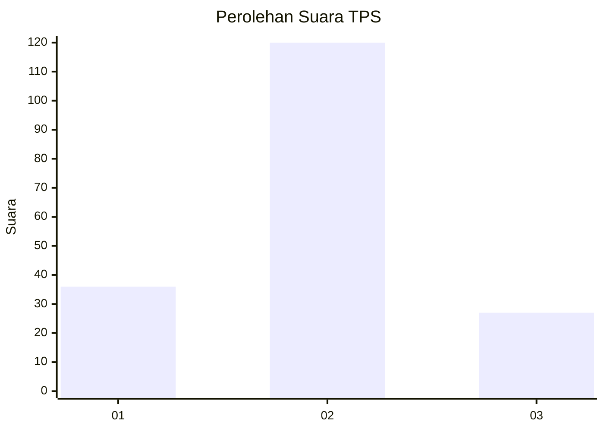
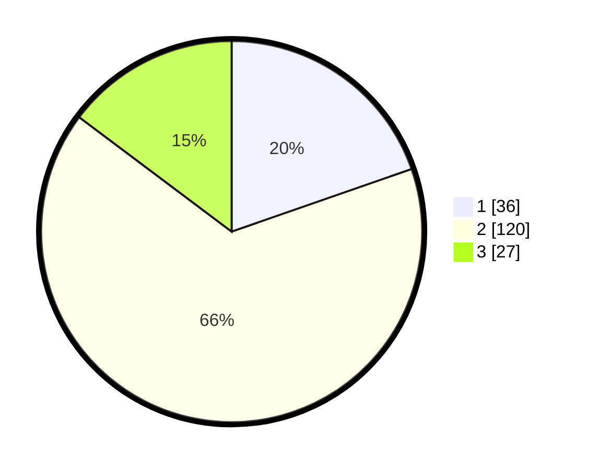

# Hasil

## Grafik

## Tabel

| No. | Nama Paslon    | Suara | Suara (raw) | Persentase |
|:--- |:-------------- | -----:| -----------:| ----------:|
| 1   | ANIES MUHAIMIN | 36    | [36][p-1]   | 19,67      |
| 2   | PRABOWO GIBRAN | 120   | [120][p-2]  | 65,57      |
| 3   | GANJAR MAHFUD  | 27    | [27][p-3]   | 14,75      |

[p-1]: https://github.com/gigit-pemilu/pemilu-2024/blob/main/pilpres/hitung-suara/sub/35-jawa-timur/sub/09-jember/sub/17-ajung/sub/2002-mangaran/sub/016-tps/sub/paslon-1.txt
[p-2]: https://github.com/gigit-pemilu/pemilu-2024/blob/main/pilpres/hitung-suara/sub/35-jawa-timur/sub/09-jember/sub/17-ajung/sub/2002-mangaran/sub/016-tps/sub/paslon-2.txt
[p-3]: https://github.com/gigit-pemilu/pemilu-2024/blob/main/pilpres/hitung-suara/sub/35-jawa-timur/sub/09-jember/sub/17-ajung/sub/2002-mangaran/sub/016-tps/sub/paslon-3.txt

## Foto C Plano

https://sirekap-obj-formc.kpu.go.id/32d9/pemilu/ppwp/35/09/17/20/02/3509172002016-20240215-030834--6c2e887b-377b-4c26-a328-0994ca4f6fc9.jpg

https://sirekap-obj-formc.kpu.go.id/32d9/pemilu/ppwp/35/09/17/20/02/3509172002016-20240215-030926--64e8f03f-52a4-41df-b70d-631d03e4eb8b.jpg

https://sirekap-obj-formc.kpu.go.id/32d9/pemilu/ppwp/35/09/17/20/02/3509172002016-20240217-193705--3af3cbc8-7cbc-4b31-91a7-68000d7ec3f0.jpg

## Metadata

| Key        | Value               |
| ---------- | ------------------- |
| Time Stamp | 2024-02-19 06:16:00 |

