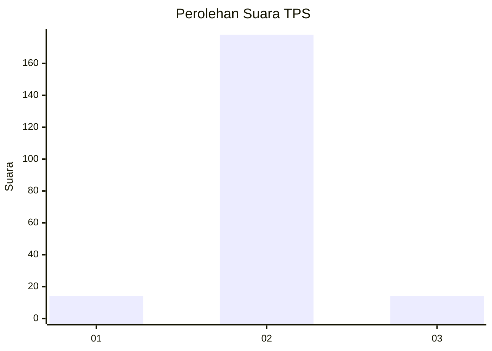
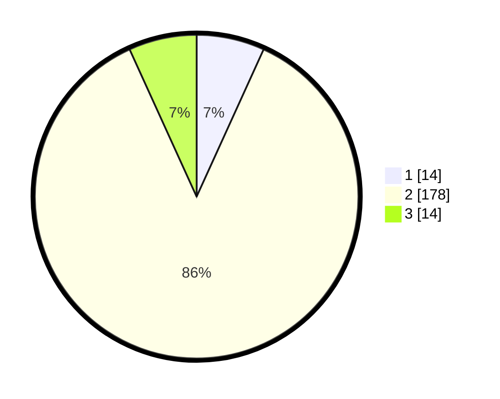

# Hasil

## Grafik

## Tabel

| No. | Nama Paslon    | Suara | Suara (raw) | Persentase |
|:--- |:-------------- | -----:| -----------:| ----------:|
| 1   | ANIES MUHAIMIN | 14    | [14][p-1]   | 6,80       |
| 2   | PRABOWO GIBRAN | 178   | [178][p-2]  | 86,41      |
| 3   | GANJAR MAHFUD  | 14    | [14][p-3]   | 6,80       |

[p-1]: https://github.com/gigit-pemilu/pemilu-2024/blob/main/pilpres/hitung-suara/sub/35-jawa-timur/sub/09-jember/sub/17-ajung/sub/2002-mangaran/sub/022-tps/sub/paslon-1.txt
[p-2]: https://github.com/gigit-pemilu/pemilu-2024/blob/main/pilpres/hitung-suara/sub/35-jawa-timur/sub/09-jember/sub/17-ajung/sub/2002-mangaran/sub/022-tps/sub/paslon-2.txt
[p-3]: https://github.com/gigit-pemilu/pemilu-2024/blob/main/pilpres/hitung-suara/sub/35-jawa-timur/sub/09-jember/sub/17-ajung/sub/2002-mangaran/sub/022-tps/sub/paslon-3.txt

## Foto C Plano

https://sirekap-obj-formc.kpu.go.id/f96a/pemilu/ppwp/35/09/17/20/02/3509172002022-20240218-110449--8608ad19-4675-4ee8-805b-47775bf02670.jpg

https://sirekap-obj-formc.kpu.go.id/f96a/pemilu/ppwp/35/09/17/20/02/3509172002022-20240218-110551--e6b61f23-8c5a-432b-914a-536094a206ce.jpg

https://sirekap-obj-formc.kpu.go.id/f96a/pemilu/ppwp/35/09/17/20/02/3509172002022-20240218-110626--002d642b-f949-47ef-835d-99284308cb44.jpg

## Metadata

| Key        | Value               |
| ---------- | ------------------- |
| Time Stamp | 2024-02-25 15:00:00 |

