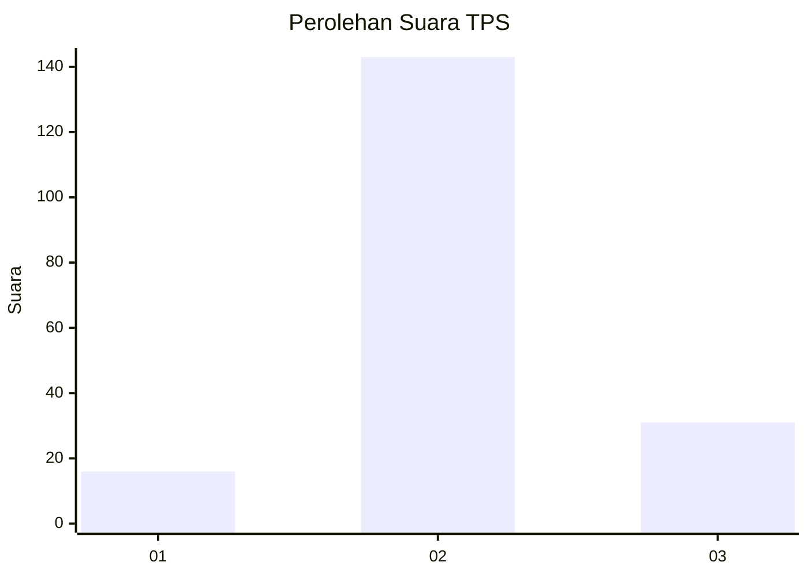
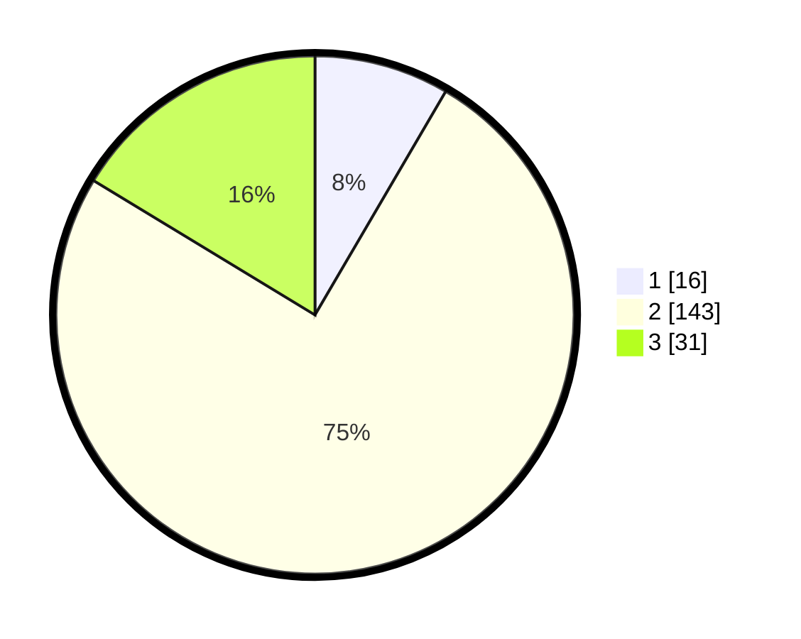

# Hasil

## Grafik

## Tabel

| No. | Nama Paslon    | Suara | Suara (raw) | Persentase |
|:--- |:-------------- | -----:| -----------:| ----------:|
| 1   | ANIES MUHAIMIN | 16    | [16][p-1]   | 8,42       |
| 2   | PRABOWO GIBRAN | 143   | [143][p-2]  | 75,26      |
| 3   | GANJAR MAHFUD  | 31    | [31][p-3]   | 16,32      |

[p-1]: https://github.com/gigit-pemilu/pemilu-2024/blob/main/pilpres/hitung-suara/sub/35-jawa-timur/sub/09-jember/sub/17-ajung/sub/2002-mangaran/sub/024-tps/sub/paslon-1.txt
[p-2]: https://github.com/gigit-pemilu/pemilu-2024/blob/main/pilpres/hitung-suara/sub/35-jawa-timur/sub/09-jember/sub/17-ajung/sub/2002-mangaran/sub/024-tps/sub/paslon-2.txt
[p-3]: https://github.com/gigit-pemilu/pemilu-2024/blob/main/pilpres/hitung-suara/sub/35-jawa-timur/sub/09-jember/sub/17-ajung/sub/2002-mangaran/sub/024-tps/sub/paslon-3.txt

## Foto C Plano

https://sirekap-obj-formc.kpu.go.id/f32f/pemilu/ppwp/35/09/17/20/02/3509172002024-20240215-013818--4188fa94-21c6-43b9-a364-fcd7f12d2cd2.jpg

https://sirekap-obj-formc.kpu.go.id/f32f/pemilu/ppwp/35/09/17/20/02/3509172002024-20240215-013921--a317f566-0338-4fbd-a555-03f2a1726d0d.jpg

https://sirekap-obj-formc.kpu.go.id/f32f/pemilu/ppwp/35/09/17/20/02/3509172002024-20240215-014050--0d61a453-7465-4c69-8d7d-e17f6c0e1c88.jpg

## Metadata

| Key        | Value               |
| ---------- | ------------------- |
| Time Stamp | 2024-02-15 15:00:29 |

