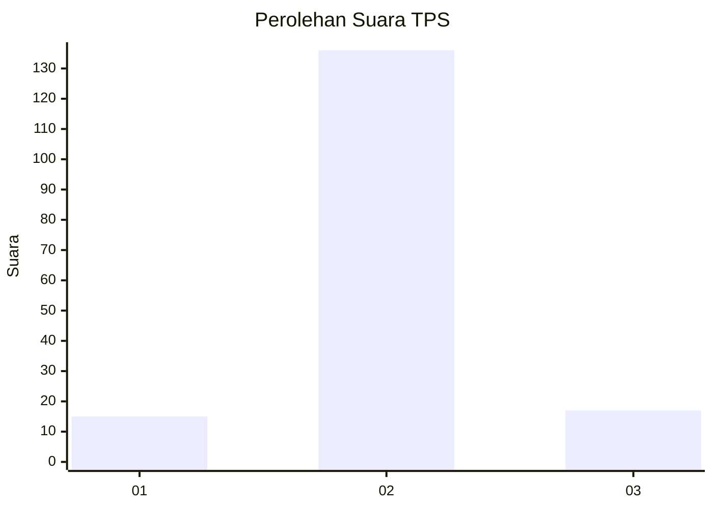
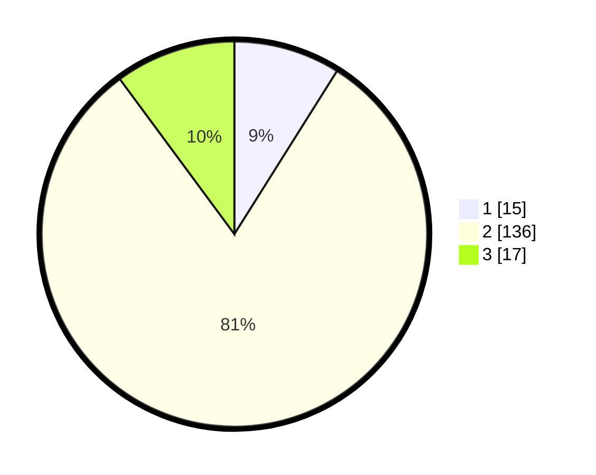

# Hasil

## Grafik

## Tabel

| No. | Nama Paslon    | Suara | Suara (raw) | Persentase |
|:--- |:-------------- | -----:| -----------:| ----------:|
| 1   | ANIES MUHAIMIN | 15    | [15][p-1]   | 8,93       |
| 2   | PRABOWO GIBRAN | 136   | [136][p-2]  | 80,95      |
| 3   | GANJAR MAHFUD  | 17    | [17][p-3]   | 10,12      |

[p-1]: https://github.com/gigit-pemilu/pemilu-2024/blob/main/pilpres/hitung-suara/sub/35-jawa-timur/sub/09-jember/sub/17-ajung/sub/2002-mangaran/sub/038-tps/sub/paslon-1.txt
[p-2]: https://github.com/gigit-pemilu/pemilu-2024/blob/main/pilpres/hitung-suara/sub/35-jawa-timur/sub/09-jember/sub/17-ajung/sub/2002-mangaran/sub/038-tps/sub/paslon-2.txt
[p-3]: https://github.com/gigit-pemilu/pemilu-2024/blob/main/pilpres/hitung-suara/sub/35-jawa-timur/sub/09-jember/sub/17-ajung/sub/2002-mangaran/sub/038-tps/sub/paslon-3.txt

## Foto C Plano

https://sirekap-obj-formc.kpu.go.id/859d/pemilu/ppwp/35/09/17/20/02/3509172002038-20240214-211600--1794a76e-a860-484f-b04f-0b2d1a1ac90a.jpg

https://sirekap-obj-formc.kpu.go.id/859d/pemilu/ppwp/35/09/17/20/02/3509172002038-20240214-211655--6573029a-b80f-48ef-ad98-7f848de5e274.jpg

https://sirekap-obj-formc.kpu.go.id/859d/pemilu/ppwp/35/09/17/20/02/3509172002038-20240214-211812--35e20d66-a1a2-421c-8e5e-81b994dd389d.jpg

## Metadata

| Key        | Value               |
| ---------- | ------------------- |
| Time Stamp | 2024-02-15 12:00:28 |

