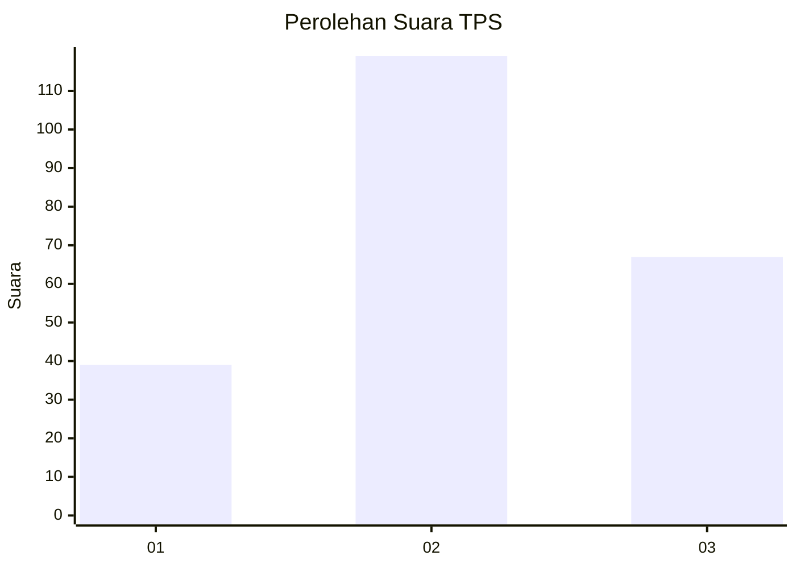
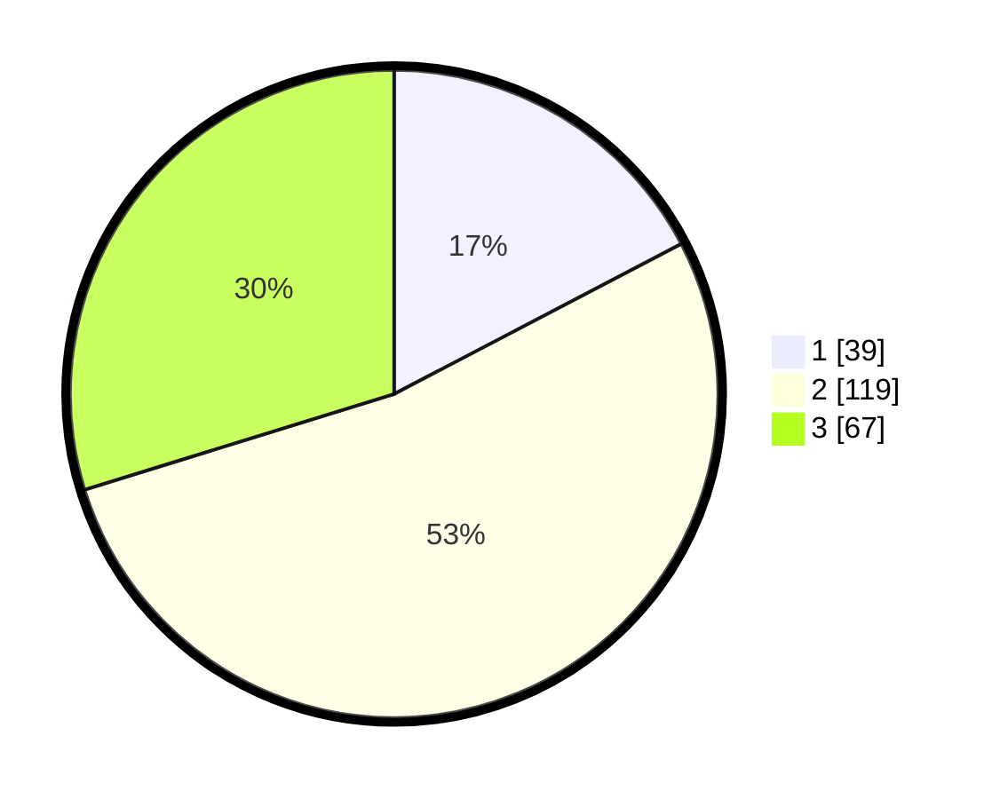

# Hasil

## Grafik

## Tabel

| No. | Nama Paslon    | Suara | Suara (raw) | Persentase |
|:--- |:-------------- | -----:| -----------:| ----------:|
| 1   | ANIES MUHAIMIN | 39    | [39][p-1]   | 17,33      |
| 2   | PRABOWO GIBRAN | 119   | [119][p-2]  | 52,89      |
| 3   | GANJAR MAHFUD  | 67    | [67][p-3]   | 29,78      |

[p-1]: https://github.com/gigit-pemilu/pemilu-2024/blob/main/pilpres/hitung-suara/sub/35-jawa-timur/sub/09-jember/sub/17-ajung/sub/2003-pancakarya/sub/005-tps/sub/paslon-1.txt
[p-2]: https://github.com/gigit-pemilu/pemilu-2024/blob/main/pilpres/hitung-suara/sub/35-jawa-timur/sub/09-jember/sub/17-ajung/sub/2003-pancakarya/sub/005-tps/sub/paslon-2.txt
[p-3]: https://github.com/gigit-pemilu/pemilu-2024/blob/main/pilpres/hitung-suara/sub/35-jawa-timur/sub/09-jember/sub/17-ajung/sub/2003-pancakarya/sub/005-tps/sub/paslon-3.txt

## Foto C Plano

https://sirekap-obj-formc.kpu.go.id/6495/pemilu/ppwp/35/09/17/20/03/3509172003005-20240218-110559--dca05f67-7412-485b-b307-d36ebca8ada0.jpg

https://sirekap-obj-formc.kpu.go.id/6495/pemilu/ppwp/35/09/17/20/03/3509172003005-20240218-110654--0ea6890f-1ae8-4888-9e1d-3a410f2221d7.jpg

https://sirekap-obj-formc.kpu.go.id/6495/pemilu/ppwp/35/09/17/20/03/3509172003005-20240218-110729--d95e91f0-d219-4e01-92fc-a03de1eac553.jpg

## Metadata

| Key        | Value               |
| ---------- | ------------------- |
| Time Stamp | 2024-02-25 16:00:00 |

