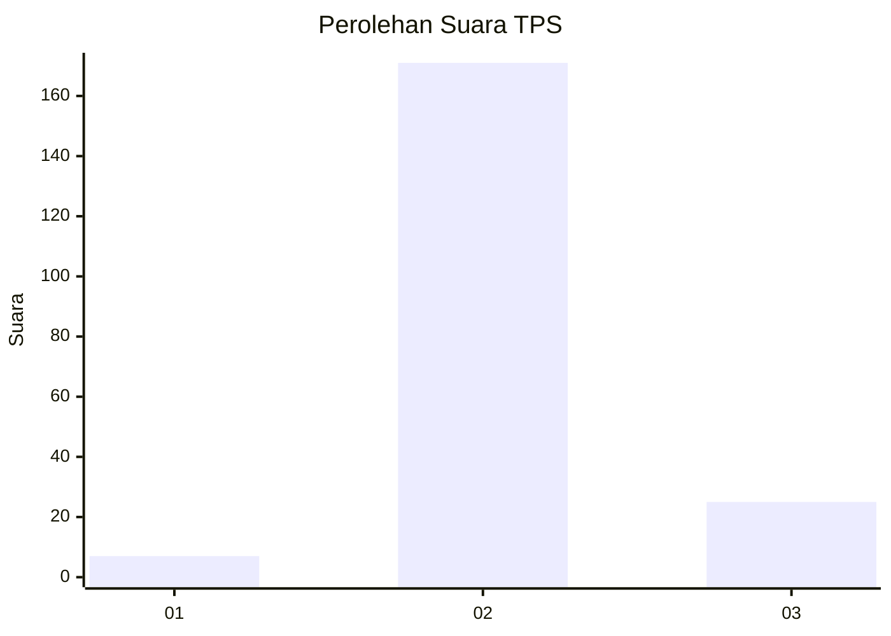
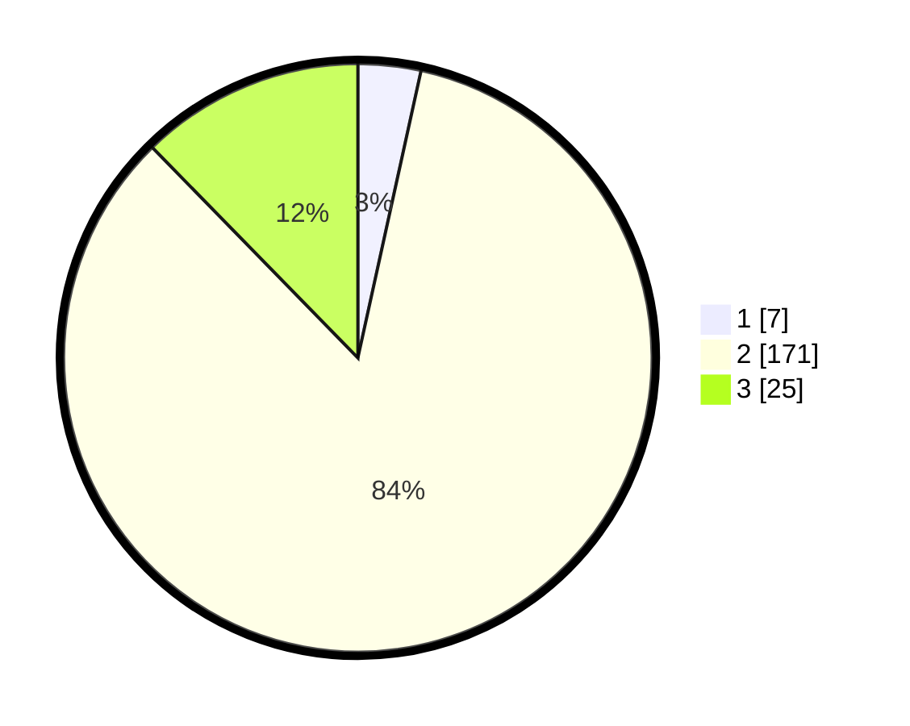

# Hasil

## Grafik

## Tabel

| No. | Nama Paslon    | Suara | Suara (raw) | Persentase |
|:--- |:-------------- | -----:| -----------:| ----------:|
| 1   | ANIES MUHAIMIN | 7     | [7][p-1]    | 3,45       |
| 2   | PRABOWO GIBRAN | 171   | [171][p-2]  | 84,24      |
| 3   | GANJAR MAHFUD  | 25    | [25][p-3]   | 12,32      |

[p-1]: https://github.com/gigit-pemilu/pemilu-2024/blob/main/pilpres/hitung-suara/sub/35-jawa-timur/sub/09-jember/sub/17-ajung/sub/2003-pancakarya/sub/013-tps/sub/paslon-1.txt
[p-2]: https://github.com/gigit-pemilu/pemilu-2024/blob/main/pilpres/hitung-suara/sub/35-jawa-timur/sub/09-jember/sub/17-ajung/sub/2003-pancakarya/sub/013-tps/sub/paslon-2.txt
[p-3]: https://github.com/gigit-pemilu/pemilu-2024/blob/main/pilpres/hitung-suara/sub/35-jawa-timur/sub/09-jember/sub/17-ajung/sub/2003-pancakarya/sub/013-tps/sub/paslon-3.txt

## Foto C Plano

https://sirekap-obj-formc.kpu.go.id/28f3/pemilu/ppwp/35/09/17/20/03/3509172003013-20240214-210115--8cba65da-0029-4ca6-955f-263b69e3a8c5.jpg

https://sirekap-obj-formc.kpu.go.id/28f3/pemilu/ppwp/35/09/17/20/03/3509172003013-20240214-210501--2b493f17-7129-47eb-a691-04ce7733b3a4.jpg

https://sirekap-obj-formc.kpu.go.id/28f3/pemilu/ppwp/35/09/17/20/03/3509172003013-20240214-210634--0fb8809e-5939-4ab4-80d6-f81aa962d527.jpg

## Metadata

| Key        | Value               |
| ---------- | ------------------- |
| Time Stamp | 2024-02-15 15:00:29 |

