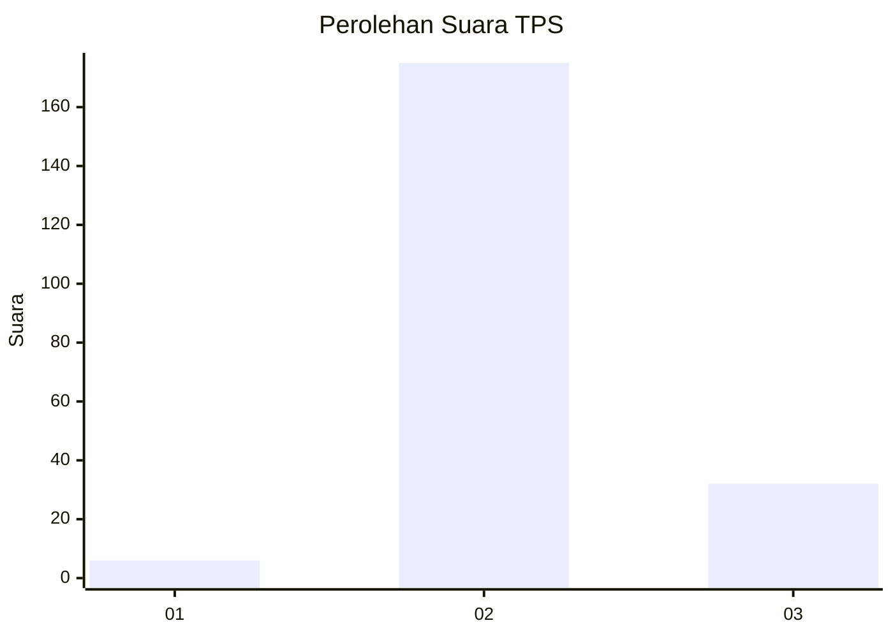
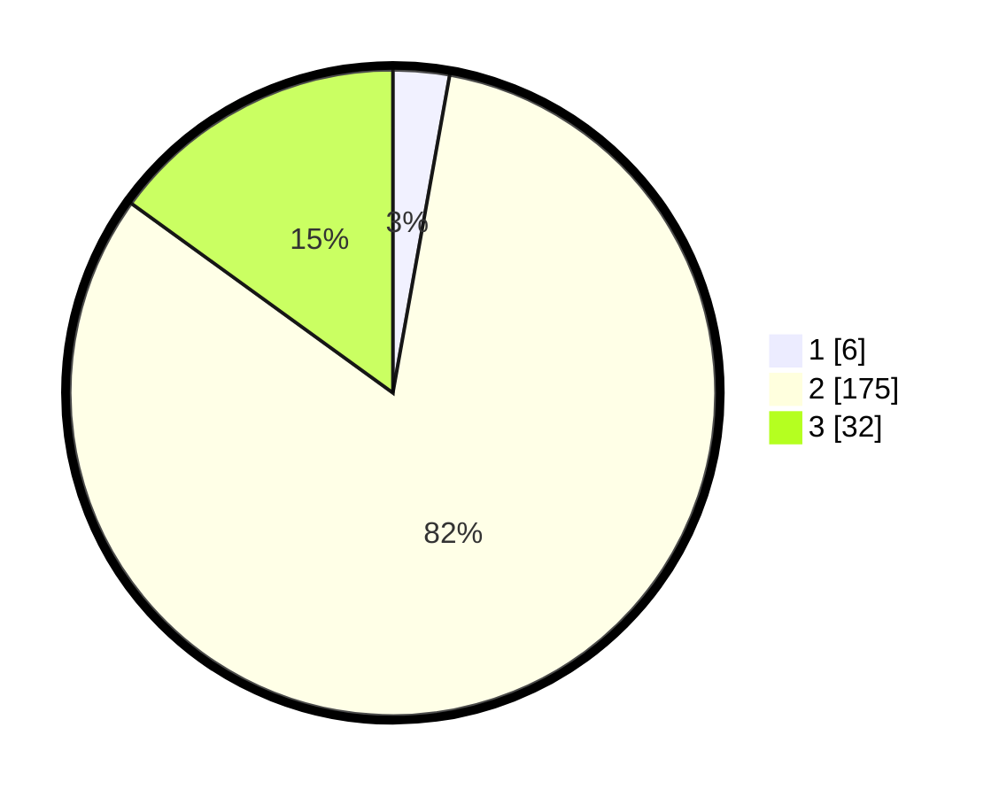

# Hasil

## Grafik

## Tabel

| No. | Nama Paslon    | Suara | Suara (raw) | Persentase |
|:--- |:-------------- | -----:| -----------:| ----------:|
| 1   | ANIES MUHAIMIN | 6     | [6][p-1]    | 2,82       |
| 2   | PRABOWO GIBRAN | 175   | [175][p-2]  | 82,16      |
| 3   | GANJAR MAHFUD  | 32    | [32][p-3]   | 15,02      |

[p-1]: https://github.com/gigit-pemilu/pemilu-2024/blob/main/pilpres/hitung-suara/sub/35-jawa-timur/sub/09-jember/sub/17-ajung/sub/2003-pancakarya/sub/014-tps/sub/paslon-1.txt
[p-2]: https://github.com/gigit-pemilu/pemilu-2024/blob/main/pilpres/hitung-suara/sub/35-jawa-timur/sub/09-jember/sub/17-ajung/sub/2003-pancakarya/sub/014-tps/sub/paslon-2.txt
[p-3]: https://github.com/gigit-pemilu/pemilu-2024/blob/main/pilpres/hitung-suara/sub/35-jawa-timur/sub/09-jember/sub/17-ajung/sub/2003-pancakarya/sub/014-tps/sub/paslon-3.txt

## Foto C Plano

https://sirekap-obj-formc.kpu.go.id/b56f/pemilu/ppwp/35/09/17/20/03/3509172003014-20240214-203902--e26b61eb-d609-413c-9244-6c39fa006d41.jpg

https://sirekap-obj-formc.kpu.go.id/b56f/pemilu/ppwp/35/09/17/20/03/3509172003014-20240214-204024--35672dc8-26f7-48cf-ae13-d4cf0cea35c0.jpg

https://sirekap-obj-formc.kpu.go.id/b56f/pemilu/ppwp/35/09/17/20/03/3509172003014-20240214-204238--b6704dc4-003c-4b61-ab5e-4fc9ecc16192.jpg

## Metadata

| Key        | Value               |
| ---------- | ------------------- |
| Time Stamp | 2024-02-21 17:00:00 |

