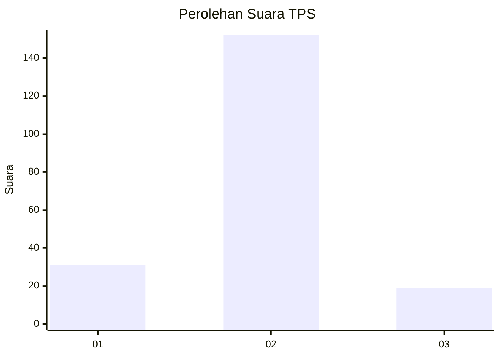
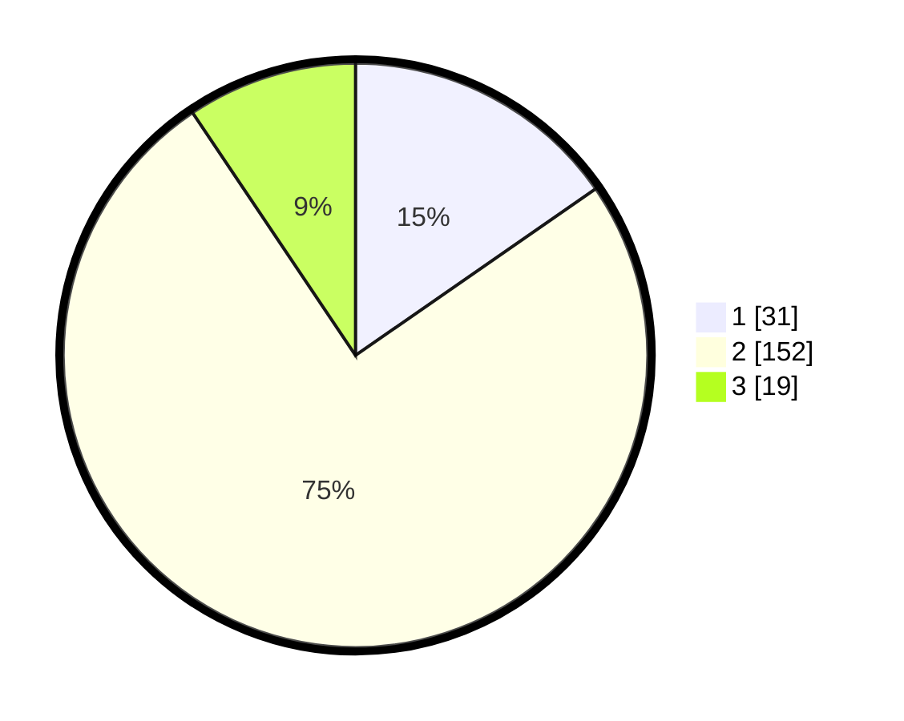

# Hasil

## Grafik

## Tabel

| No. | Nama Paslon    | Suara | Suara (raw) | Persentase |
|:--- |:-------------- | -----:| -----------:| ----------:|
| 1   | ANIES MUHAIMIN | 31    | [31][p-1]   | 15,35      |
| 2   | PRABOWO GIBRAN | 152   | [152][p-2]  | 75,25      |
| 3   | GANJAR MAHFUD  | 19    | [19][p-3]   | 9,41       |

[p-1]: https://github.com/gigit-pemilu/pemilu-2024/blob/main/pilpres/hitung-suara/sub/35-jawa-timur/sub/09-jember/sub/17-ajung/sub/2003-pancakarya/sub/021-tps/sub/paslon-1.txt
[p-2]: https://github.com/gigit-pemilu/pemilu-2024/blob/main/pilpres/hitung-suara/sub/35-jawa-timur/sub/09-jember/sub/17-ajung/sub/2003-pancakarya/sub/021-tps/sub/paslon-2.txt
[p-3]: https://github.com/gigit-pemilu/pemilu-2024/blob/main/pilpres/hitung-suara/sub/35-jawa-timur/sub/09-jember/sub/17-ajung/sub/2003-pancakarya/sub/021-tps/sub/paslon-3.txt

## Foto C Plano

https://sirekap-obj-formc.kpu.go.id/a2c5/pemilu/ppwp/35/09/17/20/03/3509172003021-20240215-005006--29f4e218-d0d7-4f52-93e6-7d632eee2193.jpg

https://sirekap-obj-formc.kpu.go.id/a2c5/pemilu/ppwp/35/09/17/20/03/3509172003021-20240215-005145--3f32d6e7-b48f-4d01-b24b-1b79df7a57b0.jpg

https://sirekap-obj-formc.kpu.go.id/a2c5/pemilu/ppwp/35/09/17/20/03/3509172003021-20240215-005320--9f875653-a0de-4d74-bd4b-ded220400914.jpg

## Metadata

| Key        | Value               |
| ---------- | ------------------- |
| Time Stamp | 2024-02-15 12:00:28 |

