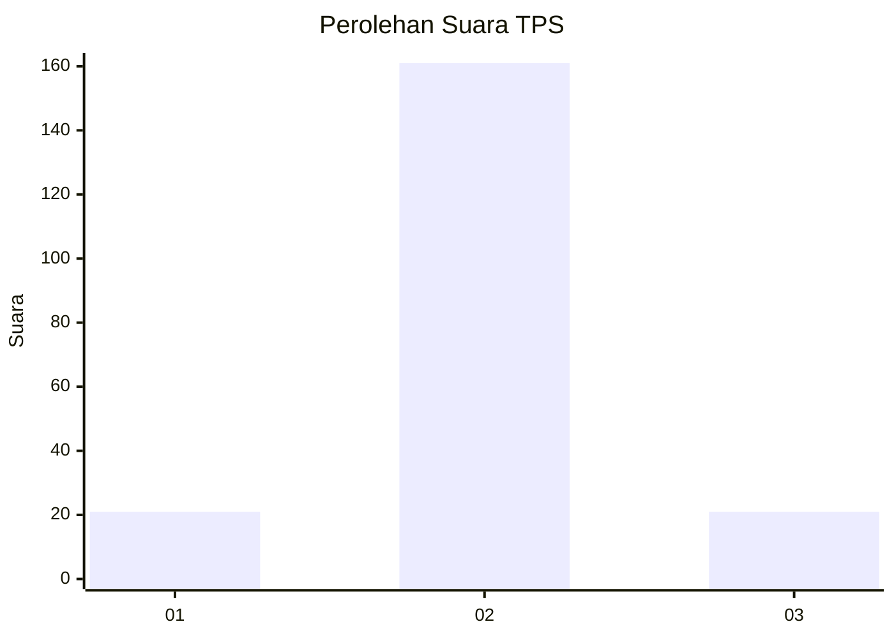
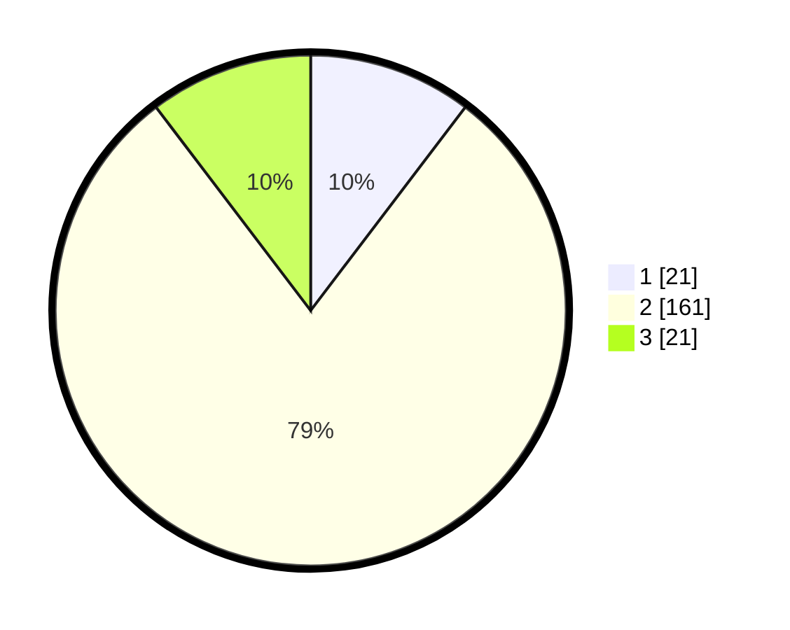

# Hasil

## Grafik

## Tabel

| No. | Nama Paslon    | Suara | Suara (raw) | Persentase |
|:--- |:-------------- | -----:| -----------:| ----------:|
| 1   | ANIES MUHAIMIN | 21    | [21][p-1]   | 10,34      |
| 2   | PRABOWO GIBRAN | 161   | [161][p-2]  | 79,31      |
| 3   | GANJAR MAHFUD  | 21    | [21][p-3]   | 10,34      |

[p-1]: https://github.com/gigit-pemilu/pemilu-2024/blob/main/pilpres/hitung-suara/sub/35-jawa-timur/sub/09-jember/sub/17-ajung/sub/2003-pancakarya/sub/028-tps/sub/paslon-1.txt
[p-2]: https://github.com/gigit-pemilu/pemilu-2024/blob/main/pilpres/hitung-suara/sub/35-jawa-timur/sub/09-jember/sub/17-ajung/sub/2003-pancakarya/sub/028-tps/sub/paslon-2.txt
[p-3]: https://github.com/gigit-pemilu/pemilu-2024/blob/main/pilpres/hitung-suara/sub/35-jawa-timur/sub/09-jember/sub/17-ajung/sub/2003-pancakarya/sub/028-tps/sub/paslon-3.txt

## Foto C Plano

https://sirekap-obj-formc.kpu.go.id/8ad6/pemilu/ppwp/35/09/17/20/03/3509172003028-20240214-224417--44f0b73d-df02-4aea-b6b9-4ba2a2f75096.jpg

https://sirekap-obj-formc.kpu.go.id/8ad6/pemilu/ppwp/35/09/17/20/03/3509172003028-20240214-224454--3cbc7205-c6f0-4435-a4c7-b777e20b8c68.jpg

https://sirekap-obj-formc.kpu.go.id/8ad6/pemilu/ppwp/35/09/17/20/03/3509172003028-20240214-224553--3afb0c56-c423-4288-9db2-603c6c8f8120.jpg

## Metadata

| Key        | Value               |
| ---------- | ------------------- |
| Time Stamp | 2024-02-15 15:00:29 |

