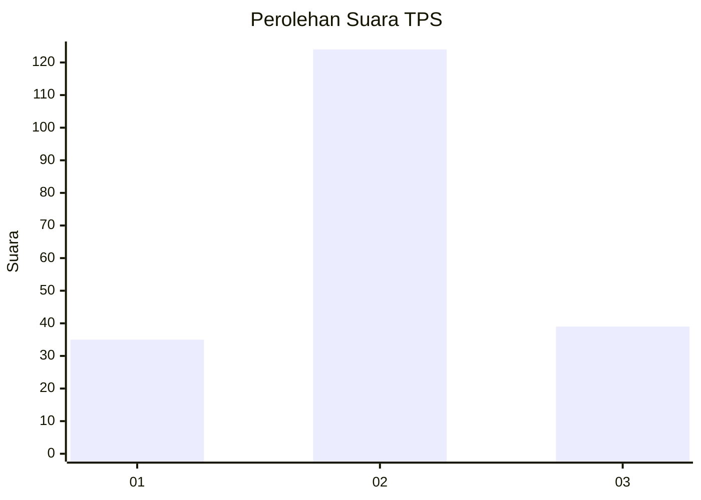
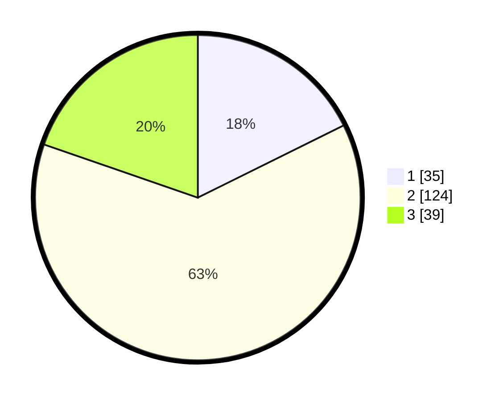

# Hasil

## Grafik

## Tabel

| No. | Nama Paslon    | Suara | Suara (raw) | Persentase |
|:--- |:-------------- | -----:| -----------:| ----------:|
| 1   | ANIES MUHAIMIN | 35    | [35][p-1]   | 17,68      |
| 2   | PRABOWO GIBRAN | 124   | [124][p-2]  | 62,63      |
| 3   | GANJAR MAHFUD  | 39    | [39][p-3]   | 19,70      |

[p-1]: https://github.com/gigit-pemilu/pemilu-2024-35-jawa-timur/blob/main/pilpres/hitung-suara/sub/35-jawa-timur/sub/09-jember/sub/17-ajung/sub/2004-ajung/sub/003-tps/sub/paslon-1.txt
[p-2]: https://github.com/gigit-pemilu/pemilu-2024-35-jawa-timur/blob/main/pilpres/hitung-suara/sub/35-jawa-timur/sub/09-jember/sub/17-ajung/sub/2004-ajung/sub/003-tps/sub/paslon-2.txt
[p-3]: https://github.com/gigit-pemilu/pemilu-2024-35-jawa-timur/blob/main/pilpres/hitung-suara/sub/35-jawa-timur/sub/09-jember/sub/17-ajung/sub/2004-ajung/sub/003-tps/sub/paslon-3.txt

## Foto C Plano

https://sirekap-obj-formc.kpu.go.id/a4a1/pemilu/ppwp/35/09/17/20/04/3509172004003-20240217-151102--b720fdec-5287-4056-ac5f-d92e0bf1c88b.jpg

https://sirekap-obj-formc.kpu.go.id/a4a1/pemilu/ppwp/35/09/17/20/04/3509172004003-20240217-151815--8d4c8a0f-49c3-4f71-80cd-c9474760d08b.jpg

https://sirekap-obj-formc.kpu.go.id/a4a1/pemilu/ppwp/35/09/17/20/04/3509172004003-20240217-152017--a041ee16-9cf6-4d6e-b2a1-23efbb2e51bb.jpg

## Metadata

| Key        | Value               |
| ---------- | ------------------- |
| Time Stamp | 2024-02-25 12:00:00 |

