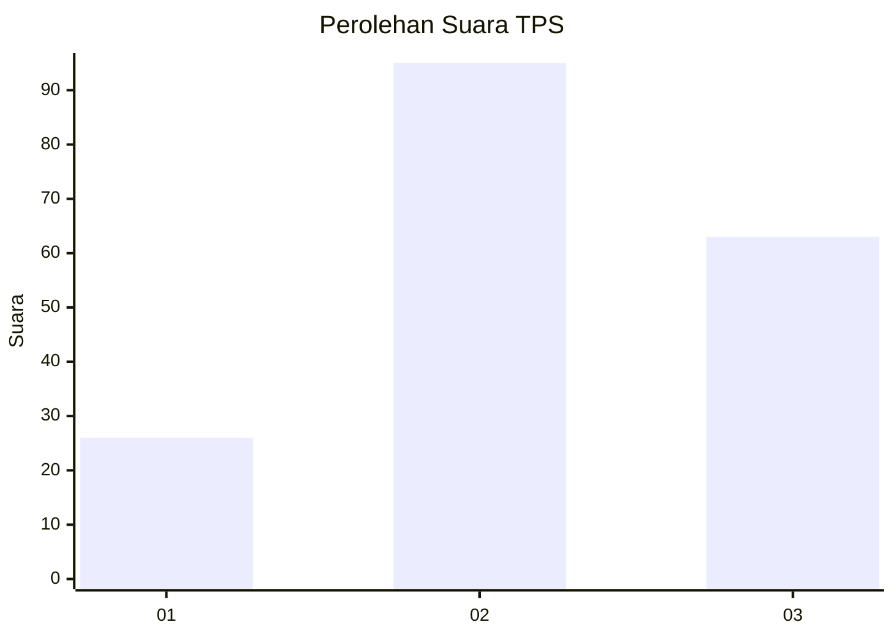
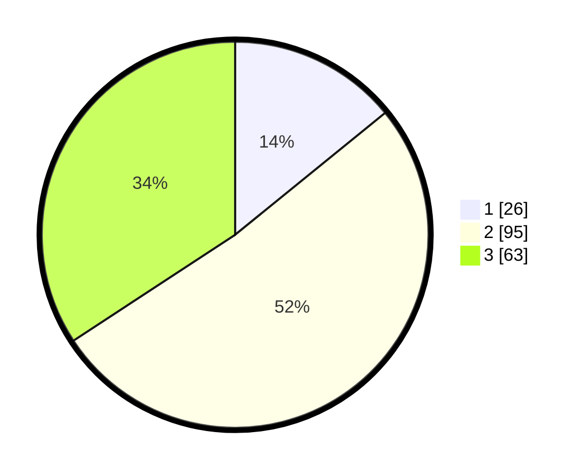

# Hasil

## Grafik

## Tabel

| No. | Nama Paslon    | Suara | Suara (raw) | Persentase |
|:--- |:-------------- | -----:| -----------:| ----------:|
| 1   | ANIES MUHAIMIN | 26    | [26][p-1]   | 14,13      |
| 2   | PRABOWO GIBRAN | 95    | [95][p-2]   | 51,63      |
| 3   | GANJAR MAHFUD  | 63    | [63][p-3]   | 34,24      |

[p-1]: https://github.com/gigit-pemilu/pemilu-2024-35-jawa-timur/blob/main/pilpres/hitung-suara/sub/35-jawa-timur/sub/09-jember/sub/17-ajung/sub/2004-ajung/sub/004-tps/sub/paslon-1.txt
[p-2]: https://github.com/gigit-pemilu/pemilu-2024-35-jawa-timur/blob/main/pilpres/hitung-suara/sub/35-jawa-timur/sub/09-jember/sub/17-ajung/sub/2004-ajung/sub/004-tps/sub/paslon-2.txt
[p-3]: https://github.com/gigit-pemilu/pemilu-2024-35-jawa-timur/blob/main/pilpres/hitung-suara/sub/35-jawa-timur/sub/09-jember/sub/17-ajung/sub/2004-ajung/sub/004-tps/sub/paslon-3.txt

## Foto C Plano

https://sirekap-obj-formc.kpu.go.id/aa8d/pemilu/ppwp/35/09/17/20/04/3509172004004-20240215-000930--708d1eb5-5de1-4271-b82c-21a72fc2e6a9.jpg

https://sirekap-obj-formc.kpu.go.id/aa8d/pemilu/ppwp/35/09/17/20/04/3509172004004-20240215-001111--f775af6a-2e66-4683-9c11-b939c67d7490.jpg

https://sirekap-obj-formc.kpu.go.id/aa8d/pemilu/ppwp/35/09/17/20/04/3509172004004-20240215-001516--ebf21f9a-ba91-493d-949b-c086073023a7.jpg

## Metadata

| Key        | Value               |
| ---------- | ------------------- |
| Time Stamp | 2024-02-15 12:00:28 |

