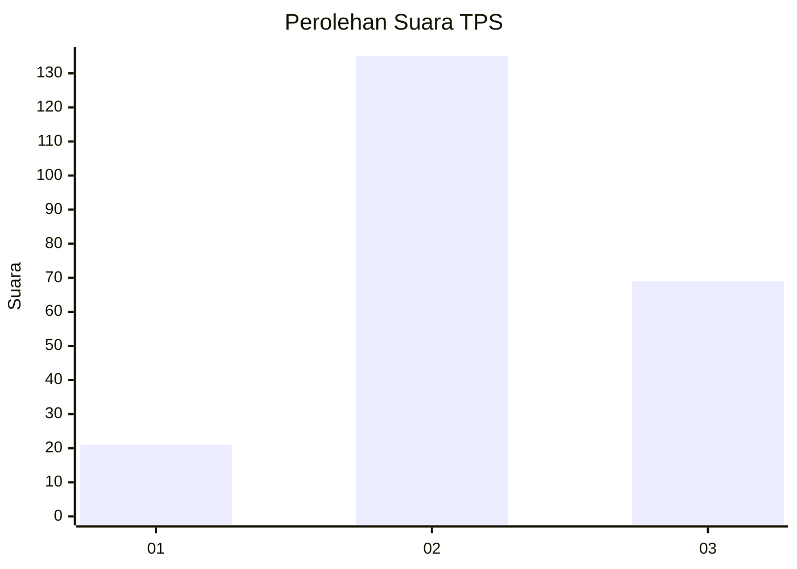
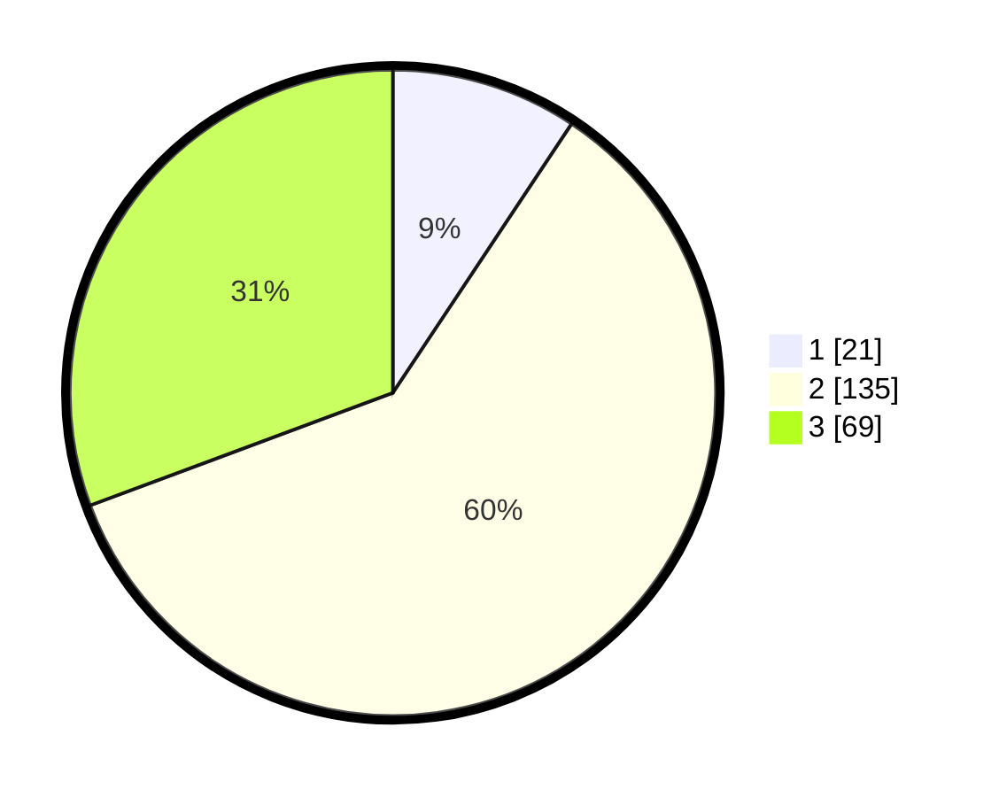

# Hasil

## Grafik

## Tabel

| No. | Nama Paslon    | Suara | Suara (raw) | Persentase |
|:--- |:-------------- | -----:| -----------:| ----------:|
| 1   | ANIES MUHAIMIN | 21    | [21][p-1]   | 9,33       |
| 2   | PRABOWO GIBRAN | 135   | [135][p-2]  | 60,00      |
| 3   | GANJAR MAHFUD  | 69    | [69][p-3]   | 30,67      |

[p-1]: https://github.com/gigit-pemilu/pemilu-2024/blob/main/pilpres/hitung-suara/sub/35-jawa-timur/sub/09-jember/sub/17-ajung/sub/2004-ajung/sub/006-tps/sub/paslon-1.txt
[p-2]: https://github.com/gigit-pemilu/pemilu-2024/blob/main/pilpres/hitung-suara/sub/35-jawa-timur/sub/09-jember/sub/17-ajung/sub/2004-ajung/sub/006-tps/sub/paslon-2.txt
[p-3]: https://github.com/gigit-pemilu/pemilu-2024/blob/main/pilpres/hitung-suara/sub/35-jawa-timur/sub/09-jember/sub/17-ajung/sub/2004-ajung/sub/006-tps/sub/paslon-3.txt

## Foto C Plano

https://sirekap-obj-formc.kpu.go.id/1bea/pemilu/ppwp/35/09/17/20/04/3509172004006-20240214-215810--a6af8698-4d3a-4d59-ab46-9c49cd5c87b3.jpg

https://sirekap-obj-formc.kpu.go.id/1bea/pemilu/ppwp/35/09/17/20/04/3509172004006-20240214-220751--bd0ec1fc-15ba-451f-9947-7b405409afd5.jpg

https://sirekap-obj-formc.kpu.go.id/1bea/pemilu/ppwp/35/09/17/20/04/3509172004006-20240214-220931--7a99f013-7f57-40ee-83b9-0961cd27045c.jpg

## Metadata

| Key        | Value               |
| ---------- | ------------------- |
| Time Stamp | 2024-02-15 15:00:29 |

