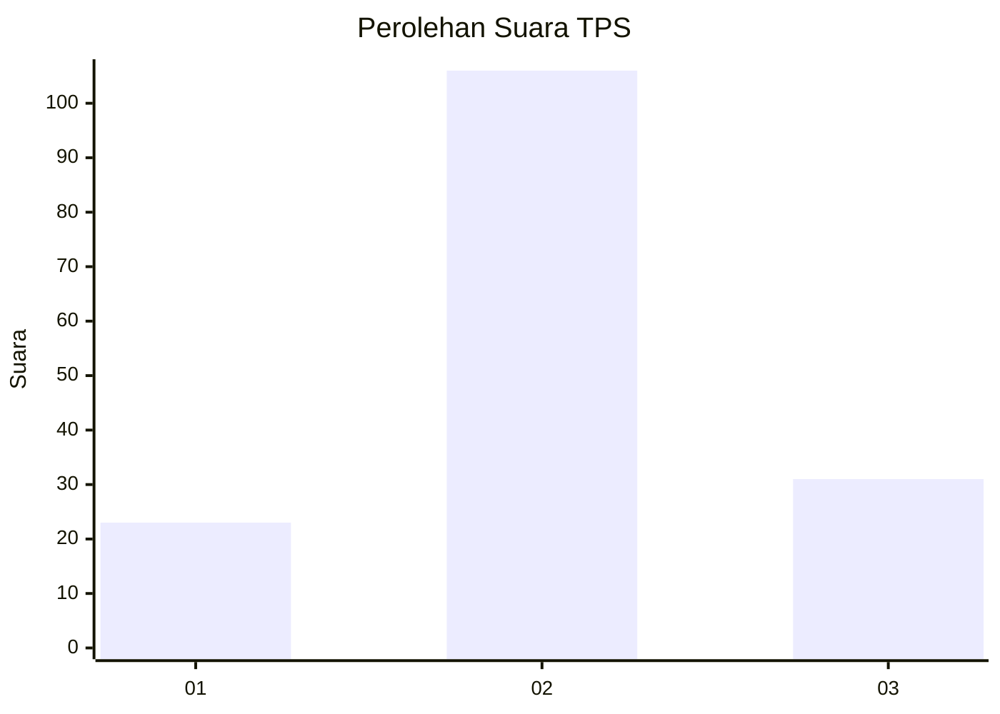
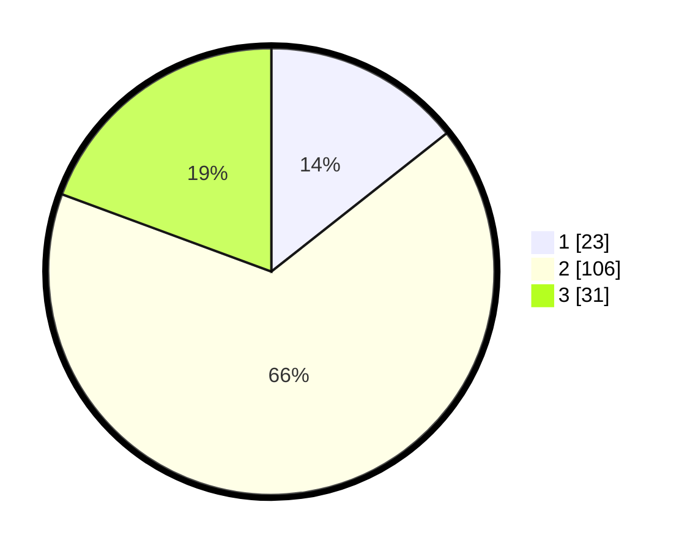

# Hasil

## Grafik

## Tabel

| No. | Nama Paslon    | Suara | Suara (raw) | Persentase |
|:--- |:-------------- | -----:| -----------:| ----------:|
| 1   | ANIES MUHAIMIN | 23    | [23][p-1]   | 14,38      |
| 2   | PRABOWO GIBRAN | 106   | [106][p-2]  | 66,25      |
| 3   | GANJAR MAHFUD  | 31    | [31][p-3]   | 19,38      |

[p-1]: https://github.com/gigit-pemilu/pemilu-2024-35-jawa-timur/blob/main/pilpres/hitung-suara/sub/35-jawa-timur/sub/09-jember/sub/17-ajung/sub/2004-ajung/sub/009-tps/sub/paslon-1.txt
[p-2]: https://github.com/gigit-pemilu/pemilu-2024-35-jawa-timur/blob/main/pilpres/hitung-suara/sub/35-jawa-timur/sub/09-jember/sub/17-ajung/sub/2004-ajung/sub/009-tps/sub/paslon-2.txt
[p-3]: https://github.com/gigit-pemilu/pemilu-2024-35-jawa-timur/blob/main/pilpres/hitung-suara/sub/35-jawa-timur/sub/09-jember/sub/17-ajung/sub/2004-ajung/sub/009-tps/sub/paslon-3.txt

## Foto C Plano

https://sirekap-obj-formc.kpu.go.id/937b/pemilu/ppwp/35/09/17/20/04/3509172004009-20240214-202921--085fca25-156a-441c-b8b9-4d7658351503.jpg

https://sirekap-obj-formc.kpu.go.id/937b/pemilu/ppwp/35/09/17/20/04/3509172004009-20240214-203156--972dc713-2421-4543-9a1e-c89e69a695d8.jpg

https://sirekap-obj-formc.kpu.go.id/937b/pemilu/ppwp/35/09/17/20/04/3509172004009-20240214-203339--59a135c5-a0cd-4d32-bfb9-2b13ba1b74f4.jpg

## Metadata

| Key        | Value               |
| ---------- | ------------------- |
| Time Stamp | 2024-02-15 00:41:44 |

