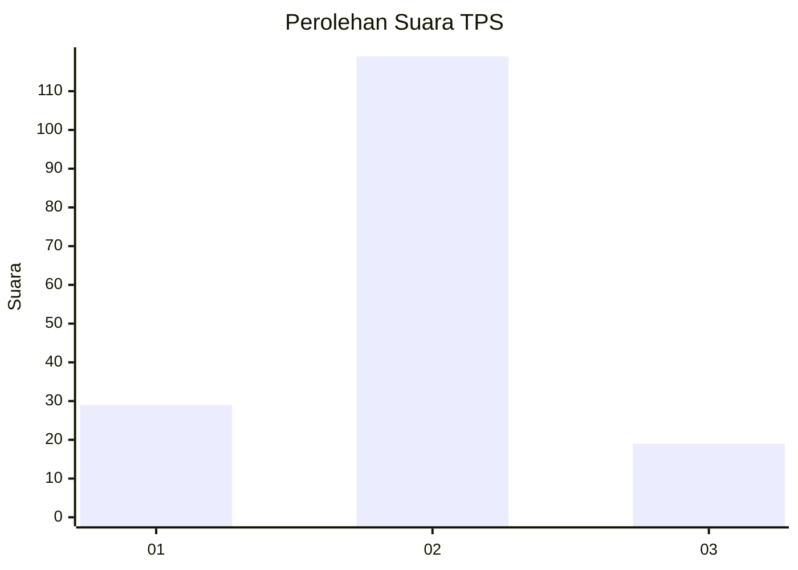
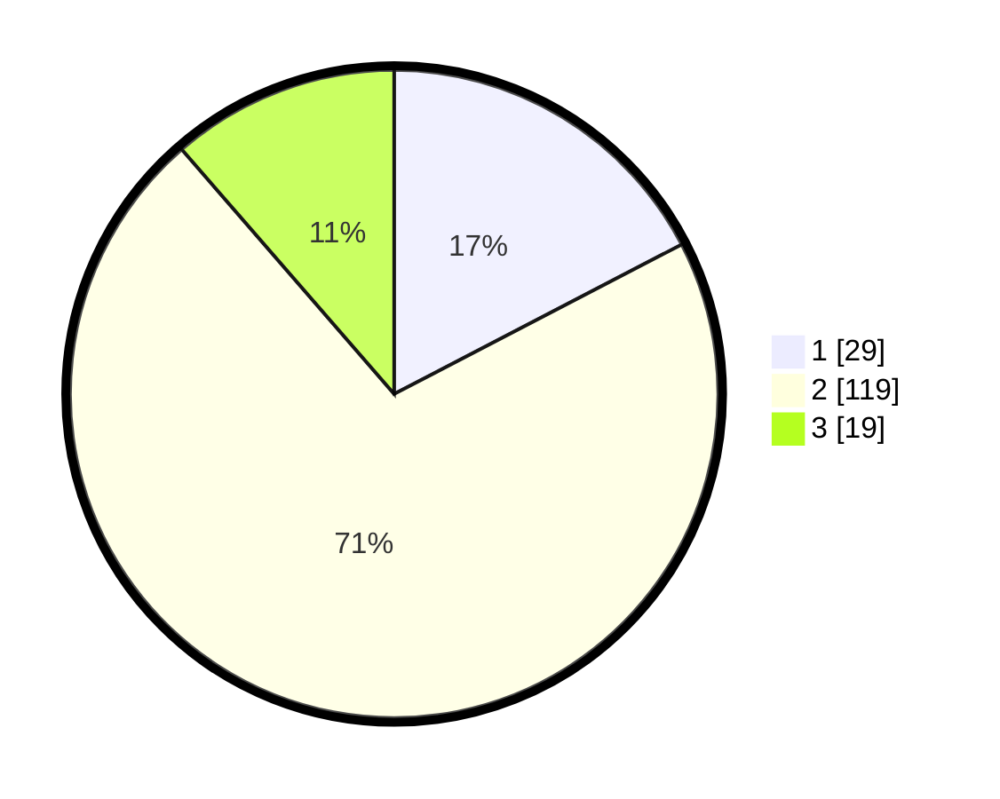

# Hasil

## Grafik

## Tabel

| No. | Nama Paslon    | Suara | Suara (raw) | Persentase |
|:--- |:-------------- | -----:| -----------:| ----------:|
| 1   | ANIES MUHAIMIN | 29    | [29][p-1]   | 17,37      |
| 2   | PRABOWO GIBRAN | 119   | [119][p-2]  | 71,26      |
| 3   | GANJAR MAHFUD  | 19    | [19][p-3]   | 11,38      |

[p-1]: https://github.com/gigit-pemilu/pemilu-2024-35-jawa-timur/blob/main/pilpres/hitung-suara/sub/35-jawa-timur/sub/09-jember/sub/17-ajung/sub/2004-ajung/sub/017-tps/sub/paslon-1.txt
[p-2]: https://github.com/gigit-pemilu/pemilu-2024-35-jawa-timur/blob/main/pilpres/hitung-suara/sub/35-jawa-timur/sub/09-jember/sub/17-ajung/sub/2004-ajung/sub/017-tps/sub/paslon-2.txt
[p-3]: https://github.com/gigit-pemilu/pemilu-2024-35-jawa-timur/blob/main/pilpres/hitung-suara/sub/35-jawa-timur/sub/09-jember/sub/17-ajung/sub/2004-ajung/sub/017-tps/sub/paslon-3.txt

## Foto C Plano

https://sirekap-obj-formc.kpu.go.id/bdaa/pemilu/ppwp/35/09/17/20/04/3509172004017-20240218-061742--45b619e0-ceb3-4a35-bb9b-2326d0b1d1b6.jpg

https://sirekap-obj-formc.kpu.go.id/bdaa/pemilu/ppwp/35/09/17/20/04/3509172004017-20240218-061839--8d7fe438-a511-47b1-af48-278671b43165.jpg

https://sirekap-obj-formc.kpu.go.id/bdaa/pemilu/ppwp/35/09/17/20/04/3509172004017-20240218-090852--b4ef2c21-221d-4029-8b78-57a9de3a98f7.jpg

## Metadata

| Key        | Value               |
| ---------- | ------------------- |
| Time Stamp | 2024-02-25 15:00:00 |

