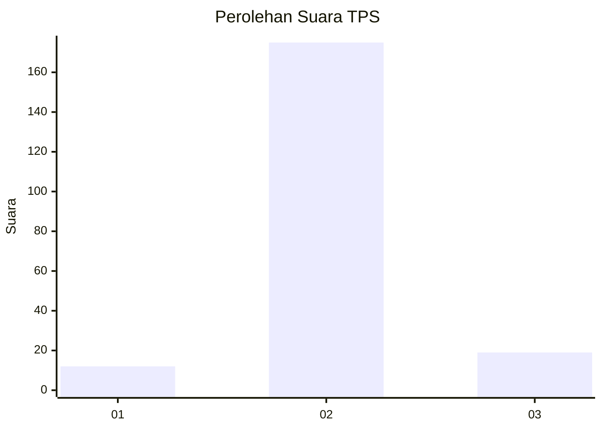
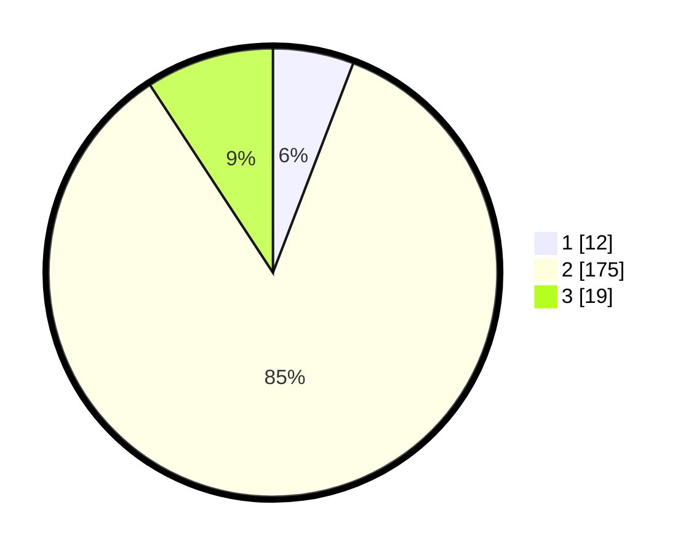

# Hasil

## Grafik

## Tabel

| No. | Nama Paslon    | Suara | Suara (raw) | Persentase |
|:--- |:-------------- | -----:| -----------:| ----------:|
| 1   | ANIES MUHAIMIN | 12    | [12][p-1]   | 5,83       |
| 2   | PRABOWO GIBRAN | 175   | [175][p-2]  | 84,95      |
| 3   | GANJAR MAHFUD  | 19    | [19][p-3]   | 9,22       |

[p-1]: https://github.com/gigit-pemilu/pemilu-2024/blob/main/pilpres/hitung-suara/sub/35-jawa-timur/sub/09-jember/sub/17-ajung/sub/2004-ajung/sub/022-tps/sub/paslon-1.txt
[p-2]: https://github.com/gigit-pemilu/pemilu-2024/blob/main/pilpres/hitung-suara/sub/35-jawa-timur/sub/09-jember/sub/17-ajung/sub/2004-ajung/sub/022-tps/sub/paslon-2.txt
[p-3]: https://github.com/gigit-pemilu/pemilu-2024/blob/main/pilpres/hitung-suara/sub/35-jawa-timur/sub/09-jember/sub/17-ajung/sub/2004-ajung/sub/022-tps/sub/paslon-3.txt

## Foto C Plano

https://sirekap-obj-formc.kpu.go.id/1e1f/pemilu/ppwp/35/09/17/20/04/3509172004022-20240214-141706--e3a6fd20-d88a-499d-975f-6271dd32d021.jpg

https://sirekap-obj-formc.kpu.go.id/1e1f/pemilu/ppwp/35/09/17/20/04/3509172004022-20240214-213913--70e7ca75-2157-48a8-b7f4-7cdc9be1539d.jpg

https://sirekap-obj-formc.kpu.go.id/1e1f/pemilu/ppwp/35/09/17/20/04/3509172004022-20240214-214100--0b0895e0-00c0-410b-8684-0d44ea93293b.jpg

## Metadata

| Key        | Value               |
| ---------- | ------------------- |
| Time Stamp | 2024-02-15 15:00:29 |

