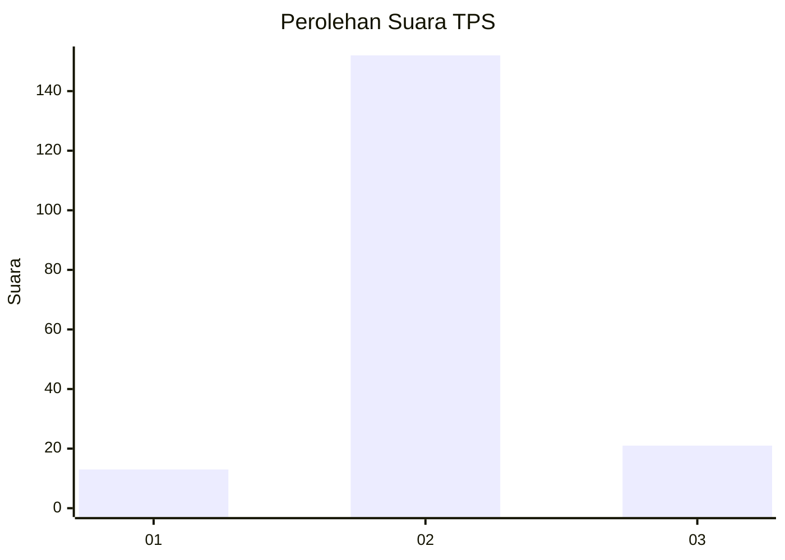
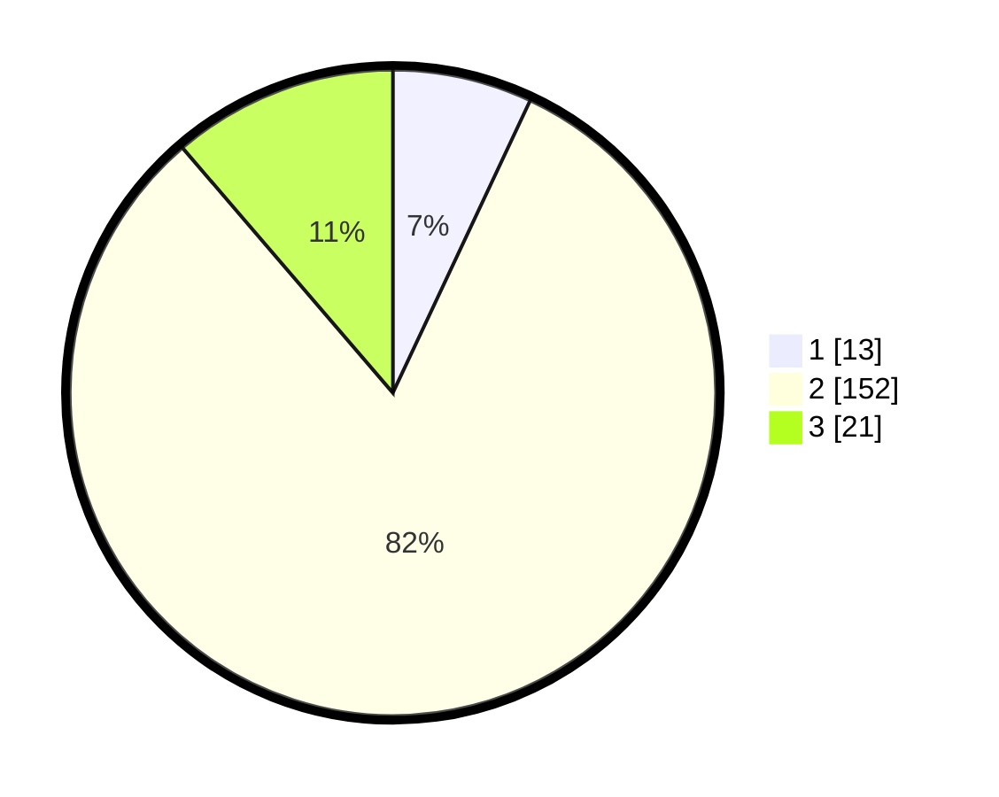

# Hasil

## Grafik

## Tabel

| No. | Nama Paslon    | Suara | Suara (raw) | Persentase |
|:--- |:-------------- | -----:| -----------:| ----------:|
| 1   | ANIES MUHAIMIN | 13    | [13][p-1]   | 6,99       |
| 2   | PRABOWO GIBRAN | 152   | [152][p-2]  | 81,72      |
| 3   | GANJAR MAHFUD  | 21    | [21][p-3]   | 11,29      |

[p-1]: https://github.com/gigit-pemilu/pemilu-2024/blob/main/pilpres/hitung-suara/sub/35-jawa-timur/sub/09-jember/sub/17-ajung/sub/2004-ajung/sub/026-tps/sub/paslon-1.txt
[p-2]: https://github.com/gigit-pemilu/pemilu-2024/blob/main/pilpres/hitung-suara/sub/35-jawa-timur/sub/09-jember/sub/17-ajung/sub/2004-ajung/sub/026-tps/sub/paslon-2.txt
[p-3]: https://github.com/gigit-pemilu/pemilu-2024/blob/main/pilpres/hitung-suara/sub/35-jawa-timur/sub/09-jember/sub/17-ajung/sub/2004-ajung/sub/026-tps/sub/paslon-3.txt

## Foto C Plano

https://sirekap-obj-formc.kpu.go.id/4137/pemilu/ppwp/35/09/17/20/04/3509172004026-20240214-220332--ac7679d8-77c5-491e-b260-fdba99dff9ed.jpg

https://sirekap-obj-formc.kpu.go.id/4137/pemilu/ppwp/35/09/17/20/04/3509172004026-20240214-220350--f66d7fc4-d379-4384-a1a7-b15df2df622d.jpg

https://sirekap-obj-formc.kpu.go.id/4137/pemilu/ppwp/35/09/17/20/04/3509172004026-20240214-220407--9337971b-8c9d-4f7c-89b1-a85d4a988bf0.jpg

## Metadata

| Key        | Value               |
| ---------- | ------------------- |
| Time Stamp | 2024-02-15 12:00:28 |

