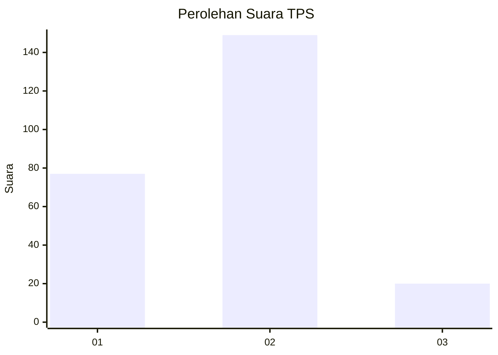
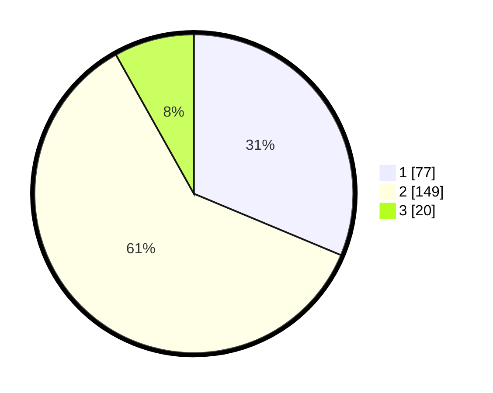

# Hasil

## Grafik

## Tabel

| No. | Nama Paslon    | Suara | Suara (raw) | Persentase |
|:--- |:-------------- | -----:| -----------:| ----------:|
| 1   | ANIES MUHAIMIN | 77    | [77][p-1]   | 31,30      |
| 2   | PRABOWO GIBRAN | 149   | [149][p-2]  | 60,57      |
| 3   | GANJAR MAHFUD  | 20    | [20][p-3]   | 8,13       |

[p-1]: https://github.com/gigit-pemilu/pemilu-2024-35-jawa-timur/blob/main/pilpres/hitung-suara/sub/35-jawa-timur/sub/09-jember/sub/17-ajung/sub/2004-ajung/sub/030-tps/sub/paslon-1.txt
[p-2]: https://github.com/gigit-pemilu/pemilu-2024-35-jawa-timur/blob/main/pilpres/hitung-suara/sub/35-jawa-timur/sub/09-jember/sub/17-ajung/sub/2004-ajung/sub/030-tps/sub/paslon-2.txt
[p-3]: https://github.com/gigit-pemilu/pemilu-2024-35-jawa-timur/blob/main/pilpres/hitung-suara/sub/35-jawa-timur/sub/09-jember/sub/17-ajung/sub/2004-ajung/sub/030-tps/sub/paslon-3.txt

## Foto C Plano

https://sirekap-obj-formc.kpu.go.id/7704/pemilu/ppwp/35/09/17/20/04/3509172004030-20240214-222722--f7c251b0-41e1-405e-8755-5350c7bca4ff.jpg

https://sirekap-obj-formc.kpu.go.id/7704/pemilu/ppwp/35/09/17/20/04/3509172004030-20240214-222745--278d14b2-a501-4995-b254-6a659ea04a4b.jpg

https://sirekap-obj-formc.kpu.go.id/7704/pemilu/ppwp/35/09/17/20/04/3509172004030-20240214-222806--f2faa154-2f6b-48be-9d51-01245c0218f7.jpg

## Metadata

| Key        | Value               |
| ---------- | ------------------- |
| Time Stamp | 2024-02-15 15:00:29 |

