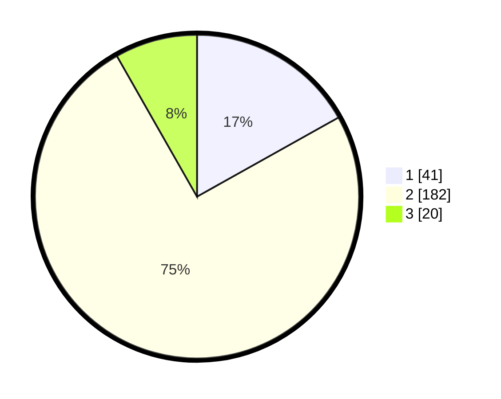

# Hasil

## Grafik

## Tabel

| No. | Nama Paslon    | Suara | Suara (raw) | Persentase |
|:--- |:-------------- | -----:| -----------:| ----------:|
| 1   | ANIES MUHAIMIN | 41    | [41][p-1]   | 16,87      |
| 2   | PRABOWO GIBRAN | 182   | [182][p-2]  | 74,90      |
| 3   | GANJAR MAHFUD  | 20    | [20][p-3]   | 8,23       |

[p-1]: https://github.com/gigit-pemilu/pemilu-2024-35-jawa-timur/blob/main/pilpres/hitung-suara/sub/35-jawa-timur/sub/09-jember/sub/17-ajung/sub/2004-ajung/sub/033-tps/sub/paslon-1.txt
[p-2]: https://github.com/gigit-pemilu/pemilu-2024-35-jawa-timur/blob/main/pilpres/hitung-suara/sub/35-jawa-timur/sub/09-jember/sub/17-ajung/sub/2004-ajung/sub/033-tps/sub/paslon-2.txt
[p-3]: https://github.com/gigit-pemilu/pemilu-2024-35-jawa-timur/blob/main/pilpres/hitung-suara/sub/35-jawa-timur/sub/09-jember/sub/17-ajung/sub/2004-ajung/sub/033-tps/sub/paslon-3.txt

## Foto C Plano

https://sirekap-obj-formc.kpu.go.id/6f16/pemilu/ppwp/35/09/17/20/04/3509172004033-20240215-214804--8a7a2f9b-0a32-4ebe-8fdc-9f9419383f50.jpg

https://sirekap-obj-formc.kpu.go.id/6f16/pemilu/ppwp/35/09/17/20/04/3509172004033-20240215-214841--0681a90d-7aaf-4501-ae28-11c640ee9576.jpg

https://sirekap-obj-formc.kpu.go.id/6f16/pemilu/ppwp/35/09/17/20/04/3509172004033-20240215-214909--0dc9c606-9f0a-4673-aa89-58c8fd7b64bd.jpg

## Metadata

| Key        | Value               |
| ---------- | ------------------- |
| Time Stamp | 2024-02-21 21:00:04 |

