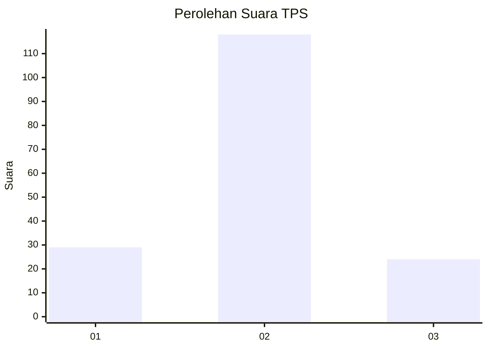
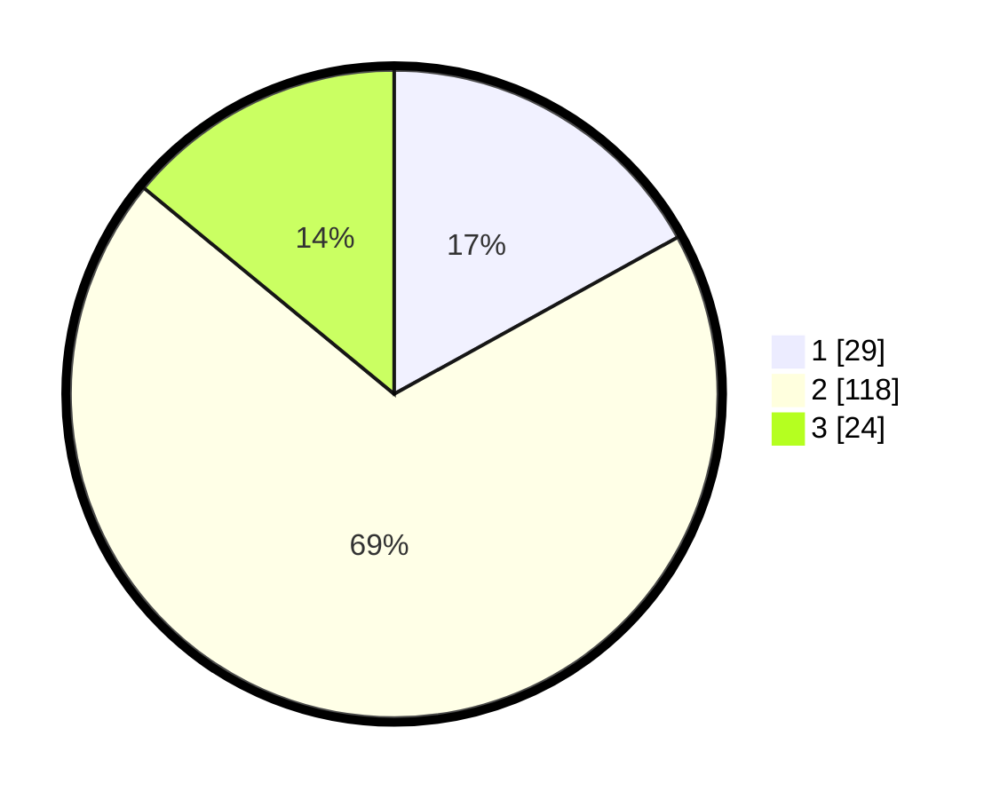

# Hasil

## Grafik

## Tabel

| No. | Nama Paslon    | Suara | Suara (raw) | Persentase |
|:--- |:-------------- | -----:| -----------:| ----------:|
| 1   | ANIES MUHAIMIN | 29    | [29][p-1]   | 16,96      |
| 2   | PRABOWO GIBRAN | 118   | [118][p-2]  | 69,01      |
| 3   | GANJAR MAHFUD  | 24    | [24][p-3]   | 14,04      |

[p-1]: https://github.com/gigit-pemilu/pemilu-2024/blob/main/pilpres/hitung-suara/sub/35-jawa-timur/sub/09-jember/sub/17-ajung/sub/2004-ajung/sub/044-tps/sub/paslon-1.txt
[p-2]: https://github.com/gigit-pemilu/pemilu-2024/blob/main/pilpres/hitung-suara/sub/35-jawa-timur/sub/09-jember/sub/17-ajung/sub/2004-ajung/sub/044-tps/sub/paslon-2.txt
[p-3]: https://github.com/gigit-pemilu/pemilu-2024/blob/main/pilpres/hitung-suara/sub/35-jawa-timur/sub/09-jember/sub/17-ajung/sub/2004-ajung/sub/044-tps/sub/paslon-3.txt

## Foto C Plano

https://sirekap-obj-formc.kpu.go.id/b209/pemilu/ppwp/35/09/17/20/04/3509172004044-20240218-115119--2538bb39-2ef3-4b9d-bded-e803bd3b620f.jpg

https://sirekap-obj-formc.kpu.go.id/b209/pemilu/ppwp/35/09/17/20/04/3509172004044-20240218-115235--83cd63bc-e65d-4786-8b7a-e9ee4edb385c.jpg

https://sirekap-obj-formc.kpu.go.id/b209/pemilu/ppwp/35/09/17/20/04/3509172004044-20240218-115401--b968cce0-a41d-4c06-a0fb-fdddcaf90c25.jpg

## Metadata

| Key        | Value               |
| ---------- | ------------------- |
| Time Stamp | 2024-02-25 12:00:00 |

