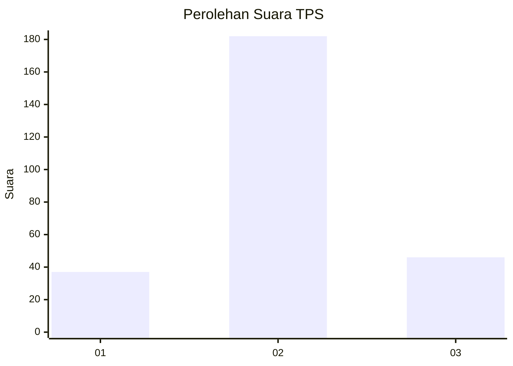
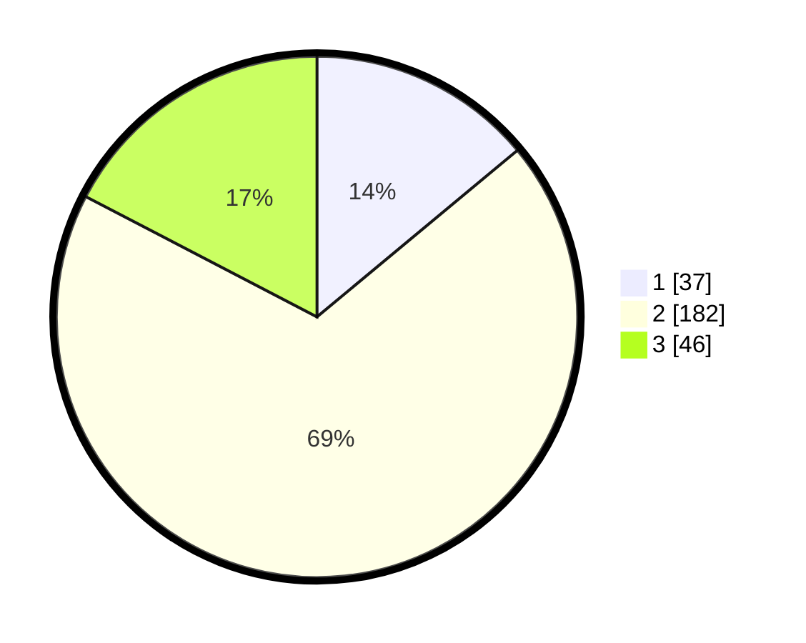

# Hasil

## Grafik

## Tabel

| No. | Nama Paslon    | Suara | Suara (raw) | Persentase |
|:--- |:-------------- | -----:| -----------:| ----------:|
| 1   | ANIES MUHAIMIN | 37    | [37][p-1]   | 13,96      |
| 2   | PRABOWO GIBRAN | 182   | [182][p-2]  | 68,68      |
| 3   | GANJAR MAHFUD  | 46    | [46][p-3]   | 17,36      |

[p-1]: https://github.com/gigit-pemilu/pemilu-2024-35-jawa-timur/blob/main/pilpres/hitung-suara/sub/35-jawa-timur/sub/09-jember/sub/17-ajung/sub/2004-ajung/sub/049-tps/sub/paslon-1.txt
[p-2]: https://github.com/gigit-pemilu/pemilu-2024-35-jawa-timur/blob/main/pilpres/hitung-suara/sub/35-jawa-timur/sub/09-jember/sub/17-ajung/sub/2004-ajung/sub/049-tps/sub/paslon-2.txt
[p-3]: https://github.com/gigit-pemilu/pemilu-2024-35-jawa-timur/blob/main/pilpres/hitung-suara/sub/35-jawa-timur/sub/09-jember/sub/17-ajung/sub/2004-ajung/sub/049-tps/sub/paslon-3.txt

## Foto C Plano

https://sirekap-obj-formc.kpu.go.id/7c4d/pemilu/ppwp/35/09/17/20/04/3509172004049-20240220-204157--f2e1d2d6-ccc1-4aaa-917f-1dc1c0fc5159.jpg

https://sirekap-obj-formc.kpu.go.id/7c4d/pemilu/ppwp/35/09/17/20/04/3509172004049-20240220-195525--ffececc2-08db-4850-b7e8-5168389e2f23.jpg

https://sirekap-obj-formc.kpu.go.id/7c4d/pemilu/ppwp/35/09/17/20/04/3509172004049-20240220-204313--3b9712ad-f99d-4cad-8a80-06acf1ceac63.jpg

## Metadata

| Key        | Value               |
| ---------- | ------------------- |
| Time Stamp | 2024-02-21 20:00:00 |

