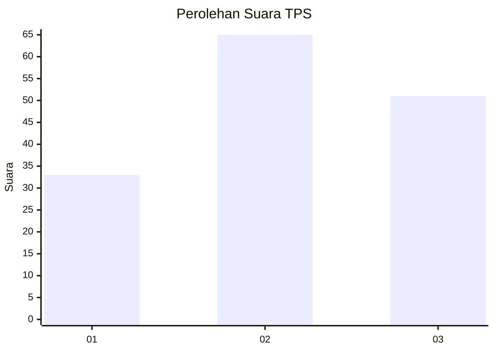
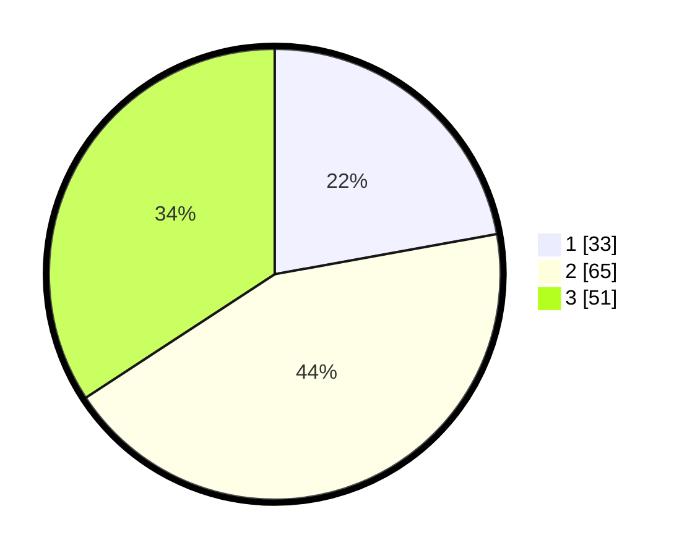

# Hasil

## Grafik

## Tabel

| No. | Nama Paslon    | Suara | Suara (raw) | Persentase |
|:--- |:-------------- | -----:| -----------:| ----------:|
| 1   | ANIES MUHAIMIN | 33    | [33][p-1]   | 22,15      |
| 2   | PRABOWO GIBRAN | 65    | [65][p-2]   | 43,62      |
| 3   | GANJAR MAHFUD  | 51    | [51][p-3]   | 34,23      |

[p-1]: https://github.com/gigit-pemilu/pemilu-2024/blob/main/pilpres/hitung-suara/sub/35-jawa-timur/sub/09-jember/sub/17-ajung/sub/2004-ajung/sub/050-tps/sub/paslon-1.txt
[p-2]: https://github.com/gigit-pemilu/pemilu-2024/blob/main/pilpres/hitung-suara/sub/35-jawa-timur/sub/09-jember/sub/17-ajung/sub/2004-ajung/sub/050-tps/sub/paslon-2.txt
[p-3]: https://github.com/gigit-pemilu/pemilu-2024/blob/main/pilpres/hitung-suara/sub/35-jawa-timur/sub/09-jember/sub/17-ajung/sub/2004-ajung/sub/050-tps/sub/paslon-3.txt

## Foto C Plano

https://sirekap-obj-formc.kpu.go.id/2859/pemilu/ppwp/35/09/17/20/04/3509172004050-20240214-214459--249d7628-955d-480e-8ca8-64aaa8999788.jpg

https://sirekap-obj-formc.kpu.go.id/2859/pemilu/ppwp/35/09/17/20/04/3509172004050-20240214-214604--88025daf-ebde-4a02-bf0c-f1b2e2bc2fb9.jpg

https://sirekap-obj-formc.kpu.go.id/2859/pemilu/ppwp/35/09/17/20/04/3509172004050-20240214-214708--81f4a319-b249-4111-89fb-24ccb2da86c6.jpg

## Metadata

| Key        | Value               |
| ---------- | ------------------- |
| Time Stamp | 2024-02-15 12:00:28 |

