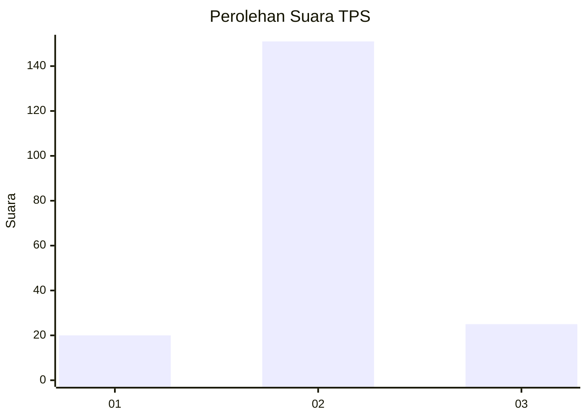
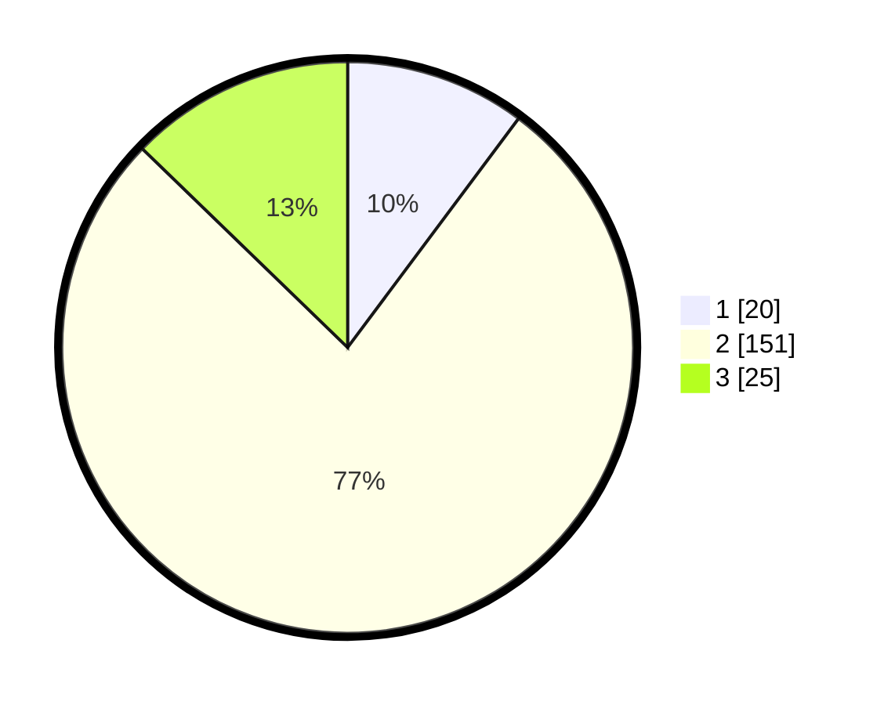

# Hasil

## Grafik

## Tabel

| No. | Nama Paslon    | Suara | Suara (raw) | Persentase |
|:--- |:-------------- | -----:| -----------:| ----------:|
| 1   | ANIES MUHAIMIN | 20    | [20][p-1]   | 10,20      |
| 2   | PRABOWO GIBRAN | 151   | [151][p-2]  | 77,04      |
| 3   | GANJAR MAHFUD  | 25    | [25][p-3]   | 12,76      |

[p-1]: https://github.com/gigit-pemilu/pemilu-2024/blob/main/pilpres/hitung-suara/sub/35-jawa-timur/sub/09-jember/sub/17-ajung/sub/2005-klompangan/sub/007-tps/sub/paslon-1.txt
[p-2]: https://github.com/gigit-pemilu/pemilu-2024/blob/main/pilpres/hitung-suara/sub/35-jawa-timur/sub/09-jember/sub/17-ajung/sub/2005-klompangan/sub/007-tps/sub/paslon-2.txt
[p-3]: https://github.com/gigit-pemilu/pemilu-2024/blob/main/pilpres/hitung-suara/sub/35-jawa-timur/sub/09-jember/sub/17-ajung/sub/2005-klompangan/sub/007-tps/sub/paslon-3.txt

## Foto C Plano

https://sirekap-obj-formc.kpu.go.id/0537/pemilu/ppwp/35/09/17/20/05/3509172005007-20240214-221847--076379d4-9e06-4c55-b807-71e92bc0f295.jpg

https://sirekap-obj-formc.kpu.go.id/0537/pemilu/ppwp/35/09/17/20/05/3509172005007-20240214-222059--e4930ae3-c6e2-4e1c-b5bb-7788904a53e1.jpg

https://sirekap-obj-formc.kpu.go.id/0537/pemilu/ppwp/35/09/17/20/05/3509172005007-20240214-222230--6dab0461-7d0f-4fe9-8eac-90cb17bb1843.jpg

## Metadata

| Key        | Value               |
| ---------- | ------------------- |
| Time Stamp | 2024-02-15 12:00:28 |

