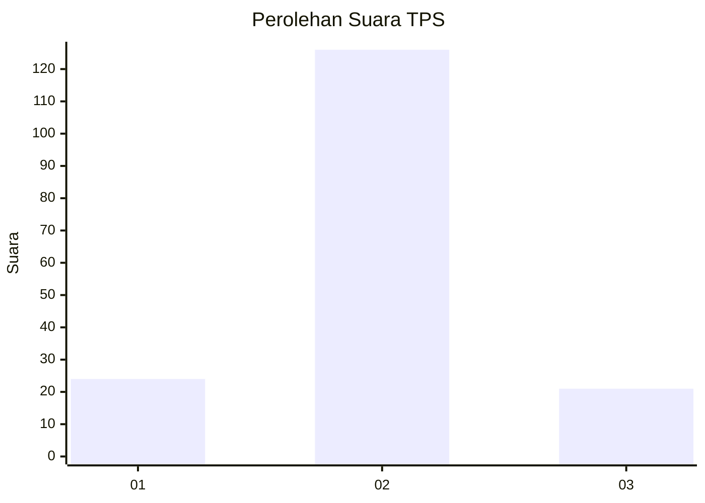
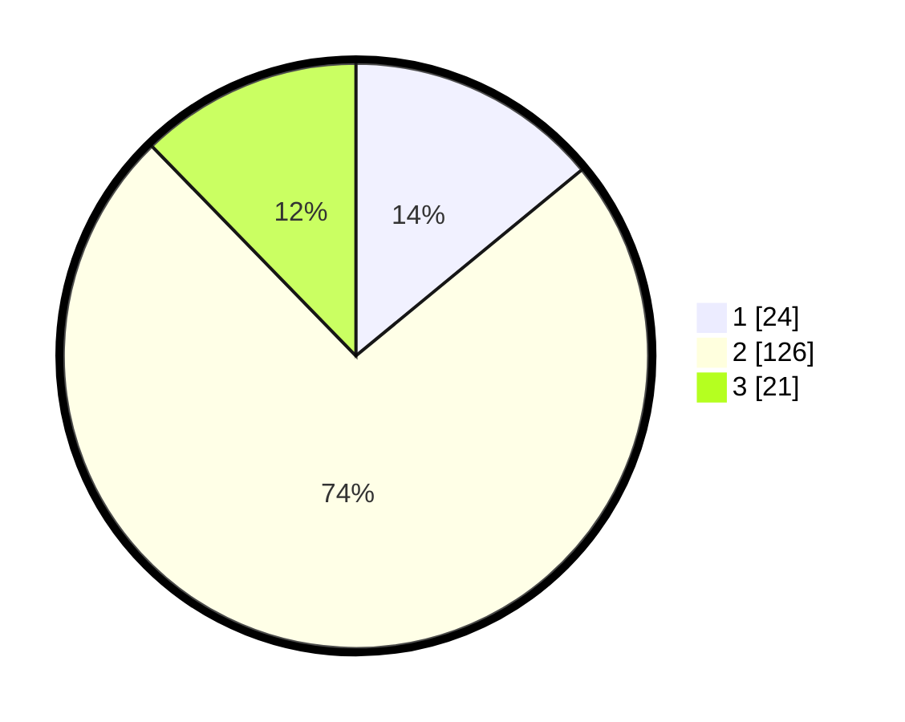

# Hasil

## Grafik

## Tabel

| No. | Nama Paslon    | Suara | Suara (raw) | Persentase |
|:--- |:-------------- | -----:| -----------:| ----------:|
| 1   | ANIES MUHAIMIN | 24    | [24][p-1]   | 14,04      |
| 2   | PRABOWO GIBRAN | 126   | [126][p-2]  | 73,68      |
| 3   | GANJAR MAHFUD  | 21    | [21][p-3]   | 12,28      |

[p-1]: https://github.com/gigit-pemilu/pemilu-2024/blob/main/pilpres/hitung-suara/sub/35-jawa-timur/sub/09-jember/sub/17-ajung/sub/2005-klompangan/sub/009-tps/sub/paslon-1.txt
[p-2]: https://github.com/gigit-pemilu/pemilu-2024/blob/main/pilpres/hitung-suara/sub/35-jawa-timur/sub/09-jember/sub/17-ajung/sub/2005-klompangan/sub/009-tps/sub/paslon-2.txt
[p-3]: https://github.com/gigit-pemilu/pemilu-2024/blob/main/pilpres/hitung-suara/sub/35-jawa-timur/sub/09-jember/sub/17-ajung/sub/2005-klompangan/sub/009-tps/sub/paslon-3.txt

## Foto C Plano

https://sirekap-obj-formc.kpu.go.id/485a/pemilu/ppwp/35/09/17/20/05/3509172005009-20240217-121319--1865080a-98a7-4b67-abad-d7e558c841a1.jpg

https://sirekap-obj-formc.kpu.go.id/485a/pemilu/ppwp/35/09/17/20/05/3509172005009-20240217-120322--ff364133-0082-4d30-b758-f5e23e3d92cb.jpg

https://sirekap-obj-formc.kpu.go.id/485a/pemilu/ppwp/35/09/17/20/05/3509172005009-20240217-115914--c8ed42f8-b351-4cb4-a4f9-9c59a9d6f9fe.jpg

## Metadata

| Key        | Value               |
| ---------- | ------------------- |
| Time Stamp | 2024-02-25 17:00:00 |

