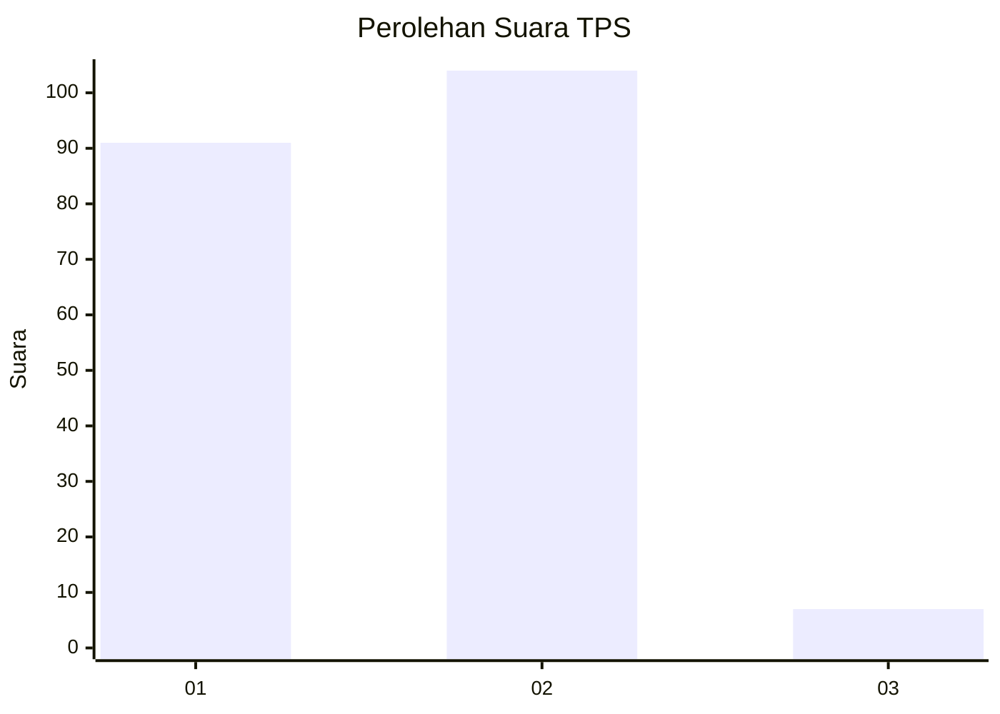
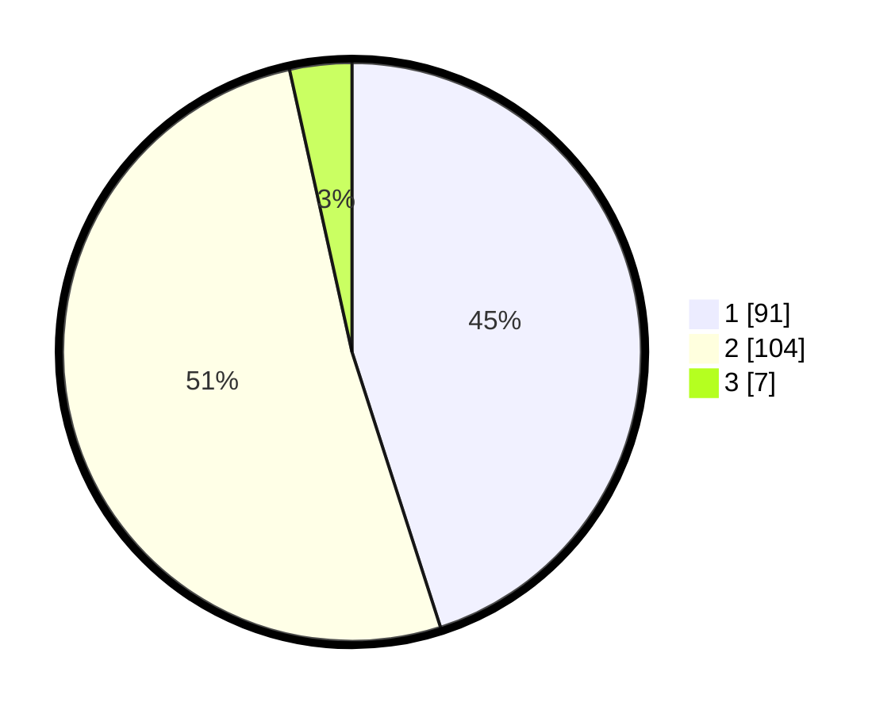

# Hasil

## Grafik

## Tabel

| No. | Nama Paslon    | Suara | Suara (raw) | Persentase |
|:--- |:-------------- | -----:| -----------:| ----------:|
| 1   | ANIES MUHAIMIN | 91    | [91][p-1]   | 45,05      |
| 2   | PRABOWO GIBRAN | 104   | [104][p-2]  | 51,49      |
| 3   | GANJAR MAHFUD  | 7     | [7][p-3]    | 3,47       |

[p-1]: https://github.com/gigit-pemilu/pemilu-2024-35-jawa-timur/blob/main/pilpres/hitung-suara/sub/35-jawa-timur/sub/09-jember/sub/17-ajung/sub/2005-klompangan/sub/014-tps/sub/paslon-1.txt
[p-2]: https://github.com/gigit-pemilu/pemilu-2024-35-jawa-timur/blob/main/pilpres/hitung-suara/sub/35-jawa-timur/sub/09-jember/sub/17-ajung/sub/2005-klompangan/sub/014-tps/sub/paslon-2.txt
[p-3]: https://github.com/gigit-pemilu/pemilu-2024-35-jawa-timur/blob/main/pilpres/hitung-suara/sub/35-jawa-timur/sub/09-jember/sub/17-ajung/sub/2005-klompangan/sub/014-tps/sub/paslon-3.txt

## Foto C Plano

https://sirekap-obj-formc.kpu.go.id/9359/pemilu/ppwp/35/09/17/20/05/3509172005014-20240214-213055--606b72b3-bebc-454d-9c9c-d5d52e040519.jpg

https://sirekap-obj-formc.kpu.go.id/9359/pemilu/ppwp/35/09/17/20/05/3509172005014-20240214-213231--1ea3229a-0f92-43b6-a6f5-b9c581eb06bb.jpg

https://sirekap-obj-formc.kpu.go.id/9359/pemilu/ppwp/35/09/17/20/05/3509172005014-20240214-213520--f5a3d965-bb3e-4728-aa33-ee59cd02a2e0.jpg

## Metadata

| Key        | Value               |
| ---------- | ------------------- |
| Time Stamp | 2024-02-15 02:10:27 |

