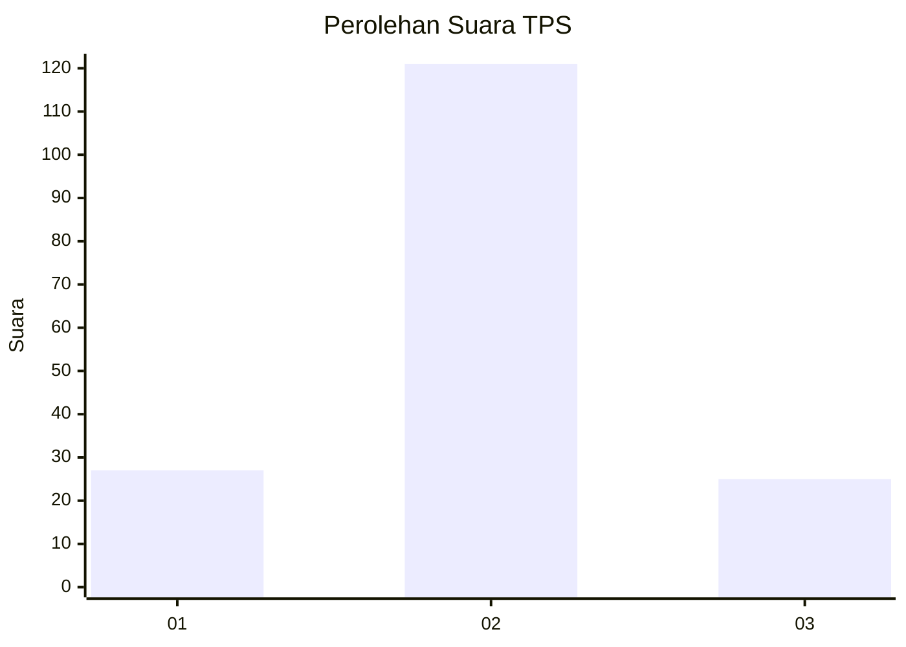

# Hasil

## Grafik

## Tabel

| No. | Nama Paslon    | Suara | Suara (raw) | Persentase |
|:--- |:-------------- | -----:| -----------:| ----------:|
| 1   | ANIES MUHAIMIN | 27    | [27][p-1]   | 15,61      |
| 2   | PRABOWO GIBRAN | 121   | [121][p-2]  | 69,94      |
| 3   | GANJAR MAHFUD  | 25    | [25][p-3]   | 14,45      |

[p-1]: https://github.com/gigit-pemilu/pemilu-2024/blob/main/pilpres/hitung-suara/sub/35-jawa-timur/sub/09-jember/sub/17-ajung/sub/2005-klompangan/sub/034-tps/sub/paslon-1.txt
[p-2]: https://github.com/gigit-pemilu/pemilu-2024/blob/main/pilpres/hitung-suara/sub/35-jawa-timur/sub/09-jember/sub/17-ajung/sub/2005-klompangan/sub/034-tps/sub/paslon-2.txt
[p-3]: https://github.com/gigit-pemilu/pemilu-2024/blob/main/pilpres/hitung-suara/sub/35-jawa-timur/sub/09-jember/sub/17-ajung/sub/2005-klompangan/sub/034-tps/sub/paslon-3.txt

## Foto C Plano

https://sirekap-obj-formc.kpu.go.id/1ad5/pemilu/ppwp/35/09/17/20/05/3509172005034-20240214-224158--d5b509d7-4ef9-42ac-9f3d-559c6c622308.jpg

https://sirekap-obj-formc.kpu.go.id/1ad5/pemilu/ppwp/35/09/17/20/05/3509172005034-20240214-224335--93f769a8-20be-4bed-8f45-7f8e3d81e264.jpg

https://sirekap-obj-formc.kpu.go.id/1ad5/pemilu/ppwp/35/09/17/20/05/3509172005034-20240214-224504--b14e8189-e38f-4eb4-8697-8e1e90682826.jpg

## Metadata

| Key        | Value               |
| ---------- | ------------------- |
| Time Stamp | 2024-02-22 12:00:00 |

