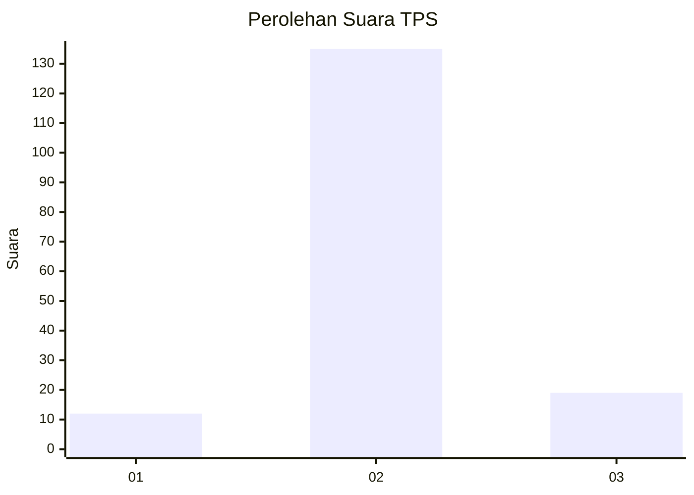
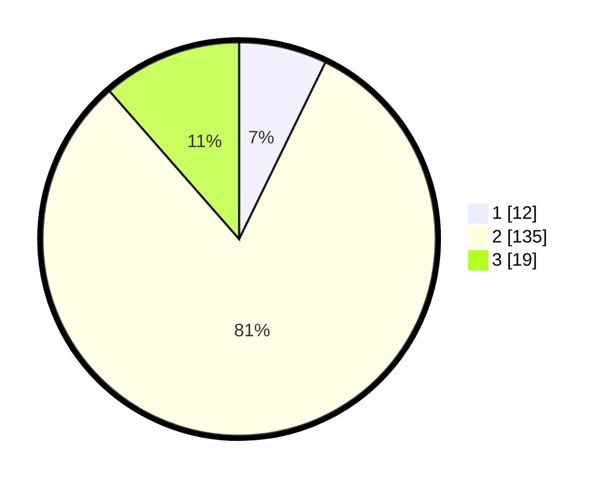

# Hasil

## Grafik

## Tabel

| No. | Nama Paslon    | Suara | Suara (raw) | Persentase |
|:--- |:-------------- | -----:| -----------:| ----------:|
| 1   | ANIES MUHAIMIN | 12    | [12][p-1]   | 7,23       |
| 2   | PRABOWO GIBRAN | 135   | [135][p-2]  | 81,33      |
| 3   | GANJAR MAHFUD  | 19    | [19][p-3]   | 11,45      |

[p-1]: https://github.com/gigit-pemilu/pemilu-2024-35-jawa-timur/blob/main/pilpres/hitung-suara/sub/35-jawa-timur/sub/09-jember/sub/17-ajung/sub/2006-wirowongso/sub/002-tps/sub/paslon-1.txt
[p-2]: https://github.com/gigit-pemilu/pemilu-2024-35-jawa-timur/blob/main/pilpres/hitung-suara/sub/35-jawa-timur/sub/09-jember/sub/17-ajung/sub/2006-wirowongso/sub/002-tps/sub/paslon-2.txt
[p-3]: https://github.com/gigit-pemilu/pemilu-2024-35-jawa-timur/blob/main/pilpres/hitung-suara/sub/35-jawa-timur/sub/09-jember/sub/17-ajung/sub/2006-wirowongso/sub/002-tps/sub/paslon-3.txt

## Foto C Plano

https://sirekap-obj-formc.kpu.go.id/8e1b/pemilu/ppwp/35/09/17/20/06/3509172006002-20240214-230734--be530afe-e705-41a2-b1df-21caf019782e.jpg

https://sirekap-obj-formc.kpu.go.id/8e1b/pemilu/ppwp/35/09/17/20/06/3509172006002-20240214-230904--18aa55e8-81e9-408c-8e76-5e9a32e865de.jpg

https://sirekap-obj-formc.kpu.go.id/8e1b/pemilu/ppwp/35/09/17/20/06/3509172006002-20240214-231109--1d243f46-20e3-4382-8cb2-206dde0e38b2.jpg

## Metadata

| Key        | Value               |
| ---------- | ------------------- |
| Time Stamp | 2024-02-15 12:00:28 |

