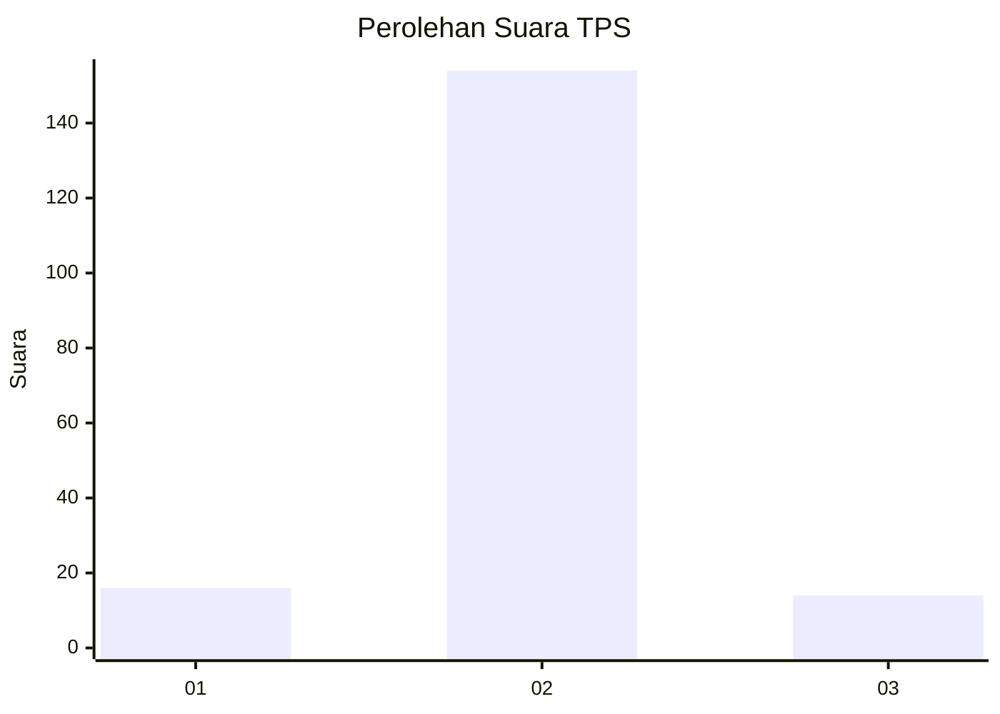
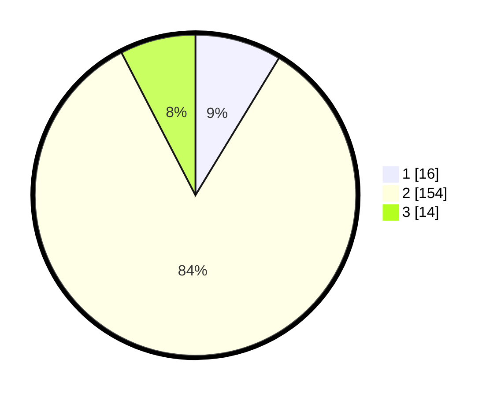

# Hasil

## Grafik

## Tabel

| No. | Nama Paslon    | Suara | Suara (raw) | Persentase |
|:--- |:-------------- | -----:| -----------:| ----------:|
| 1   | ANIES MUHAIMIN | 16    | [16][p-1]   | 8,70       |
| 2   | PRABOWO GIBRAN | 154   | [154][p-2]  | 83,70      |
| 3   | GANJAR MAHFUD  | 14    | [14][p-3]   | 7,61       |

[p-1]: https://github.com/gigit-pemilu/pemilu-2024-35-jawa-timur/blob/main/pilpres/hitung-suara/sub/35-jawa-timur/sub/09-jember/sub/17-ajung/sub/2006-wirowongso/sub/006-tps/sub/paslon-1.txt
[p-2]: https://github.com/gigit-pemilu/pemilu-2024-35-jawa-timur/blob/main/pilpres/hitung-suara/sub/35-jawa-timur/sub/09-jember/sub/17-ajung/sub/2006-wirowongso/sub/006-tps/sub/paslon-2.txt
[p-3]: https://github.com/gigit-pemilu/pemilu-2024-35-jawa-timur/blob/main/pilpres/hitung-suara/sub/35-jawa-timur/sub/09-jember/sub/17-ajung/sub/2006-wirowongso/sub/006-tps/sub/paslon-3.txt

## Foto C Plano

https://sirekap-obj-formc.kpu.go.id/c0c5/pemilu/ppwp/35/09/17/20/06/3509172006006-20240215-043818--723fb7b0-591d-44e7-af87-143d16dd5074.jpg

https://sirekap-obj-formc.kpu.go.id/c0c5/pemilu/ppwp/35/09/17/20/06/3509172006006-20240215-043924--cbfe94fd-726f-489e-94e7-1b5d4fd4c257.jpg

https://sirekap-obj-formc.kpu.go.id/c0c5/pemilu/ppwp/35/09/17/20/06/3509172006006-20240214-212202--20c9fdbe-14f5-46ab-9ecd-755c341541e2.jpg

## Metadata

| Key        | Value               |
| ---------- | ------------------- |
| Time Stamp | 2024-02-15 21:01:18 |

