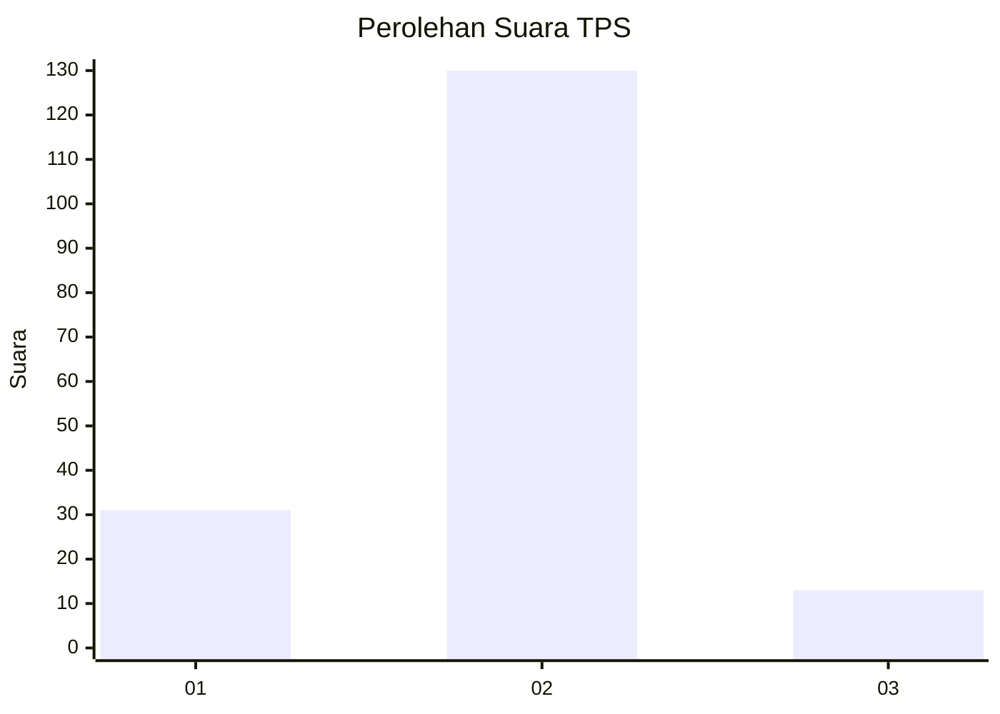
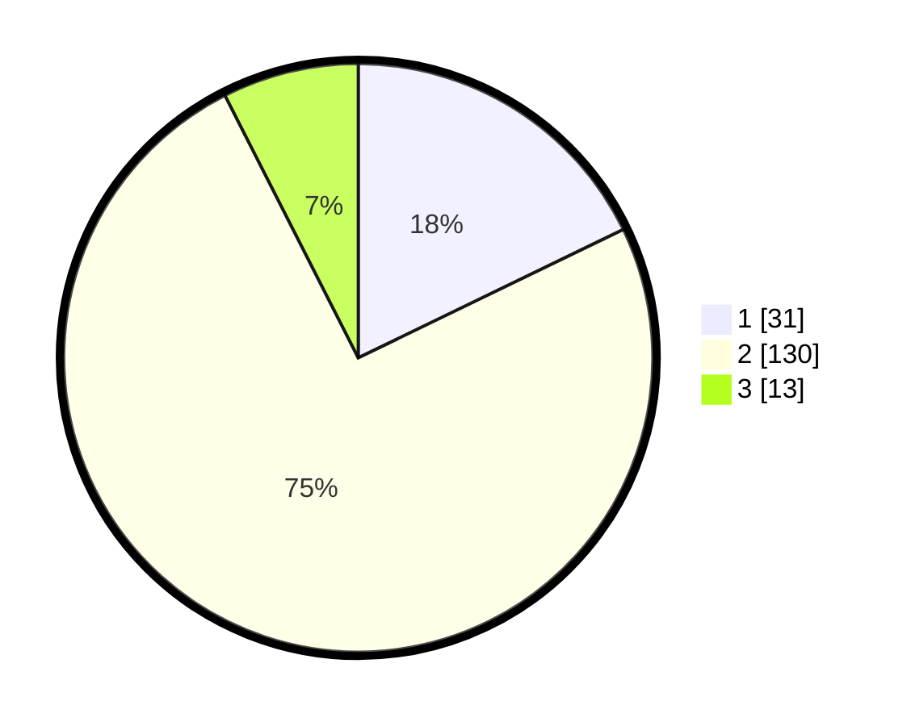

# Hasil

## Grafik

## Tabel

| No. | Nama Paslon    | Suara | Suara (raw) | Persentase |
|:--- |:-------------- | -----:| -----------:| ----------:|
| 1   | ANIES MUHAIMIN | 31    | [31][p-1]   | 17,82      |
| 2   | PRABOWO GIBRAN | 130   | [130][p-2]  | 74,71      |
| 3   | GANJAR MAHFUD  | 13    | [13][p-3]   | 7,47       |

[p-1]: https://github.com/gigit-pemilu/pemilu-2024-35-jawa-timur/blob/main/pilpres/hitung-suara/sub/35-jawa-timur/sub/09-jember/sub/17-ajung/sub/2006-wirowongso/sub/012-tps/sub/paslon-1.txt
[p-2]: https://github.com/gigit-pemilu/pemilu-2024-35-jawa-timur/blob/main/pilpres/hitung-suara/sub/35-jawa-timur/sub/09-jember/sub/17-ajung/sub/2006-wirowongso/sub/012-tps/sub/paslon-2.txt
[p-3]: https://github.com/gigit-pemilu/pemilu-2024-35-jawa-timur/blob/main/pilpres/hitung-suara/sub/35-jawa-timur/sub/09-jember/sub/17-ajung/sub/2006-wirowongso/sub/012-tps/sub/paslon-3.txt

## Foto C Plano

https://sirekap-obj-formc.kpu.go.id/da0d/pemilu/ppwp/35/09/17/20/06/3509172006012-20240215-014222--388eaad6-7658-4d4d-9de3-cc5318cb83da.jpg

https://sirekap-obj-formc.kpu.go.id/da0d/pemilu/ppwp/35/09/17/20/06/3509172006012-20240215-014316--c01acac2-7e99-40e1-a4cb-22b2544e66b8.jpg

https://sirekap-obj-formc.kpu.go.id/da0d/pemilu/ppwp/35/09/17/20/06/3509172006012-20240215-014546--5c8815d8-a305-4efd-a9fa-06de0df19bb4.jpg

## Metadata

| Key        | Value               |
| ---------- | ------------------- |
| Time Stamp | 2024-02-15 21:01:18 |

