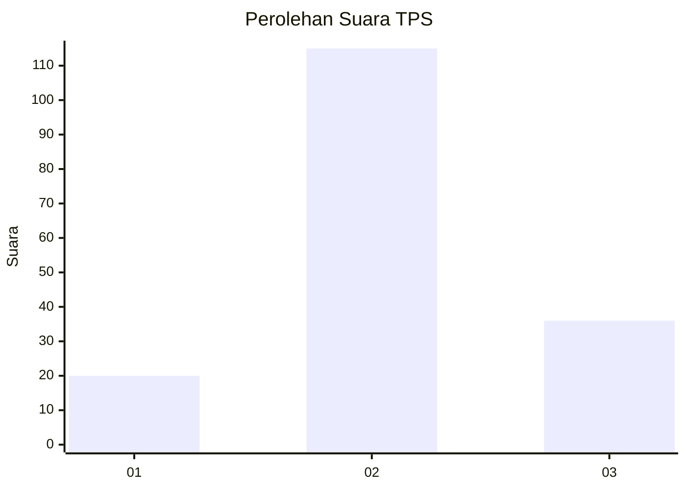
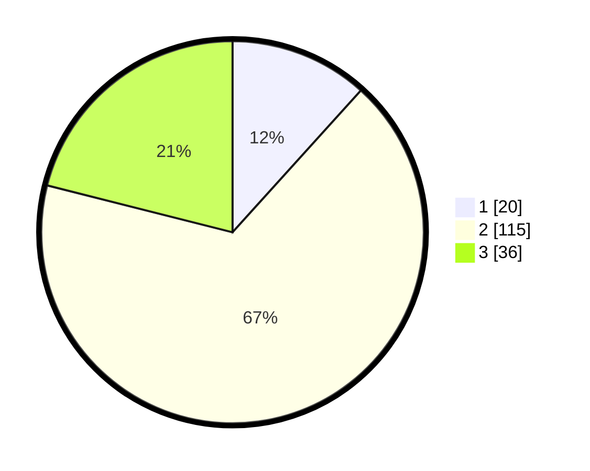

# Hasil

## Grafik

## Tabel

| No. | Nama Paslon    | Suara | Suara (raw) | Persentase |
|:--- |:-------------- | -----:| -----------:| ----------:|
| 1   | ANIES MUHAIMIN | 20    | [20][p-1]   | 11,70      |
| 2   | PRABOWO GIBRAN | 115   | [115][p-2]  | 67,25      |
| 3   | GANJAR MAHFUD  | 36    | [36][p-3]   | 21,05      |

[p-1]: https://github.com/gigit-pemilu/pemilu-2024/blob/main/pilpres/hitung-suara/sub/35-jawa-timur/sub/09-jember/sub/17-ajung/sub/2006-wirowongso/sub/029-tps/sub/paslon-1.txt
[p-2]: https://github.com/gigit-pemilu/pemilu-2024/blob/main/pilpres/hitung-suara/sub/35-jawa-timur/sub/09-jember/sub/17-ajung/sub/2006-wirowongso/sub/029-tps/sub/paslon-2.txt
[p-3]: https://github.com/gigit-pemilu/pemilu-2024/blob/main/pilpres/hitung-suara/sub/35-jawa-timur/sub/09-jember/sub/17-ajung/sub/2006-wirowongso/sub/029-tps/sub/paslon-3.txt

## Foto C Plano

https://sirekap-obj-formc.kpu.go.id/885d/pemilu/ppwp/35/09/17/20/06/3509172006029-20240217-194435--b1f2f8c0-892a-4e10-bb08-bfbf4598b21f.jpg

https://sirekap-obj-formc.kpu.go.id/885d/pemilu/ppwp/35/09/17/20/06/3509172006029-20240217-194656--3e754bae-0f3d-4728-b339-4492228897ad.jpg

https://sirekap-obj-formc.kpu.go.id/885d/pemilu/ppwp/35/09/17/20/06/3509172006029-20240217-194808--bcea4b8b-1b58-44a0-b632-7a53005cd830.jpg

## Metadata

| Key        | Value               |
| ---------- | ------------------- |
| Time Stamp | 2024-02-24 22:31:28 |

