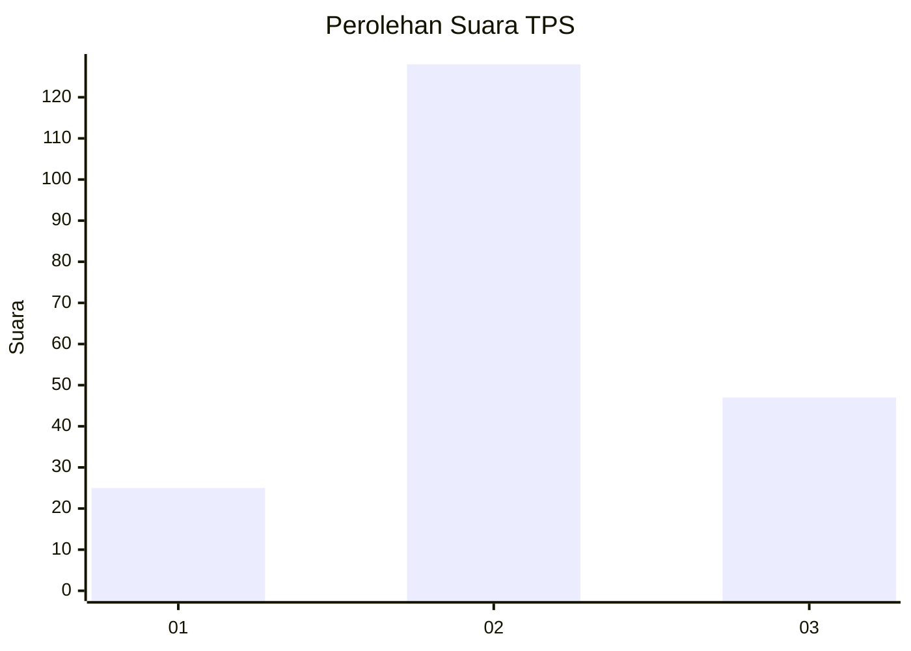
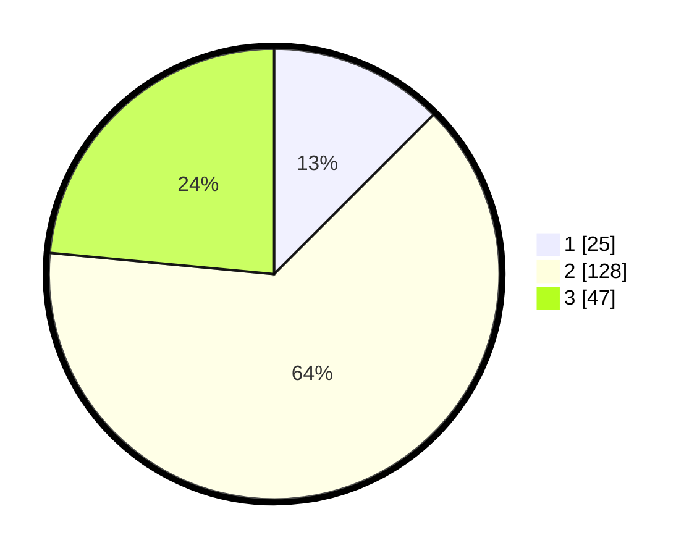

# Hasil

## Grafik

## Tabel

| No. | Nama Paslon    | Suara | Suara (raw) | Persentase |
|:--- |:-------------- | -----:| -----------:| ----------:|
| 1   | ANIES MUHAIMIN | 25    | [25][p-1]   | 12,50      |
| 2   | PRABOWO GIBRAN | 128   | [128][p-2]  | 64,00      |
| 3   | GANJAR MAHFUD  | 47    | [47][p-3]   | 23,50      |

[p-1]: https://github.com/gigit-pemilu/pemilu-2024/blob/main/pilpres/hitung-suara/sub/35-jawa-timur/sub/09-jember/sub/17-ajung/sub/2007-rowoindah/sub/006-tps/sub/paslon-1.txt
[p-2]: https://github.com/gigit-pemilu/pemilu-2024/blob/main/pilpres/hitung-suara/sub/35-jawa-timur/sub/09-jember/sub/17-ajung/sub/2007-rowoindah/sub/006-tps/sub/paslon-2.txt
[p-3]: https://github.com/gigit-pemilu/pemilu-2024/blob/main/pilpres/hitung-suara/sub/35-jawa-timur/sub/09-jember/sub/17-ajung/sub/2007-rowoindah/sub/006-tps/sub/paslon-3.txt

## Foto C Plano

https://sirekap-obj-formc.kpu.go.id/a87e/pemilu/ppwp/35/09/17/20/07/3509172007006-20240214-141853--d99cc82f-2c1d-429a-a4f4-790f199a77aa.jpg

https://sirekap-obj-formc.kpu.go.id/a87e/pemilu/ppwp/35/09/17/20/07/3509172007006-20240214-141944--784990bf-d8af-4481-be0b-8210db48be6f.jpg

https://sirekap-obj-formc.kpu.go.id/a87e/pemilu/ppwp/35/09/17/20/07/3509172007006-20240214-222114--1c5a9fb8-653a-4702-9da0-35f38c71fa96.jpg

## Metadata

| Key        | Value               |
| ---------- | ------------------- |
| Time Stamp | 2024-02-15 09:00:24 |

